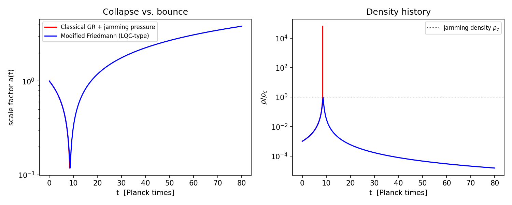
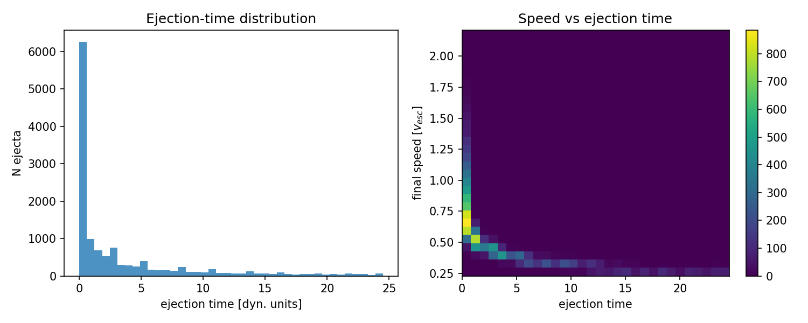
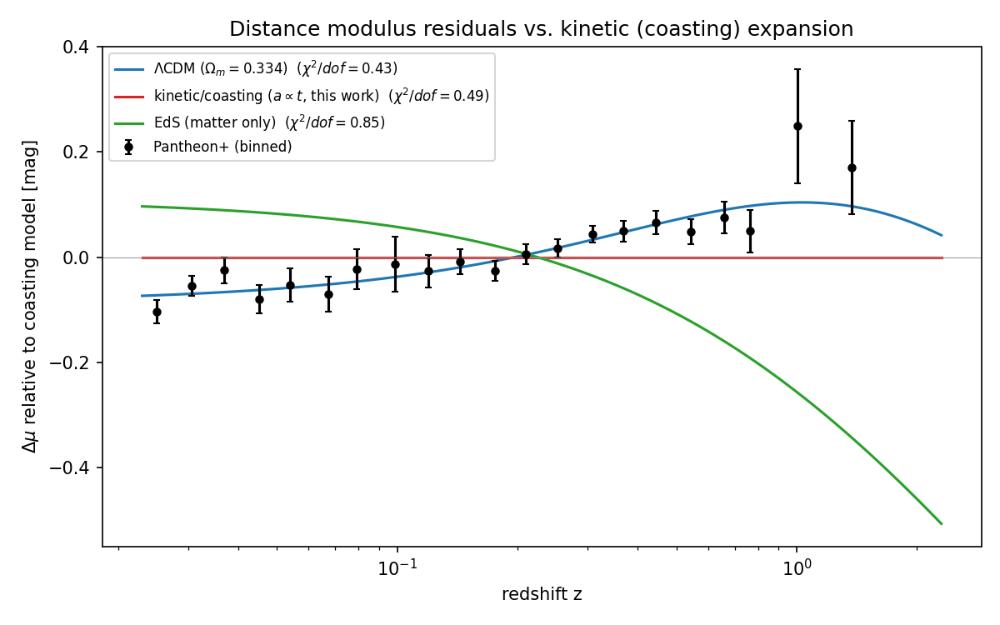
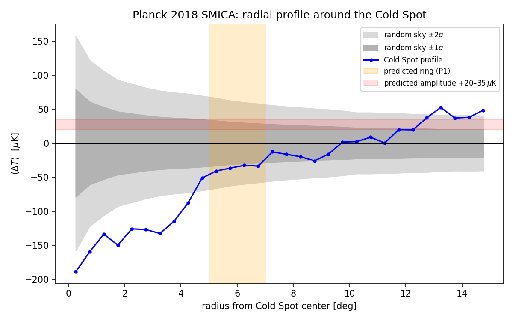
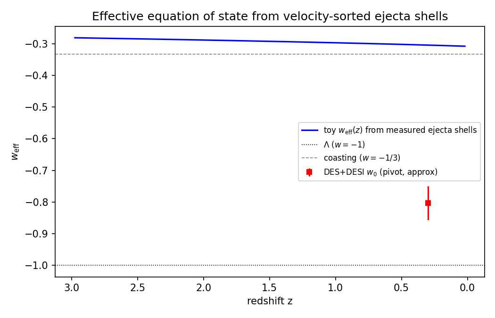

**Abstract.** The universe is a set of concentric rings of identical Planck-mass relics obeying different mechanics in each ring; we live in the innermost, Kernel 0,0,0, the only ring with light: the Big Apple. Dark matter needs no new particle: it is the Planck-mass relics that survive the grinding in Kernel 0,0,0 — the trace fraction $f = T_{\text{eq}}/T_{\text{conv}}$ left when relic mergers, which convert relic mass to light, stop keeping pace with the expansion — ordinary gravitating matter invisible to every non-gravitational detector, so the forty-year null of direct searches becomes a prediction (P5 (No Particle DM)) and a confirmed particle detection would falsify the core hypothesis. Dark energy is *not* dispensed with: no arrangement of ejecta or of neighbouring universes can accelerate the expansion, and the acceleration is attributed to a constant tension of space whose value the framework does not derive. Cosmic inflation — "comic inflation" in our working vocabulary — is dispensed with as a *mechanism*: no inflaton, no slow roll; a non-singular hard-sphere bounce replaces the initial singularity and evades the Borde–Guth–Vilenkin theorem, but the horizon and flatness problems remain open and the red tilt is fitted. The rings come first (Sec. 3, H8 (Precious Rings – Dante's Purgatory)): they are phase transitions of one material, as the Earth's seismic discontinuities are, and an energy-conserving shell toy of the rebound shows the ordering the rings need — a pressure-held interior below a free-streaming exterior, with contact capping ejection near $60\%$ and the $88\%$ reached only by free-streaming material — but no three-band structure and no specific ring radius. Beneath the rings is the bounce (Sec. 4, H1 (Bounce – The Big Pool Bang)): a jammed ensemble of Planck-mass relics ($\sim\!10^{60}$–$10^{61}$ survivors per present Hubble volume), treated as effective hard spheres,^[Code, figures, build instructions and download links for all datasets used: https://github.com/AIMFIRST-VN/big001] rebounds under a loop-quantum-cosmology-type modified Friedmann equation whose critical density is conjecturally the jamming density; toy $N$-body simulations with a turbulent kick distribution eject $88\% \pm 4\%$ of the mass with clean velocity sorting — the mass of the dark rings. The hot Big Bang is Kernel 0,0,0 (Sec. 5): the survivor fraction is a consistency condition the merge-then-evaporate channel must meet, not a derivation, and the geometric merger cross-section misses it by up to 28 orders of magnitude, the leading open problem. The kernel interior is *assumed* homogeneous FLRW with its edge beyond the horizon; the system of rings is a finite centred cloud that still has *no bounce mechanism* ($\sim\!10^{40}$ inside its own Schwarzschild radius). Coasting expansion is disfavored by Pantheon+ ($\Delta\chi^2 \approx 84$) and DES-SN5YR ($\Delta\chi^2 \approx 131$), a relativistic LTB lightcone through the ejecta decelerates ($q_0^{\text{eff}} = +0.16$), and a kinetic-Sunyaev–Zel'dovich gate caps any ejection profile at $\sim\!1\%$ of the observed dark energy, so we adopt the framework *plus a constant tension of space* ($w=-1$; Sec. 6). Inside a homogeneous kernel a spherical mantle and shell exert nothing, so our position, H5 (Our Position – Where Is Nemo; Sec. 7), is $\Lambda$CDM's own null — the structure-subtracted off-centre dipole stays inside the $\approx 2.5$ Mpc mock floor, as it does — while the kernel is flat to a few percent in primordial temperature and dark-to-baryon ratio, which the model's own radial gradient must respect (P12 (Kernel Gradient)). A predicted Cold Spot hot ring at $5°$–$7°$ is absent in Planck 2018 data; a neighbouring universe beyond our particle horizon can imprint only an initial-condition (Sachs–Wolfe) potential, which for the Cold Spot fixes a source mass $M_2 \approx 10^{48}$ kg ($+0.6/-0.4$ dex) $1$–$2.5$ Gly beyond last scattering with an induced local velocity $\lesssim 1$ km s$^{-1}$. We organize the claims into eight hypotheses — H8 (Precious Rings – Dante's Purgatory), H1 (Bounce – The Big Pool Bang), H5 (Our Position – Where Is Nemo), H2 (Vortex – The Cold Eye of Sauron), H3 (Neighbour – Big Pool Bang Multiverse 2), H4 (Population – The Dark Comic Background), H6 (Neighbour Location) and H7 (Pool Model) — each with explicit falsifiers collected in one table, catalogue thirteen predictions (P1 (Polarization Ring)–P13 (No Primordial Holes)) with the instruments required, and state the unsolved problems: the merger cross-section gap, baryogenesis, the assumed homogeneity of the kernel, the causal structure of the bounce, the relativistic formulation of ejection, the horizon and flatness problems, and the expansion history.

## **1. Introduction: Three Questions**

The picture is an apple — the Big Apple. One kind of ball, a Planck-mass relic, fills a jammed sphere; the sphere rebounds, and the rebound sorts the balls into concentric rings by one number each, its kick relative to the escape speed. The rings are not made of different stuff; they are the same stuff under different mechanics — jammed, then collisional, then collisionless, then a wall — as the Earth's seismic discontinuities are one rock under different pressure. An apple has three distinct tissues, and the hypothesis is that the rebound produces them (Sec. 3.2 records a first fluid toy whose apparent confirmation of this was an artefact; Sec. 3.3 the controlled one): the core with its seeds is Kernel 0,0,0, the innermost ring, where the balls that fell back collide and grind one another into light, leaving the surviving relics as seeds in it — the only ring with light, and where we live; the flesh is the dark mantle; and the thin skin, which comes off first, is the atmosphere that the unloading wave releases first and fastest, the dark shell of sorted ejecta. Beyond the skin is a boundary, and beyond that other bangs may lie. The paper is organized around three questions about this apple.

1. **How does the model work?** A first-order vacuum crystallization jams into a hard-sphere state; a loop-quantum-cosmology-type bounce rebounds it; the rebound sorts the relics by speed into rings (Secs. 3–4): H8 (Precious Rings – Dante's Purgatory) for the rings, H1 (Bounce – The Big Pool Bang) for the bounce beneath them. The relics that fell back form Kernel 0,0,0, where collisions grind relic mass into light until the mergers stop keeping pace with the expansion: that light is the hot Big Bang, and the cold trace of survivors is our dark matter, with no new particle (Sec. 5). The $88\% \pm 4\%$ that the toy rebound ejects are the dark rings outside. The rebound kinetics do *not* reproduce cosmic acceleration, so the adopted expansion history is the framework plus a constant tension of space whose value is not derived (Sec. 6); and the conversion calculation that must reproduce the survivor fraction has not been done (Sec. 13).

2. **Where are we?** In Kernel 0,0,0, at or near its centre, says H8 (Precious Rings – Dante's Purgatory); H5 (Our Position – Where Is Nemo; Sec. 7) tests that placement. Inside a homogeneous kernel a spherical mantle and shell exert nothing, so the placement predicts exactly what $\Lambda$CDM predicts: a displaced-centre null and a bulk flow explained by local attractors. Our current answer: the displaced-centre test is null to within a few Mpc, and the hemispherical asymmetry is better assigned to an external neighbour than to our own offset. A second handle, the radial gradient of the grinding (P12 (Kernel Gradient); Sec. 5.4), is flat to a few percent over the observable volume.

3. **Where is the second Big Bang?** Beyond the boundary ring. A neighbouring Big Pool Bang beyond our particle horizon can imprint the last-scattering surface only through the potential it contributed to the initial conditions — a Sachs–Wolfe spot with a low-multipole tail. The Cold Spot at $(l,b) = (203°, -56°)$ is the candidate, treated under H2 (Vortex – The Cold Eye of Sauron), H3 (Neighbour – Big Pool Bang Multiverse 2) and H6 (Neighbour Location) in Secs. 8–10: direction known to $\pm 3°$, comoving distance $1$–$2.5$ Gly beyond the last-scattering surface, mass $M_2 \approx 10^{48}$ kg to within $+0.6/-0.4$ dex, and a curl-mode test, P8 (Curl Test), pre-registered. The eight extreme spots of the Planck map are the candidate list for a population of such neighbours, H4 (Population – The Dark Comic Background) and H7 (Pool Model), treated in Sec. 11.

The paper answers the questions in that order: Sec. 2 the hard-sphere ansatz and relic counts; Sec. 3 the rings, their acoustic structure and a hydrodynamic toy of the rebound; Sec. 4 the bounce and velocity sorting; Sec. 5 Kernel 0,0,0 as the hot Big Bang, the consistency checks and the kernel's radial structure; Sec. 6 the geometry by ring and the expansion history; Sec. 7 our position; Secs. 8–11 the Cold Spot, the neighbour, its location and the population; Sec. 12 the thirteen predictions and the falsification table; Sec. 13 open problems. Appendix A records exploratory nulls, Appendix B a lattice check, Appendix C the kinematic-mimicry tests and the $w(z)$ drift, Appendix D the $N$-body ejection details.

## **2. Planck-Mass Relics as Effective Hard Spheres**

Standard cosmology relies on scalar-field inflation to explain why the observable universe is flat, isotropic, and thermally uniform, at the cost of fine-tuning and of singularity theorems (Borde, Guth & Vilenkin 2003). The **Big Pool Bangs Theory** is a mechanical alternative grounded in first-order phase-transition dynamics. Space begins in a false vacuum with $\rho_{\text{vac}} \sim \rho_P$. Quantum fluctuations trigger a **vacuum crystallization** transition which nucleates at many points: bubbles of converted phase grow, collide, and merge, and the "bang" is their percolation into a single jammed state.

**The hard-sphere ansatz.** For a particle of mass $m$ the reduced Compton wavelength $\hbar/mc$ and the Schwarzschild radius $2Gm/c^2$ coincide at $m \approx m_P$, where both equal $\sim\!\ell_P = 1.616\times10^{-35}$ m, the regime in which neither quantum field theory nor classical general relativity is separately valid. **We adopt, as a modeling ansatz rather than a derivation, that Planck relics possess a minimum spatial extent $\sim\!\ell_P$ that no interaction can compress**, and treat them as effective incompressible hard spheres. The ansatz is judged by the phenomenology it generates (Secs. 3–11); its microphysical justification is an open problem (Sec. 13); condensed-matter pictures of the vacuum (Volovik 2003) and analogue gravity in fluids (Barceló, Liberati & Visser 2011) are the nearest precedents for treating it as a medium. The closest object in the quantum-gravity literature is the white-hole remnant of loop gravity (Bianchi et al. 2018; Rovelli & Vidotto 2018): a black hole that has Hawking-evaporated down to the Planck mass tunnels into a long-lived Planck-mass white hole, proposed there as a dark-matter candidate. We take it as the candidate microphysics of the relic, together with its two clocks — evaporation of a clump of $N$ relics in $\sim N^3\,t_P$ and a remnant lifetime $\sim N^4\,t_P$ — and note that the Planck-star bounce time $\sim N^2\,t_P$ of Rovelli & Vidotto (2014), used in Sec. 3.1 for baby bangs, is the earlier, shorter estimate that this later work supersedes.

**Relic counts.** Because quantum geometry prohibits localized infinite densities, the energy crystallizes into irreducible **Planck-mass relics** ($m_P \approx 21.8\,\mu$g). We count *survivors, per present-day Hubble volume, today*: $N \approx 10^{60}$–$10^{61}$ relics, of mass $M_1 = N m_P \approx 2.2\times10^{52}$ kg at the lower end (order of magnitude; the matter mass of the *observable* universe is $\sim\!1.5\times10^{53}$ kg). These are survivor numbers, not totals. Under H8 (Precious Rings – Dante's Purgatory) the survivors are the fraction $f = T_{\text{eq}}/T_{\text{conv}}$ of the relics that were present in the comoving Hubble volume at the bounce (Sec. 5), so the number at the bounce was $N/f \approx 10^{88}$ for Planck-scale conversion (fewer for lower $T_{\text{conv}}$), and the comoving region that becomes one present Hubble volume spanned, at the bounce density, $\sim\!3\times10^{29}$ causal (Planck-size) patches per dimension. In Geometry A (Sec. 4) the jammed patch is super-horizon, so its total number and mass are unbounded by observation; in Geometry B they are the mass of a finite cloud. The relics saturate local volume up to the random close-packing limit $\eta_{\text{rcp}} \approx 0.64$, and with $\rho_P = m_P/\ell_P^3 = 5.2\times10^{96}$ kg m$^{-3}$ the jamming density is $\rho_c = \eta_{\text{rcp}}\rho_P$. The Schwarzschild radius of even the survivor mass is $3.3\times10^{25}$ m, forty orders larger than its jammed size ($\sim\!10^{-15}$ m), so a finite ball of this mass and density would be a black hole, not a bouncing patch. The bounce of Sec. 4 is meaningful only if the jammed patch is the whole (or a super-horizon) universe described by a homogeneous FLRW-type metric, for which no exterior Schwarzschild geometry exists (Geometry A); the finite-cloud reading (Geometry B) must confront this trapped-surface problem directly. We use $\rho_c$, not a jamming radius, as the physical parameter.

*Crystallization timeline.* Bubble walls propagate at $\leq c$, so percolating the $\sim\!3\times10^{29}$ causal patches per dimension takes at least $3\times10^{29}\,t_P \approx 1.6\times10^{-14}$ s divided by the number of nucleation sites per crossing length; any nucleation density sparse enough to give nontrivial merger statistics implies an assembly time many orders above $t_P$, whose consistency with trapped-surface avoidance (Sec. 4) is open.

*Nucleation as the origin of the kick spectrum.* The randomness of the merger history is inherited by the jammed core as internal turbulence, a candidate source for the stochastic kick spectrum that Sec. 4 otherwise requires as an input — provided nucleation-era velocity structure survives the jammed epoch rather than thermalizing. A Poisson nucleation-and-merger simulation recovers a Maxwellian kick distribution (speed coefficient of variation $0.41$–$0.42$), largely a central-limit consequence; the nontrivial statistic is the coherent-to-dispersive ratio $\sigma_{\text{rel}}$. Poisson nucleation is turbulence-dominated ($\sigma/\langle v_r\rangle \approx 5$–$8$); a *cascade* model — a single seed bubble whose wall catalyzes further nucleation, halted by a jamming feedback at $\eta \approx 0.64$ — yields $\sigma_{\text{rel}} = 0.65$–$0.78$, robust across a $4\times$ range in trigger distance. Three caveats gate the chain: the cascade's heavier-tailed kick field has not been fed through the $N$-body pipeline; the model retains structural choices (trigger distance, nucleation lag, wall-area weighting, the arrest $\eta = 0.64$); and the wall-momentum efficiency is assumed universal, whereas it is model-dependent and typically small (Espinosa et al. 2010). Bubble collisions in any first-order transition also source a stochastic gravitational-wave background peaked at the transition scale; this is a generic prediction of H1 (Bounce – The Big Pool Bang), listed as P3 (Transition GW Background), not of any neighbour.

**The first move (Holy Moly Ghost Waves): nucleation as a rogue fluctuation.** The cascade above needs one seed bubble and never said where it came from. The false vacuum decays when a fluctuation in one region carries the field over the barrier: in the thermal picture a tail event in which many modes add in one place, the same statistics that make one ocean wave in ten thousand a rogue wave; the zero-temperature limit is the Coleman–De Luccia instanton. The rate per unit spacetime volume is $\Gamma \sim \ell_P^{-4}\,e^{-S}$ with $S$ the bounce action. Counting fixes $S$: a patch of size $L$ waits about $L/c$ for its first seed, so the expected number of seeds in that time is $(L/\ell_P)^4 e^{-S}$, and *exactly one* seed requires $S \approx 4\ln(L/\ell_P)$ — $S \approx 184$ for $L = 10^{20}\,\ell_P$ and $S \approx 270$–$280$ for a cell of order the present Hubble volume at the bounce (Sec. 11f). These are rogue-wave odds, $10^{-80}$ to $10^{-120}$ per Planck 4-volume — and the sea analogy is literal: the statistics of extreme excursions of a random field are those of Rice (1944, 1945) and Longuet-Higgins (1957) for a random sea surface, which is where the peaks theory of cosmological structure (Bardeen et al. 1986) took them from — and they are not fine-tuned: in the thin-wall formula $S = 27\pi^2\sigma^4/(2\epsilon^3)$ with $\epsilon \approx \rho_P$, they correspond to a wall tension $\sigma \approx 1.1$–$1.2\,M_P^3$, the natural Planck value. The site of the seed is the origin of Kernel 0,0,0 (Sec. 3). The catch is the wait: $L/c$ is $10^{20}$–$10^{29}\,t_P$, and a false vacuum with the equation of state of a cosmological constant would inflate by $e^{10^{20}}$ or more meanwhile. The framework therefore requires the pre-crystallization state to carry Planck energy density *without* the negative pressure that drives expansion — closer to a jammed solid than to de Sitter space — or else nucleation must be prompt everywhere ($S \to 0$), which is the Poisson case of Sec. 2 that yields no coherent kick and no centre. This non-$\Lambda$ initial equation of state is a new assumption and is listed in Sec. 13.

## **3. H8 (Precious Rings – Dante's Purgatory): The Big Apple**

**Motivation.** A single homogeneous bounce cannot be both a jammed-relic rebound whose ejecta are the dark matter and the source of a radiation era that leaves cold relics at matter–radiation equality: if every relic shares one history, the ejecta are hot at equality for any ejection Lorentz factor (Sec. 5). H8 (Precious Rings – Dante's Purgatory) resolves the conflict by *location*. The relics are identical, but they do not share one history: the kick each receives relative to the local escape speed, $f = v/v_{\text{esc}}$ — the one number the rebound assigns to every relic (Sec. 4, Fig. 2) — sorts them into concentric rings, and the mechanics differ from ring to ring because the density, the collision rate and the binding differ. Dante's Purgatory is the picture: one mountain, one kind of soul, and a different law on every terrace. The Big Apple is the shape: a core with seeds, a flesh, and a skin that comes off first. Table 1 is the map.

**Table 1. H8 (Precious Rings – Dante's Purgatory): the rings, their mechanics, and our handle on each.**

| Ring | Who is there | Mechanics | State | Becomes | Our handle |
| :---- | :---- | :---- | :---- | :---- | :---- |
| Kernel 0,0,0 (the core with its seeds) | Relics that were not released by the unloading wave ($f$ well below $1$) | Collisional: mergers, evaporation, thermalization, radiation-fluid dynamics | Light plus a trace of surviving relics | The hot Big Bang we live in: CMB, helium, baryons, and our cold dark matter as the survivors of the grinding | Everything we observe |
| Mantle (the flesh) | Relics that rose and fell back late, or are marginally bound ($f \approx 1$) | Gravitational, weakly collisional, mixed by many orbits | Cold relic gas, no light | A dark buffer with no memory of the initial geometry | Sets whether Kernel 0,0,0 has an edge, and how an H5 (Our Position – Where Is Nemo) offset would show |
| Shell (the skin) | The fast ejecta (the $88\%$, $f > 1$), released first | Collisionless free streaming, fastest furthest | Dark, locally velocity-sorted | The dark rings around us; the only ring that keeps the initial geometry and spin | Beyond our horizon except through initial-condition imprints |
| Boundary and beyond | Walls to neighbouring bangs | Vacuum-bubble physics (Coleman & De Luccia 1980) | Not matter | Cold Spot imprint, low-multipole tail | H3 (Neighbour – Big Pool Bang Multiverse 2), H6 (Neighbour Location), P8 (Curl Test), P9 (Low-$\ell$ Tail) |

**We live in Kernel 0,0,0.** The hot Big Bang is Kernel 0,0,0: the ring in which collisions grind relic mass into light and leave a cold trace of survivors, our dark matter (Sec. 5). The $88\% \pm 4\%$ ejected fraction of the toy rebound (Sec. 4) is the mass of the *dark rings around Kernel 0,0,0* — the shell — not the matter in our galaxies; inside Kernel 0,0,0 the dark-matter-to-baryon ratio, $5.4$, is set by the survivor fraction together with baryogenesis, which remains open (Sec. 13). P5 (No Particle DM) is unchanged — the survivors are the same objects as the ejecta.

**Observers live in kernels.** Only Kernel 0,0,0 has light. An observer in the shell would see no CMB, no stars, and no thermal history at all — Dante inverted: we are in the innermost ring, the only one with light, and that is why we are here to ask.

**The coherence gradient.** Appendix A records, as an untested hypothesis, that only the earliest and fastest ejecta preserve geometric correlations while everything slower is randomized by violent relaxation. H8 (Precious Rings – Dante's Purgatory) makes that its statement: free streaming preserves the initial geometry and spin in the shell; collisions in Kernel 0,0,0 and orbit mixing in the mantle erase them. The shell is the only ring that remembers how the bang began, and it is the ring we cannot see.

**Geometry by ring.** Two geometric readings of the rebound are defined in Sec. 4: Geometry A (homogeneous FLRW, no centre, no exterior) and Geometry B (a finite centred cloud whose radial ordering survives). H8 (Precious Rings – Dante's Purgatory) assigns them by location, once: the kernel interior is *assumed* homogeneous FLRW with its edge beyond the horizon (this is an assumption, not a derivation — Sec. 13, item 4(c)); the whole system of rings is Geometry B. Every observation we make is made inside Kernel 0,0,0, so the comparisons of Sec. 6 test the assumed Geometry A, and H5 (Our Position – Where Is Nemo; Sec. 7) tests our placement at or near the kernel's centre.

### **3.1 Acoustic structure of the rings**

The rings are phase transitions of one material. The Earth's 410 km and 660 km discontinuities and its core–mantle boundary are changes of phase of one rock under pressure, and seismology maps them because sound crosses them at different speeds and reflects at the contrast. The Big Apple has the same structure with one material: jammed (the pre-bounce state, pressure diverging at $\eta = 0.64$), then a collisional gas (Kernel 0,0,0, where the relics are so dense that they merge and the merger products evaporate), then a collisionless gas (the mantle and shell), then a wall (the boundary). Each ring has its own sound speed: $c/\sqrt{3}$ in the kernel once conversion has made it a radiation fluid; the relic velocity dispersion in the mantle, where the only restoring force is gravity. In the shell there is no restoring force at all — free-streaming relics carry no sound — so the shell is acoustically dead. At the boundary the restoring force is the wall tension.

The consequence is the same as in seismology: waves from the kernel *reflect* at the kernel–mantle edge, where a radiation fluid meets a pressureless gas and the impedance contrast is total. The kernel's acoustic history is therefore confined to the kernel — the toy of Sec. 3.2 shows the reflected waves recompressing the core repeatedly — and if the kernel's edge lay inside our horizon, primordial acoustic waves that reached it before last scattering would have returned and imprinted a ring-shaped echo in the CMB at the angular scale of the edge, a feature with a preferred centre and radius unlike the statistically isotropic acoustic peaks. None is seen. Either the edge is beyond the horizon, as H8 (Precious Rings – Dante's Purgatory) assumes, or it has no impedance contrast and is not an edge in the acoustic sense; a detected centred echo would falsify the assumption, and we list it as falsifier (v) below. The acoustic reading has two further signatures, both with precedent. *Refraction.* A wave crossing a layer where the sound speed changes arrives with its crests displaced, and the cosmic version has been measured: neutrinos streaming through the plasma shift the phase of the acoustic peaks (Bashinsky & Seljak 2004; Baumann et al. 2016), and Baumann et al. (2019) detected that shift in the baryon acoustic oscillations of BOSS. A ring boundary would imprint a phase shift that varies with scale rather than the constant one neutrinos give; a scale-dependent phase in the BAO harmonics beyond the neutrino value is the refraction test. *A shadow zone.* Earth's core casts a P-wave shadow between $104°$ and $140°$ from a quake; a layered kernel would cast one in scale, a band of frequencies with suppressed power. And a second ringing at a period unrelated to the drag-epoch sound horizon (Hu & Sugiyama 1996; the fossil sound of Peebles & Yu 1970 and Eisenstein et al. 2005) would be an echo of a ring crossing, which nothing in the standard picture produces; a search for it in the BOSS spectrum, with thresholds fixed in advance, is reported in Sec. 3.3. Anything imprinted causally before nucleosynthesis is sub-parsec today, so these are searches for fingerprints in the initial conditions, not for waves that travelled.

**Table 2. The layers in time and space: what the wave distribution dates, with the bounce as time zero (radiation-era scalings; comoving sizes for today's universe; angles at the last-scattering distance).**

| Layer or event | Time after bounce | Size then | Size today (comoving) | Angle on the sky |
|---|---|---|---|---|
| Bounce, Planck density | $5\times10^{-44}$ s | $3\times10^{-35}$ m | $0.6$ mm | $10^{-28}$ deg |
| Kernel contact phase ends (order $10^{-24}$ s; not derived) | $10^{-24}$ s | $6\times10^{-16}$ m | $2600$ km | $10^{-19}$ deg |
| Electroweak | $10^{-11}$ s | $6$ mm | $8\times10^{12}$ m | $10^{-12}$ deg |
| Quark–hadron | $10^{-5}$ s | $6$ km | $0.3$ pc | $10^{-9}$ deg |
| Nucleosynthesis | $1$ s | $2$ light-seconds | $84$ pc | $10^{-7}$ deg |
| Equality: the peak of the swell | $51{,}000$ yr | $31$ kpc | $106$ Mpc horizon; $555$ Mpc peak wavelength | $0.4°$–$2.3°$ |
| Drag epoch: the sound stops | $380{,}000$ yr | $139$ kpc | $147$ Mpc | $0.6°$ |
| Last scattering | $372{,}000$ yr | $280$ Mpc horizon | $280$ Mpc | $1.15°$ |
| Silk damping tail | the last $10^5$ yr before that | $10$ kpc | $10$ Mpc | $2.5'$ |
| Cold remnant ball (rest mass only, Sec. 3.1) | now | $10^{-15}$ m | a point | none |

Everything above the nucleosynthesis row is sub-parsec today and invisible to any survey; the surveys read the last four rows, and the age of Sec. 6 is the storm's date read from them.

**Stratified bodies as analogies.** The Sun is the nearest object stratified the way the rings are: by transport regime, not by material. Its seven conventional layers — core (fusion), radiative zone (photon diffusion), tachocline (a shear layer), convective zone (bulk motion), photosphere (where light escapes), chromosphere and corona (thin, collisionless, magnetic), and the solar wind (material that escapes entirely) — are one plasma under seven different dominant processes, and the interior boundaries were located by helioseismology, i.e. by how sound reflects and refracts at them, which is the method Sec. 3.1 invokes for the kernel's edge. The Sun also supplies a caution for P12 (Kernel Gradient): the corona is a hundred times hotter than the photosphere beneath it, heated by waves and reconnection rather than by proximity to the core, so "further out" is colder only if no ring has heating of its own. The core-collapse supernova is the closer *dynamical* analogy: the collapse halts when the core reaches nuclear density and nuclear matter becomes incompressible — a jamming transition in the sense of Sec. 2 — the rebound launches a shock that ejects most of the star, and a compact remnant of order a tenth of the mass is left behind, supported by degeneracy pressure. The rebound-and-remnant fraction of a supernova is of the same order as the ejected/trapped split of Sec. 4, and the incompressibility that produces the bounce is the same kind of physics as the hard-sphere jamming.

*A remnant?* The supernova analogy raises the question whether a compact relic remnant is left at the origin of Kernel 0,0,0: a jammed core that never unjammed, which in loop-quantum-gravity terms would be a Planck star (Rovelli & Vidotto 2014). We cannot exclude one, but we can bound it. A point mass $M$ at distance $d$ perturbs the local Hubble rate by $\delta H/H \sim GM/(H^2 d^3)$; requiring less than $1\%$ gives $M \lesssim 2\times10^{43}$ kg ($10^{13}\,M_\odot$) within $10$ Mpc, $2\times10^{46}$ kg ($10^{16}\,M_\odot$, a supercluster) within $100$ Mpc, and $2\times10^{49}$ kg within a Gpc. A remnant holding the trapped $12\%$ of $M_1$, $2.6\times10^{51}$ kg, would have a Schwarzschild radius of $0.4$ Gly and would dominate the velocity field of the entire observable volume; it is excluded anywhere inside our horizon. If a remnant exists it is either far smaller than the trapped mass — the rest having been ground into light — or it lies beyond the horizon, which under H8 means we are not at the kernel's origin, a statement H5 (Our Position – Where Is Nemo) can test. Beyond the horizon the CMB quadrupole takes over the bound: a mass $M$ at distance $D$ imprints a tidal quadrupole $\sim (GM/c^2 D)(d_{\rm LS}/D)^2$, so $M \lesssim 6\times10^{48}$ kg at one horizon and $\sim 10^{51}$ kg, $5\%$ of $M_1$, at the $5.6$ horizons where Sec. 11f typically puts the seed; such a remnant is a black hole of $5\times10^{20}\,M_\odot$ whose Planck-density interior is $4\times10^{-16}$ m across. *A search.* Inside the horizon a remnant is a naked mass with no galaxy, no gas and no light — it must sit in a void, since Bondi accretion on intergalactic gas at $10^{13}\,M_\odot$ would shine at $\sim 10^{16}\,L_\odot$ — and its signature is a weak-lensing mass peak with no cluster counterpart, with an Einstein radius of arcminutes. We ran that search with thresholds fixed before looking (`core_search.py`, `notes/core_search.md`): the DES Y3 convergence map ($4742$ deg$^2$, $11\%$ of the sky) smoothed at $5'$, $10'$ and $20'$, every peak above $S/N = 4$ cross-matched within $5'$ plus the smoothing scale against the DES redMaPPer, Planck, ACT, SPT, eROSITA, MCXC and 2MRS-group catalogues. Every peak above $S/N = 5$ is a known cluster matched by three or more catalogues; the three unmatched peaks at $S/N = 4.1$–$4.4$ (aperture masses $\sim 10^{13}\,M_\odot$) each lie within $15'$ of a catalogued cluster, are matched at the coarser scales, and number what pure noise gives over the footprint. The result is a null: no naked mass above $\sim 10^{14}\,M_\odot$ at $z \sim 0.1$ in that $11\%$ of the sky, which excludes a remnant at the $100$ Mpc bound there and says nothing about the other $89\%$ or about a $10^{13}\,M_\odot$ object at $10$ Mpc, which is below the map's threshold. The counted population gives a nearby remnant prior odds of about $1\%$, so the null costs the framework nothing; a survivor would have been evidence, and Euclid's mass maps will extend the search to most of the sky.

*Baby bangs inside the ball.* The same question can be asked of many small remnants rather than one: if the jammed ball rebounded not as a whole but as many sub-clumps, each a small bounce of its own, what would the survivors be and would they be the dark matter? Two facts bound it. First, any jammed relic clump of macroscopic mass is a black hole: at Planck density a clump of $10^{17}$ kg has a radius of $2\times10^{-27}$ m against a Schwarzschild radius of $1.5\times10^{-10}$ m, so baby bangs inside our cell are primordial black holes of Planck density, and their "decay" is either Hawking evaporation, $t \approx 13.8\,\mathrm{Gyr}\,(M/5\times10^{11}\,\mathrm{kg})^3$, or, if the loop bounce applies to a clump as it does to the ball, the Planck-star bounce of Rovelli & Vidotto (2014), a lower bound $t \sim (M/m_P)^2\,t_P$ (Haggard & Rovelli 2015 give a coefficient of order unity; the later white-hole-remnant scenario of Bianchi et al. 2018 lengthens it to $\sim M^4$ and reopens a Planck-mass remnant as dark matter, which we do not pursue), which is far shorter: $4\times10^{-2}$ yr for $10^{17}$ kg, $4\times10^{4}$ yr for $10^{20}$ kg, and the age of the universe for $6\times10^{22}$ kg. Second, the dark-matter window closes from both sides. Under Hawking decay alone, clumps of $10^{14}$–$10^{20}$ kg are the standard asteroid-mass window in which primordial black holes may still be all of the dark matter (Carr et al. 2021); but under the Planck-star bounce every clump below $6\times10^{22}$ kg has already exploded — those below $10^{20}$ kg before recombination, injecting their mass as radiation into the pre-recombination bath, where the spectral-distortion limits apply, and those between $10^{20}$ and $6\times10^{22}$ kg after it, where the injected radiation is limited by CMB anisotropy and reionization — and those above are in the mass range where microlensing surveys (Subaru HSC, Niikura et al. 2019a; OGLE, Niikura et al. 2019b) limit compact objects to a minority of the dark matter. So baby bangs inside our universe are Planck stars under the loop bounce, they cannot be the dark matter under the same bounce that makes the model, and the ones of $\sim 6\times10^{22}$ kg exploding today would be the fast-radio-burst candidates of that literature (Barrau, Rovelli & Vidotto 2014) — an association this paper notes and does not adopt. Nor does the rebound throw such clumps out: in the contact ring a clump of $N$ relics receives the relics' kinetic energy, not their speed, so it moves at $v_{\rm relic}/\sqrt{N}$ and sinks, as heavy stars sink in a cluster; only three-body slingshots eject clumps, a minority channel, so the ejecta are relic-rich and clump-poor and any primordial black holes stay inside, where these limits apply. The dark matter of H8 remains the unbound trace of *individual* relics, not clumps, which is what keeps it free of every lensing constraint; and because the kernel cannot fragment (Sec. 13, road (iii)), no primordial black hole above the force-chain window of Sec. 5 originates in it, which is P13 (No Primordial Holes).

### **3.2 A hydrodynamic toy of the rebound: a retracted first attempt**

The $N$-body toy of Sec. 4 is collisionless, and the rings are defined by collisionality, so a fluid toy is the natural complement: a one-dimensional spherical Lagrangian hard-sphere gas with the Carnahan–Starling pressure, a jamming divergence at $\eta = 0.64$, self-gravity and artificial viscosity (`rings_hydro.py`). Our first version of that toy reported three bands with edges at $45\%$ and $98\%$ of the mass at every kick strength, and an unbound fraction of $88\%$ at a kick of twice the escape speed. **Both numbers were artefacts of the code, not results, and are withdrawn.** The kick was imposed as $v = \bar{f}\,v_{\rm esc}(r)\,(r/R)$; for a uniform sphere $v_{\rm esc}(r) \propto r$, so a shell is unbound exactly when $r/R > 1/\bar{f}$ and the bound fraction is $\bar{f}^{-3}$ with no fluid physics at all — $0.579$, $0.296$, $0.125$, $0.037$, $0.008$ for $\bar{f} = 1.2, 1.5, 2, 3, 5$, which is the table we had printed. The "$88\%$ at $\bar{f} = 2$" is $1 - 1/8$. The band edges came from a band-finder that compared the smoothed density with its median over the inner $90\%$ of shells, which places an edge at $45\%$ for any monotone profile, and the $98\%$ edge was the smoothing window at the free outer boundary. The thermal energy used was also far too small for pressure to matter ($\sim\!0.7\%$ of gravity), so no unloading wave released anything; the outer layers left ballistically.

The controlled version (`rings_hydro2.py`) removes each of these: the kick is a fixed fraction $f$ of the *local* escape speed, independent of radius, so the ballistic null is a step (all bound for $f<1$, all unbound for $f>1$) and any intermediate structure is the fluid's doing; the thermal energy is set by a pressure-to-gravity ratio $\beta$ of order unity; band edges require a fixed physical contrast ($0.5$ dex over five shells); and results are reported at more than one resolution against the analytic null. Its results are given in Sec. 3.3. Until a fluid toy of that kind produces edges, the three-tissue partition of the apple is a hypothesis about the rebound, not a result of it, and the claim that "the factor between $88\%$ at $0.7\,v_{\rm esc}$ (collisionless) and at $2\,v_{\rm esc}$ (fluid) is the pressure" is withdrawn with the numbers.

### **3.3 The controlled toys: fluid, billiard balls, and hybrid**

Two generations of toys were run with the artefacts of Sec. 3.2 removed. The first generation — a Lagrangian fluid with an equation of state (`rings_hydro2.py`) and a shell-crossing code with a jamming floor and artificial viscosity (`rings_hybrid.py`) — is *superseded*: the second code was caught not conserving energy (a completed run ended with energies of $10^{21}$ and radii of $10^{11}$ in units where the ball starts at radius $1$ with energy of order $1$), and the first was never checked. Every number below comes from a rewritten toy whose energy conservation is reported in every run (`rings_contact.py`): $200$ equal-mass spherical shells, each with a radial velocity and a tangential specific angular momentum (Hénon shells), integrated with a fixed-step symplectic leapfrog in the softened potential of the enclosed mass; *contact* is an exact elastic exchange of radial velocities between two shells that approach within one jammed shell thickness where the local packing exceeds $\eta_c$, followed by a random rotation of each shell's radial and tangential velocity that conserves its kinetic energy — collisions turn radial motion into pressure with no artificial viscosity and no floor. Kick $f\,v_{\rm esc,local}(r)\,(1+\sigma\xi)$ with per-shell Gaussian noise $\xi$; $336$ runs over $f = 0.3$–$0.9$, $\sigma = 0$–$1$, $\eta_c = 0.03$, $0.1$, $0.3$ and a ballistic null ($\eta_c \to \infty$, no contact ever), three seeds each, $20$ dynamical times; energy drift below $1\%$ in $317$ runs and below $5\%$ in all (`contact_grid_results.txt`). Bound state is judged in the self-consistent final potential.

Four results (Table 3). (i) *The contact threshold is irrelevant*: $\eta_c = 0.03$, $0.1$ and $0.3$ give identical runs to three decimals, because the jammed core always exceeds $0.3$ and the escaping tail never reaches $0.03$; the "hybrid" question reduces to contact or no contact. (ii) *Both regimes partition smoothly.* The all-or-nothing behaviour of the first-generation fluid was that code's property, not the physics: with contact the ejected fraction rises steadily with both the kick and its spread, from $0\%$ at $f \le 0.5$ without noise to $44\%$ at $f = 0.9$ without noise and $58\%$ at $f = 0.9$, $\sigma = 1$. (iii) *Contact caps ejection near $60\%$; the $88\%$ needs free streaming.* No contact run in the grid exceeds $67\%$ (one seed), whereas the ballistic null reaches $88\%$ at $f = 0.8$, $\sigma = 0.3$ and $100\%$ at $f \ge 0.8$ without noise; noise *reduces* ballistic ejection above threshold (a fraction of shells is kicked inward) and raises it below. The turbulent $88\%$ of Sec. 4 is therefore a statement about the outer, collisionless material, as H8 (Precious Rings – Dante's Purgatory) requires, and pressure in the contact region is what holds the kernel and mantle back. (iv) *Ballistic shells eject a third of the mass even for a small kick.* With no contact, a ball kicked at $0.3$–$0.5\,v_{\rm esc}$ without noise re-collapses through its centre and violent relaxation throws $36\%$ of the shells out; with contact the same kick ejects nothing. A cold collisionless rebound is not a gentle one.

The edges tell a plainer story than the one we withdrew. The density profile of every contact run shows an edge at $5\%$ of the mass (the innermost bin against the softened centre, an artefact) and edges at $85$–$95\%$ (the escaping tail stretching, expected); the one interior edge that repeats across seeds, at $\sim 80\%$ of the mass for $f = 0.7$, is the bound–unbound boundary. That is *two* tissues, a bound body and an escaping tail, not three rings; the ballistic runs show $6$–$9$ edges that move with the seed, the spikes of crossing shells. Neither the three-tissue partition nor any specific ring radius is supported by a toy; what is supported is the ordering H8 (Precious Rings – Dante's Purgatory) needs — a pressure-held interior below a free-streaming exterior — and the number $88\%$ belongs to the exterior alone. *A formula for the contact runs.* Symbolic regression over the grid (`symbolic_fits.py`, `notes/symbolic_fits.md`; a library enumeration with a complexity penalty and leave-one-out, checked against PySR) finds that the contact runs collapse onto one variable, $f_{\rm eff} = f\sqrt{1+\sigma^2} = \sqrt{{\rm KE}/2|U|}$, and that the unbound fraction is $U = x^2/(x^2 + 0.70^2)$ with $x = (f_{\rm eff} - 0.38)_+$ (two parameters; residual $0.026$, below the seed-to-seed scatter of $0.03$; leave-one-out $0.027$, so not an interpolation). In words: with contact, nothing escapes below $f_{\rm eff} = 0.38$, a tenth escapes at $f_{\rm eff} \approx 0.6$–$0.66$ (${\rm KE}/|U| \approx 0.75$–$0.9$) for every spread, and the rise is gradual. The kick-profile tautology $1 - f_{\rm eff}^{-3}$ that misled Sec. 3.2 misses this by $3.5$ seed scatters. The ballistic null has *no* compact form — it is non-monotone in $f$ because of shell crossing ($0.36$, $0.35$, $0.36$, $0.30$, $0.14$, $1$, $1$ at $\sigma = 0$ for $f = 0.3$–$0.9$) — and is quoted as a table, not a formula.

**The echo search.** Sec. 3.1 promised a search for a second ringing in the galaxy power spectrum, an oscillation at a period unrelated to the drag-epoch sound horizon, which a ring crossing inside the kernel would leave as a fingerprint in the initial conditions and which nothing in the standard picture produces. We ran it with thresholds fixed in advance (`ring_echo.py`, `notes/ring_echo.md`, `figures/ring_echo.png`): the eBOSS DR16 luminous-red-galaxy monopole ($0.6 < z < 1.0$, to $k = 0.315\,h$ Mpc$^{-1}$, mock covariance and window) and the BOSS DR12 monopoles of Beutler et al. (2017) in three redshift bins and two caps, $148$ points in all; a model of smooth broadband times the standard acoustic template times a second damped sinusoid with free period from $20$ to $600\,h^{-1}$ Mpc, amplitude and phase; detection declared only above $\Delta\chi^2 = 25$ globally. The acoustic fit itself reproduces the known result ($\alpha = 0.99$–$1.02 \pm 0.02$ per bin, the BAO detected at $9.7\sigma$, $\chi^2 = 110$ for $107$ degrees of freedom). The second ringing is not there: the largest excursion is $\Delta\chi^2 = 13$ at a period of $204\,h^{-1}$ Mpc with amplitude $1.2 \pm 0.3\%$, and $500$ noise-only mock skies scanned the same way exceed it $4\%$ of the time (their median maximum is $6.7$, none reaches $25$); BOSS alone and eBOSS alone peak at different periods. The $95\%$ limits are $1$–$2\%$ of the smooth spectrum for lightly damped ringing at periods of $60$–$250\,h^{-1}$ Mpc, $4\%$ at $30$–$60$, and $4$–$6\%$ over $60$–$300$ once damping up to $20\,h^{-1}$ Mpc is allowed, against the $5$–$7\%$ of the acoustic ringing itself; above $300\,h^{-1}$ Mpc the period falls below two bin widths and the limit is degenerate with the broadband. So any echo of the rings is at most a fifth to a third as loud as the fossil sound over the scales the surveys resolve, and the no-echo falsifier of Sec. 3.1 is now a number. *Crest ripples.* A steep swell grows fine ripples on its crest at a wavelength the crest itself predicts (Longuet-Higgins 1963); the cosmic version is the harmonics of the fossil sound, which second-order mode coupling generates at twice and three times the acoustic frequency at $0.2$–$0.4\%$ of the smooth spectrum, with a definite phase. Fitting them with the acoustic frequency fixed per redshift bin by the BAO fit itself gives $A_2 = 1.1 \pm 0.3\%$ at twice the frequency ($\Delta\chi^2 = 11$; $95\%$ limit $1.6\%$ undamped, $5.7\%$ with $20\,h^{-1}$ Mpc damping) and $A_3 = 0.7 \pm 0.4\%$ at three times ($\Delta\chi^2 = 4$; limits $1.3$–$13\%$), a joint $\Delta\chi^2 = 14$–$17$ for four degrees of freedom. The second harmonic is the same feature the free-period scan found, since its $204\,h^{-1}$ Mpc is twice the sound horizon: the one hint in the whole search is a $\sim 1\%$ ripple riding on the acoustic crest at exactly twice its frequency, $3.3\sigma$ locally and about $2\sigma$ after the look-elsewhere correction, two to five times the naive second-order expectation, and not shared by BOSS and eBOSS separately. It is recorded as a hint, not a detection: the fit's nonlinear damping is poorly constrained in a monopole-only analysis, and residual template mismatch has power at the acoustic frequency and its harmonics at this level. DESI's full-shape spectra will lower every limit here by a factor of a few and decide the ripple.

**Table 3. Energy-conserving rebound toy (`rings_contact.py`; 200 shells, 3 seeds; unbound fraction in the self-consistent final potential; ballistic null has no contact).**

| Kick $f$ | Noise $\sigma$ | Contact (any $\eta_c \le 0.3$) | Ballistic null | Note |
| :-- | :-- | :-- | :-- | :-- |
| $0.3$ | $0$ | $0\%$ | $36\%$ | cold re-collapse ejects without contact |
| $0.5$ | $0$ | $0\%$ | $36\%$ | |
| $0.5$ | $1$ | $19\%$ | $25\%$ | |
| $0.7$ | $0$ | $14\%$ | $14\%$ | contact irrelevant at threshold |
| $0.7$ | $0.5$ | $27\%$ | $40\%$ | |
| $0.7$ | $1$ | $41\%$ | $51\%$ | |
| $0.8$ | $0$ | $29\%$ | $100\%$ | ballistic: $E > 0$ |
| $0.8$ | $0.3$ | $32\%$ | $88\%$ | the Sec. 4 number, free streaming only |
| $0.9$ | $0$ | $44\%$ | $100\%$ | |
| $0.9$ | $1$ | $58\%$ | $68\%$ | contact maximum in the grid |

**Falsifiers.** H8 (Precious Rings – Dante's Purgatory) falls to any of: (i) a detected off-centre dipole above the mock floor, with a direction stable across shells — we would not be at the centre of Kernel 0,0,0 (Sec. 7); (ii) any measured thermal velocity dispersion of dark matter above $\gamma/R$ — a warm-dark-matter detection at the keV scale would falsify it, whereas the existing Lyman-$\alpha$ limits, $m_{\text{WDM}} \gtrsim$ few keV, H8 (Precious Rings – Dante's Purgatory) passes trivially; (iii) failure of the merge-then-evaporate conversion, once computed (merger rate, remnant stability), to reproduce $f = T_{\text{eq}}/T_{\text{conv}}$ (Sec. 5); (iv) any evidence that the CMB region has an edge within the horizon; (v) a centred, ring-shaped acoustic echo in the CMB at a single angular scale (Sec. 3.1); (vi) a radial gradient of the primordial temperature or of the dark-to-baryon ratio with the wrong sign — hotter or more baryonic outward (P12 (Kernel Gradient), Sec. 5.4). These are collected in Table 8. The positive predictions are P5 (No Particle DM), P11 (Cold Relics) and P12 (Kernel Gradient) (Table 7).

## **4. H1 (Bounce – The Big Pool Bang): The Kinetic Bounce and Velocity Sorting**

**Why hard-sphere pressure cannot bounce the collapse.** Inside a homogeneous fluid the dynamics are governed by the Raychaudhuri equation

$$\frac{\ddot{a}}{a} = -\frac{4\pi G}{3} \left( \rho + \frac{3P}{c^2} \right).$$

Near random close packing the hard-sphere kinetic pressure diverges (free-volume equation of state, $P \propto n k_B T\,[1 - (\eta/\eta_{\text{rcp}})^{1/3}]^{-1}$), but in general relativity positive pressure *gravitates*: no classical equation of state with $P > 0$ can bounce an FLRW collapse. The rebound must be sourced by quantum-geometric corrections that dominate at the jamming density $\rho_c = \eta_{\text{rcp}}\,\rho_P$. The minimal object with the required property is the loop-quantum-cosmology (LQC) modified Friedmann equation,

$$H^2 = \frac{8\pi G}{3}\,\rho \left( 1 - \frac{\rho}{\rho_c} \right), \qquad \rho_c = \eta_{\text{rcp}}\,\rho_P,$$

which encodes a maximum attainable density covariantly: $H \to 0$ as $\rho \to \rho_c$. We propose the jamming limit of the relic gas as the physical origin of the $\rho_c$ that LQC introduces axiomatically; LQC's own Immirzi-fixed value is $\rho_c \approx 0.41\,\rho_P$ versus $0.64\,\rho_P$ here — a coincidence rather than a derivation. A numerical integration (Fig. 1) confirms that the classical hard-sphere fluid overshoots the jamming density by $>10^4$ while the modified equation bounces at $\rho = \rho_c$; the bounce is built into the equation, not confirmed by it. Whether it completes before a trapped surface forms around the still-homogeneous patch is an assumption (Sec. 13).

**Regime disclaimer.** Everything that follows in this section is a **Newtonian analogy**: the real dynamics occur where escape velocities formally exceed $c$ by $\sim\!20$ orders of magnitude. We use the Newtonian model because violent-relaxation statistics are plausibly governed by dimensionless energy ratios that survive the translation; whether they do is the central open problem of Sec. 13.

**The slingshot phase.** Picture the jammed core as billiard balls packed to the jamming limit; the rebound is the opening break. At jamming density the relic gas is collisional, so the slingshot phase begins only after expansion dilutes the ensemble below the contact threshold and relics decouple onto ballistic trajectories; from then on the system is a self-gravitating $N$-body ensemble in which three-body encounters dominate relaxation — the "core collapse and halo ejection" of globular-cluster dynamics. Applied to the birth of the universe it sorts the mass into an ejected halo (the shell of Table 1: relics kicked above escape velocity, free-streaming, ordinary gravitating mass requiring no new particle) and a trapped remainder (Kernel 0,0,0 and the mantle), in which relics that fall back grind against each other; that the grinding converts relic mass to plasma while the ejecta stay stable is the conjectured channel of Sec. 5.

**Velocity sorting (toy $N$-body; details in Appendix D).** A softened $N = 1000$ equal-mass simulation of a cold uniform sphere given a mean radial kick $\bar{f}v_{\text{esc}}$ with a Maxwellian turbulent component of dispersion $\sigma_{\text{rel}}\bar{f}v_{\text{esc}}$ illustrates the ejection *mechanism*. Over a 15-seed ensemble at $(\bar{f}, \sigma_{\text{rel}}) = (0.7, 1.0)$ the ejected fraction is $88\% \pm 4\%$, the mass of the dark rings under H8 (Precious Rings – Dante's Purgatory); the fluid toy of Sec. 3.2 reaches the same fraction at $\bar{f} = 2.0$ without turbulence, the difference being the pressure. The sorting is clean and monotonic: median speeds fall from $0.71\,v_{\text{esc}}$ for the earliest ejecta to $0.28\,v_{\text{esc}}$ for the latest (Fig. 2), so radial position maps onto ejection epoch; the tangential structure shows no correlated anisotropy, so any preferred axis must be seeded externally (Sec. 9). The numbers $(\bar{f}, \sigma_{\text{rel}})$ remain inputs to be derived from the bounce turbulence spectrum; the ejection fraction, thresholds and kinematic statistics are in Appendix D.

**Two geometries (definitions).** How the sub-horizon toy maps onto the universe is not settled by the toy; two readings are defined here and assigned by ring in Sec. 3.

> * **Geometry A (homogeneous).** The jammed patch is the whole (super-horizon) universe, there is no exterior, and ejection happens everywhere: every comoving region is simultaneously "trapped" and "halo". The radial shells of Fig. 2 translate into *local velocity-space structure* on an assumed FLRW background — the matter's initial peculiar-velocity distribution, which redshifts into the Hubble flow under the radiation era that conversion supplies (Sec. 5) — not into a geometric centre. This geometry avoids the trapped-surface problem of Sec. 2.
> * **Geometry B (finite centred cloud).** The rebound is a single centred event and genuine radial velocity sorting survives: the fastest furthest. The Hubble-like law is ballistic, $v = r/t$, plus the adopted tension of Sec. 6. **Geometry B currently has no bounce mechanism**: a finite cloud of the relevant mass compressed to $\rho_c$ is $\sim\!10^{40}$ inside its own Schwarzschild radius, and the homogeneous LQC equation offers it no exit. Its principal observational burden is the *monopole* distance–redshift relation: the ballistic-only LTB lightcone (Appendix C) decelerates, and the LTB-plus-tension lightcone has not been computed (Sec. 6).

## **5. Kernel 0,0,0: The Hot Big Bang**

**Ejecta temperature and the bounce-to-equality energy budget.** The ejecta leave relativistically, so they must be cold ($p/m_Pc \lesssim 10^{-3}$) by matter–radiation equality or they are hot dark matter. Free-streaming momenta redshift as $p \propto 1/a$, so the question is how much expansion separates the bounce from equality, and that is fixed by the energy budget: $a_{\rm eq}/a_{\rm bounce}$ equals the ratio of radiation-like to rest-mass energy at the bounce. We evaluated this ratio for every source of radiation the framework offers (`energy_budget.py`). (i) If the radiation is the relics' own kinetic energy, radiation domination ends exactly when the relics stop being relativistic, because it is the same energy redshifting: for any ejection Lorentz factor from $2$ to $10^{20}$ the ejecta reach equality with $p/m_Pc = 1.6$–$1.9$, hot dark matter independent of $\gamma$. (ii) The trapped material cannot rescue this: the trapped relics are the slow ones, so they carry less energy than the ejecta; cold ejecta would require the trapped population to hold $\gtrsim 100$ times the ejecta's energy per particle. (iii) A radiation component $R_0 \gg \gamma$ (in relic rest-energy units) *not* sourced by the relics would give $p/m_Pc = \gamma/R_0$ at equality — but would make the relics a trace $1/R_0$ of the energy at the bounce, with packing fraction $\lesssim 10^{-3}$, so that nothing is jammed; and the framework admits no such component, since it contains no residual vacuum and no reheating stage. Within a single homogeneous history, then, the jamming bounce and cold Planck-relic dark matter do not fit together. H8 (Precious Rings – Dante's Purgatory) resolves this by location: the relics that fell back and the relics that escaped have different histories, and the budget that matters for the CMB is that of Kernel 0,0,0 alone.

**Which material is the kernel.** An objection must be met first: material that is gravitationally *bound* after the rebound cannot become a near-critical expanding universe. The material that becomes our hot Big Bang must be the $E \approx 0$ material, and we define Kernel 0,0,0 accordingly: the ring whose total energy after conversion is near zero, expanding as near-critical FLRW. "Trapped" in the toy of Sec. 4 means *not released within the run*, not "gravitationally bound forever"; which band of a fluid rebound, if any, is the $E \approx 0$ material is exactly what the controlled toy of Sec. 3.3 has to show. The $88\%$ of the $N$-body and of the fluid toy at twice the escape speed are the shell; neither number describes the matter in our galaxies.

**Conversion: merge then evaporate.** A single Planck-mass relic is precisely the object usually taken to be the stable end state of black-hole evaporation, so the stability of isolated ejecta is the standard assumption rather than an extra one. In Kernel 0,0,0, however, relics collide and merge; a merger product of mass $2m_P$ is above the remnant scale and evaporates back to one relic in a few Planck times, radiating $\sim\!m_P$ into a thermal bath of Standard-Model quanta per merger. Repeated in a dense kernel this converts relic mass into plasma at the merger rate, while the dilute ejecta stay as relics. This is a conjecture in the semiclassical regime where Hawking's calculation is least trustworthy. Once the budget is written for Kernel 0,0,0 alone (`energy_budget.py`, case 4), the conflict above disappears, because the radiation and the dark matter of Kernel 0,0,0 are no longer the same relics at the same speed.

**The depletion equation and the consistency condition.** Conversion has no inverse process — the bath does not re-make relics — so the relic number density obeys the pure depletion equation

$$\frac{dn}{dt} + 3Hn = -\langle\sigma v\rangle\, n^2,$$

and stops when the merger rate $\Gamma = \langle\sigma v\rangle n$ falls below $H$. The survivors, a fraction $f$, are the local cold dark matter. Consistency with matter–radiation equality, $T_{\text{eq}} \approx 0.8$ eV, fixes $f$ in terms of the temperature $T_{\text{conv}}$ at which conversion stops: the radiation-to-rest-mass ratio at that moment is $R = (1-f)/f$, and equality occurs when it has redshifted to unity, $a_{\text{eq}}/a_{\text{conv}} = R = T_{\text{conv}}/T_{\text{eq}}$, so

$$f = \frac{T_{\text{eq}}}{T_{\text{conv}}}: \qquad f = 7\times10^{-29}\ (\text{Planck-scale conversion}),\ 8\times10^{-26}\ (10^{16}\ \text{GeV}),\ 8\times10^{-20}\ (10^{10}\ \text{GeV}),\ 8\times10^{-13}\ (\text{TeV}),$$

with $g_{*s}$ corrections of order a factor $3$ omitted; conversion below BBN's $\sim\!10$ MeV floor is excluded. This relation is the observed dark-matter-to-radiation ratio *rewritten*, and therefore a **consistency condition the merger channel must meet, not a derivation** of the dark-matter abundance. What the channel must supply is the cross-section: integrating the depletion equation through radiation domination, the survivor fraction is $f \approx 2H/(\langle\sigma v\rangle n)$ evaluated at conversion, which for relics that were jammed at the bounce gives the requirement

$$\langle\sigma v\rangle \approx \frac{M_P^2}{2\,T_{\text{eq}}\,T_{\text{conv}}} \approx 10^{28}\ \ell_P^2 c\ (\text{Planck-scale conversion})\ \ \text{to}\ \ 10^{44}\ \ell_P^2 c\ (\text{TeV}).$$

The geometric cross-section of a Planck-size sphere is $\sigma \sim \ell_P^2$, and with it $\Gamma/H \approx 0.6$ at the bounce, falling as $a^{-3/2}$ thereafter: two-body mergers with geometric cross-section freeze out *at once*, with $f \approx 1$ and essentially no light. Conversion can therefore only occur in the jammed contact phase, where every relic touches its neighbours and the two-body picture does not apply; and reaching $f \sim 10^{-28}$ requires $\sim\!93$ merge-and-evaporate generations (each halving the relic number) while the patch expands. Between the geometric cross-section and the required one there is a gap of up to 28 orders of magnitude, the leading open problem of this paper (Sec. 13, item 4(a)). One correction to the two-body estimate is established physics and is now included: gravitational focusing. For a Planck relic the escape speed at contact is of order $c$, so the capture cross-section is $\sigma \approx \pi\ell_P^2\,(1 + 2c^2/v^2)$ and grows without bound as the relative speed $v$ falls; for relics kinetically decoupled from the bath, $v \propto 1/a$, and in the radiation era the growth of $\sigma v$ exactly compensates the dilution of $n$, so $\Gamma/H$ no longer falls as $a^{-3/2}$ but stays constant — at $2\pi f$ times an order-unity number, proportional to the surviving fraction itself. The depletion is then logarithmic, $f = 1/(1 + 2\pi\ln a)$ (`sommerfeld_check.py`): $f \approx 5\times10^{-3}$ at the GUT temperature and $2.5\times10^{-3}$ at equality. Focusing thus removes three of the 28 orders and turns the freeze-out into a slow burn; 25 orders remain. A second, collective effect of the jammed state is a knob rather than a result: in granular media stress concentrates in one-dimensional *force chains*, and a chain of $N$ relics collapsing at once yields a black hole of $N\,m_P$ with evaporation time $\sim N^3 t_P$. Chains up to $N \sim 10^{14}$ ($2\times10^{6}$ kg) evaporate before nucleosynthesis and are harmless; chains near $N \sim 10^{20}$ ($2\times10^{12}$ kg) evaporate today and are excluded by the diffuse gamma-ray background (the extragalactic background holds evaporating holes near $10^{12}$ kg to $\lesssim 10^{-8}$ of the dark matter; Carr et al. 2021), which is the one quantitative bound on the chain fraction. What fraction of the mass sits in chains is not modelled, and that fraction is the whole question. Repeated recompression of the contact region by material falling back — present in the energy-conserving toy of Sec. 3.3, where shells kicked below threshold re-collapse through the core — is the mechanism any such calculation must include; the first toy's count of $5$–$9$ recompressions was withdrawn with it (Sec. 3.2).

The survivors are cold in every case: a relic that leaves the collisional phase with momentum $\gamma\,m_Pc$ has $p/m_Pc = \gamma/R \approx \gamma f$ at equality, from $10^{-28}$ (Planck-scale conversion) to $10^{-12}$ (TeV) for $\gamma \sim 1$, and still below $10^{-3}$ at $\gamma = 10^{3}$. The light comes from the relics. We state explicitly, because the subtitle promises it, that H8 (Precious Rings – Dante's Purgatory) contains **no inflation-like phase of any kind** — no residual vacuum, no vacuum-dominated stretch, no reheating, no e-folds. The radiation era is sourced by merge-then-evaporate conversion in Kernel 0,0,0, the rings resolve the budget without any inflationary or reheating stage, and the crystallization's latent heat plays no role in the accounting.

**What the bath contains.** Hawking emission is democratic across species, so gravitons carry $\sim\!1$–$2\%$ of the bath, which appears today as $\Delta N_{\text{eff}} \approx 0.01$–$0.03$ — a prediction attached to P11 (Cold Relics), just below CMB-S4's projected sensitivity. Two costs are stated. The bath is CP-symmetric, so baryogenesis must be *imported* and the local dark-matter-to-baryon ratio is not derived (Sec. 13, item 4(b)). And without inflation a GUT-scale transition in the bath would reintroduce the monopole problem, so either the bath starts below the GUT scale or the framework inherits that problem too.

### **5.1 Horizon problem — open**

At the bounce the causal patch is of Planck size, and the region that becomes one present-day Hubble volume comprises $\sim\!N/f \approx 10^{88}$ such patches (of order one per relic present at the bounce; Sec. 2). Nothing in the bounce equilibrates them within a few Planck times, so homogeneity across causal patches is an assumed initial condition — in Geometry A over a super-horizon, unbounded patch; in Geometry B over the finite cloud. A long contracting phase before the bounce could in principle enlarge the causal patch, but the collapse is not modelled here. There is one established mechanism that would supply the homogeneity without either, and it is already in the first move (Holy Moly Ghost Waves) of Sec. 2: a Coleman–De Luccia bubble is $O(4)$-symmetric, and that symmetry makes the bubble interior homogeneous on the hyperbolic slices of constant proper time from the nucleation event (Coleman & De Luccia 1980). If the relic ball is deposited by the wall as it sweeps outward at $c$ — crystallization at the front — then the ball inherits that homogeneity at birth, patch by patch, with no need for the patches to communicate afterwards. This is not the divergent correlation length of a continuous transition (our nucleation is first-order and its correlation length is the bubble size); it is the symmetry of the instanton. The price is set by the same symmetry and is stated in Sec. 5.2.

### **5.2 Flatness — not addressed**

In the turbulent regime the $N$-body simulations favor ($\bar{f} = 0.7$, $\sigma_{\text{rel}} = 1.0$) the mean kinetic energy is $\langle v^2\rangle = \bar{f}^2(1+\sigma_{\text{rel}}^2)v_{\text{esc}}^2 \approx v_{\text{esc}}^2$, but this does *not* make the total energy vanish: for a uniform sphere $U = -3GM^2/5R$ and $v_{\text{esc}}^2 = 2GM/R$, so $K \approx 1.7\,|U|$ (or $K \approx 2\,|U|$ with the kick scaled to the local escape speed), and $E = 0$ would require $\bar{f}^2(1+\sigma_{\text{rel}}^2) \approx 0.3$–$0.6$ depending on convention. The simulated systems are unbound, $E > 0$. The energy budget of the rebound says nothing about spatial flatness; flatness is not addressed by this framework, and the near-zero energy of Kernel 0,0,0 above is a definition of the kernel, not a derivation of flatness. Worse, the bubble symmetry that would solve the horizon problem (Sec. 5.1) makes the homogeneous slices *open*: without an inflationary stretch, which this framework refuses, a bubble interior born homogeneous on hyperbolic slices has spatial curvature of order unity today, against the measured $\Omega_k = 0.001 \pm 0.002$ (Planck Collaboration 2020 VI). The trade is therefore explicit — the instanton buys homogeneity and sells flatness — and it is falsifiable by sign: it predicts an open geometry, $\Omega_k > 0$, and a measured closed geometry would exclude the bubble-symmetry route outright. Whether the jamming bounce resets the slicing is not known; nothing in this paper shows that it does.

### **5.3 Spectral tilt — fitted**

One may parametrize the scalar index by a turbulent dissipation ratio $\nu_t$ (eddy turnover time to expansion time) as $n_s - 1 = -\nu_t/3$; Planck's $n_s = 0.965 \pm 0.004$ then gives $\nu_t \approx 0.105$. Both the relation and the value are fitted inputs, and showing that a Kolmogorov cascade ($E(k) \propto k^{-5/3}$) can produce a nearly scale-invariant curvature spectrum is an open problem (Sec. 13). *Prior art and a constraint.* A turbulent origin of cosmic structure is an old idea — von Weizsäcker (1951), Gamow (1952), Ozernoy & Chernin (1968) — and it was abandoned for a reason that binds us too: turbulence surviving to recombination imprints $\Delta T/T \gtrsim 10^{-3}$ on the microwave sky (Peebles 1971; Jones 1976), a hundred times what is observed. The cascade of Kernel 0,0,0 must therefore be complete, and its kinetic energy thermalized, long before last scattering; it can set the spectrum of the initial conditions, not stir the plasma at $z = 1100$. The decay law says how strong the constraint is (`cascade_decay.py`): free decaying turbulence loses energy as $t^{-10/7}$ in eddy turnovers (Saffman spectra: $t^{-6/5}$), and a vortical velocity in a radiation fluid does not redshift away, so with the fitted turnover ratio $\nu_t = 0.105$ there are $\sim 640$ turnovers between the bounce and recombination and a cascade starting near $c$ still moves at $\sim 10^{-2}\,c$ at last scattering, a thousand times the Doppler limit; free decay would need $\nu_t \lesssim 10^{-5}$ or a starting speed below $10^{-3}\,c$. The cascade therefore cannot die by free decay: it must be dissipated collisionally, in the jammed contact ring where the mean free path is a relic diameter and dissipation is exponential, which pins the epoch at which it imprints its spectrum to the contact phase and forbids turbulence in the free-streaming material afterwards — the same partition the energy-conserving toy of Sec. 3.3 found from the other side. That is a constraint on the kernel's timeline, added to open problem 3.

### **5.4 Radial structure of the kernel and P12 (Kernel Gradient)**

Grinding is more complete where the density is higher, and in a centred rebound the density is highest at the centre. Before any assumption of homogeneity, then, the model predicts a radial structure inside Kernel 0,0,0: primordial temperature *decreasing* with distance from the centre (less relic mass converted to light) and dark-to-baryon ratio *increasing* outward (more survivors per unit light). This is P12 (Kernel Gradient), a prediction with a sign. Three data sets bound it. (a) The CMB temperature–redshift relation, $T(z) = T_0(1+z)^{1-\beta}$, measured with Sunyaev–Zel'dovich clusters and molecular absorption lines to $z \approx 3$, gives $\beta$ consistent with zero at the $1$–$3\%$ level. (b) The dark-matter-to-baryon ratio at last scattering (CMB acoustic peaks) and the local ratio (cluster baryon fractions, BAO) agree to a few percent. (c) The CMB is isotropic to $10^{-5}$: a purely radial gradient produces no anisotropy for an observer *at* the centre, and an observer offset by $d$ sees a gradient $g$ as an intrinsic dipole $g\cdot d$, which the kinematic-dipole test (Doppler modulation and aberration) bounds near $10^{-4}$. The kernel is therefore flat, in temperature and composition, to a few percent over the observable volume: whatever gradient the grinding produces must be saturated inside our horizon — conversion complete to the same $f$ everywhere we can see — and the conversion calculation of item 4(a) must reproduce that saturation, not only the value of $f$. The prediction is falsifiable by its sign: a detected trend of the *opposite* sign — hotter, or more baryonic, with distance from us — would falsify H8 (Precious Rings – Dante's Purgatory), because no arrangement of grinding by depth produces it.

## **6. Geometry by Ring and the Expansion History**

Geometry A and Geometry B are defined in Sec. 4 and assigned by ring in Sec. 3: the kernel interior is assumed homogeneous FLRW with its edge beyond the horizon, and the system of rings is Geometry B. This section states what the expansion history is under that assignment, and why the framework needs a constant tension.

**Coasting is excluded.** The rebound kinetics alone imply a coasting expansion ($a \propto t$), and this is excluded. Against 1371 Hubble-flow SNe Ia from Pantheon+ (Scolnic et al. 2022; Brout et al. 2022; diagonal errors, offset marginalized), coasting yields $\chi^2 = 674$ vs $590$ for flat $\Lambda$CDM ($\Delta\chi^2 \approx 84$), though far better than Einstein–de Sitter ($\chi^2 = 1170$; Fig. 3); on DES-SN5YR (DES Collaboration 2024; Dovekie recalibration, Popovic et al. 2025; 1820 SNe, full covariance) the figures are $1632$, $1763$ ($\Delta\chi^2 \approx 131$), and $2566$. Whether the *distribution* of the ejecta could mimic acceleration for an interior observer is tested in Appendix C: a relativistic Lemaître–Tolman–Bondi lightcone through the ejecta shells decelerates ($q_0^{\text{eff}} = +0.16$); no smooth, bimodal, or lumpy profile accelerates; a blast-wave cavity is the giant-void geometry, and the kinetic Sunyaev–Zel'dovich limit on coherent cluster flows caps any cavity's contribution at $|\Delta q_0| \lesssim 0.01$ against the $\Delta q_0 \approx -1.05$ required; and a toy effective $w(z)$ from the shells drifts a few percent near $-1/3$ in the direction *opposite* to the DES+DESI $w_0w_a$ fit. **No ejection profile of any morphology supplies more than $\sim\!1\%$ of the observed dark energy.**

**The adopted expansion history: the Big Pool Bang framework plus a constant tension.** The failures above are failures of one idea only: that the *kinetics* of the rebound could substitute for dark energy. We therefore separate the two sectors: the framework is responsible for the origin and velocity structure of the matter; the acceleration is attributed to a constant tension of space, $\rho_\Lambda c^2 = -p_\Lambda$, adopted without claiming to derive it.

*Why a tension.* For a comoving separation $d = a\chi$, $\ddot d = (\ddot a/a)\,d$ with $\ddot a/a = -\tfrac{4\pi G}{3}(\rho + 3p/c^2)$: acceleration is repulsive only for $\rho + 3p/c^2 < 0$. If space stores an energy density $u \propto a^{-n}$ when stretched, thermodynamics fixes $w = n/3 - 1$. Matter ($n=3$) attracts; strings or curvature ($n=2$, $w=-1/3$) coast; a domain-wall *network* ($n=1$, $w=-2/3$; many walls per Hubble volume, Bucher & Spergel 1999) repels; a constant tension ($n=0$, $w=-1$) repels. A single wall at $\sim\!46$ Gly contributes no such term. Observationally, Planck+BAO+SN constrain a constant equation of state to $w = -1.03 \pm 0.03$ (Planck Collaboration 2020 VI), while the DES+DESI $w_0w_a$ fit prefers evolving $w$ at $\sim\!3\sigma$ (Appendix C). We adopt constant $w=-1$ as the minimal assumption consistent with the first, noting that the evolving-$w$ hint, if confirmed, is not something the kinetic sector can explain: its toy drift has the wrong sign. Neighbouring Big Pool Bangs cannot contribute: a single neighbour supplies a tidal shear and a negligible induced velocity (Sec. 10), a symmetric population supplies nothing by the shell theorem (Appendix B), and neither is a monopole. Today the tension term gives $\ddot a/a = +3.4\times10^{-36}$ s$^{-2}$ against $-0.7\times10^{-36}$ s$^{-2}$ from matter.

*Vacuum energies of neighbours do not sum.* Vacuum energy acts only where it resides, so the tensions of neighbouring bangs contribute nothing here, for the same locality reason that their masses contribute no monopole (Appendix B). If all bangs crystallized into the same vacuum, the tension is one universal constant the model does not predict; if into different vacua, the differences reside in the walls between them.

*The background is assumed, not derived.* With the tension included, the matter of Kernel 0,0,0 is treated as pressureless dust on a flat $\Lambda$CDM background once virialized into halos; the $w_{\text{eff}} \approx -0.3$ of the shell toy (Appendix C) describes the shell *kinematics*, not the background equation of state. Inside the kernel the ejection sets the matter's initial peculiar-velocity distribution on that background, those velocities redshift into the Hubble flow under the radiation era that conversion supplies (Sec. 5), and the supernova, BAO and kSZ comparisons are satisfied because the background is assumed. Geometry B — the system of rings seen as a whole — has no such shelter: there the expansion law *is* the ballistic ordering, $v = r/t$, plus the tension. The ballistic-only LTB lightcone (Appendix C) decelerates ($q_0^{\text{eff}} = +0.16$) and departs from $\Lambda$CDM by $\sim\!0.35$ mag by $z \sim 5$; the LTB-plus-$\Lambda$ lightcone has *not* been computed, and until it is, Geometry B cannot claim the agreement the kernel inherits from its assumed background — the agreement that matters, since every observation we make is made inside Kernel 0,0,0. The value of the tension is not supplied: the one framework-native candidate, a residual unconverted vacuum fraction, reproduces the $10^{-123}$ tuning of standard cosmology and is rejected (Appendix C), and the origin of $\rho_\Lambda$ is an open problem (Sec. 13), exactly as in $\Lambda$CDM.

**An age from the waves alone.** The framework inherits its age from the adopted background, so it is worth asking what the wave distribution gives by itself, without the acoustic peaks of the microwave sky and without the distance ladder (`age_from_waves.py`; inputs verified against the source papers in `notes/age_from_waves_data.md`). Two wave measurements suffice. The peak of the matter spectrum is the equality scale and fixes $\Omega_m h^2 = 0.139 \pm 0.006$ (DESI DR1 full-shape with a nucleosynthesis prior on the baryons; DESI Collaboration 2024); the fall of amplitude with radius — the growth rates $f\sigma_8(z)$ from redshift-space distortions in 6dFGS, SDSS, BOSS, eBOSS, WiggleZ, VIPERS, FastSound and DESI DR1, with the joint DES–KiDS cosmic-shear amplitude $S_8 = 0.790 \pm 0.016$ to break the amplitude–density degeneracy — fixes $\Omega_m = 0.273 \pm 0.023$ under general-relativistic growth ($\gamma = 0.55$) and a $\Lambda$CDM expansion form ($\chi^2 = 14$ for $19$ degrees of freedom). Together they give $h = 0.71$ ($0.68$–$0.75$) and an age of $13.5$ Gyr ($16$–$84\%$: $13.2$–$14.0$), against $13.80 \pm 0.02$ from the peaks. The waves agree with the peaks within one standard deviation and lean slightly young, the known preference of growth and lensing for a lower matter density showing through; at four hundred million years of precision they cannot arbitrate that tension, the DESI and BOSS volumes overlap so the combination overstates its independence, and the estimate is independent of the peaks and the ladder but not of gravity. The measurement is not new, only the framing: a CMB-independent $H_0$, and so an age, from baryon acoustic oscillations with a nucleosynthesis prior was given by Aubourg et al. (2015) and Schöneberg, Lesgourgues & Hooper (2019), from the full-shape spectrum by Philcox et al. (2020), and from the equality scale alone — the swell without the fossil sound — by Philcox et al. (2022); cosmic chronometers (Jimenez & Loeb 2002; Moresco et al. 2022) date the expansion with no ruler at all. The framing is the oceanographers': Munk (1947) and Barber & Ursell (1948) dated and located storms thousands of kilometres away from the dispersion of their swell, long waves arriving first, and Munk et al. (1963) and Snodgrass et al. (1966) tracked swell across the whole Pacific to its source; the equality peak, the acoustic period and the damping envelope are the cosmic arrivals, and the age is the storm's date. The framework's own addition is the uniformity bound of Sec. 7: whatever the age is, it cannot differ across the observable volume by more than $\sim 0.1$ Gyr. What separating the wave systems buys is not decimals but independence: each system carries its own clock — the equality peak, the acoustic period, the damping envelope, the growth with radius, the peaks at recombination — and the model is right only if they all date the same storm the same way, as Munk's swell trains did. The peaks will always be the most precise clock within a model; a persistent disagreement between clocks, of which the Hubble tension is the standing example, is what none of that precision can see, and DESI and Euclid bring the wave clocks to $\sim 0.1$ Gyr by the end of the decade, where the comparison becomes sharp.

## **7. H5 (Our Position – Where Is Nemo): Where Are We Relative to Our Own Big Pool Bang?**

H5 (Our Position – Where Is Nemo) was conceived as the discriminator between the two geometries of Sec. 4; under H8 (Precious Rings – Dante's Purgatory) it is a test of where the rings put us. It asks: **does any residual large-scale radial ordering survive in our Hubble volume?** Two signatures would answer yes: a displaced-centre dipole $\boldsymbol{\xi}$ in the structure-subtracted peculiar-velocity field above the mock floor defined below, or a bulk-flow amplitude that grows, rather than decays, with survey depth. We state the honest limit of the test at the outset. "Inside a homogeneous kernel" is observationally FLRW: a spherical mantle and shell exert nothing on the interior by the shell theorem, so the placement of H8 (Precious Rings – Dante's Purgatory) — we are at or near the centre of Kernel 0,0,0 — predicts exactly what $\Lambda$CDM predicts — a displaced-centre null and a bulk flow explained by local attractors — and H5 (Our Position – Where Is Nemo) cannot separate H8 (Precious Rings – Dante's Purgatory) from $\Lambda$CDM. It can only falsify the placement. H8 (Precious Rings – Dante's Purgatory) differs observationally from $\Lambda$CDM through P5 (No Particle DM), P12 (Kernel Gradient), and the edge of the kernel, which is beyond the horizon and unobservable. Results are summarized in Table 4.

**Displacement from the centre.** The machinery is standard (King & Ellis 1973; Alnes & Amarzguioui 2006; Asvesta et al. 2022). Attributing the full CMB dipole ($370$ km s$^{-1}$) to off-centring gives $\Delta r \approx 5$ Mpc; the residual unexplained by local gravity gives $\Delta r \lesssim 1$–$2$ Mpc. A displaced centre enters only through the curvature of the velocity law, $\sim H|\boldsymbol{\xi}|^2/2r$. Fitting the 2{,}112 Cosmicflows-4 groups (Tully et al. 2023) at $1.5$–$40$ Mpc with $v(R) = hR + kR^2$ diverging from a free centre gives $|\boldsymbol{\xi}| = 6.1$ Mpc toward $(118°, -24°)$ at $\Delta\chi^2 = 6595$, with shells at $40$–$80$ and $80$–$150$ Mpc returning centres within $10°$–$15°$ of it. Two controls change the picture. *Mock mask:* ten isotropic mocks on CF4's exact sky positions and distance errors manufacture false centres of $|\boldsymbol{\xi}| = 0.4$–$2.5$ Mpc that in the outer shells point into the *same longitude band* as the data. We define the **mock floor** as the 95th percentile of the structure-subtracted mock $|\boldsymbol{\xi}|$ distribution, $\approx 2.5$ Mpc with the present ten mocks. *Structure subtraction:* removing the 2M++ reconstruction-predicted peculiar velocities (Carrick et al. 2015) drops the inner shell to $\Delta\chi^2 = 182$, $|\boldsymbol{\xi}| = 1.7$ Mpc, within $8°$ of the CMB dipole, and the outer shells into the mock range. The $1.7$ Mpc residual lies *inside* the mock distribution ($0.4$–$2.5$ Mpc) and is therefore not a detection by the criterion just stated. What makes it worth one more test is its direction, which is that of the external dipole the 2M++ reconstruction itself calibrates against the CMB frame; one re-run with that dipole left free as a nuisance vector decides whether the direction is signal or calibration. Pending that re-run, **no displaced expansion centre is claimed once mapped structure is subtracted**; the current bound is $|\boldsymbol{\xi}| \lesssim 2$ Mpc, $\sim\!10^{-4}$ of the distance to last scattering.

**The bulk flow.** The bias-corrected Cosmicflows-4 bulk flow (Watkins et al. 2023) is $428 \pm 36$ km s$^{-1}$ at $200\,h^{-1}$ Mpc toward $(298° \pm 5°, -8° \pm 4°)$, rising with depth, in nominal $\sim\!4.8\sigma$ tension with $\Lambda$CDM (Whitford et al. 2023 argue the errors are understated). Planck's kSZ analysis (Planck Collaboration 2014 XIII) limits coherent cluster flows at Gpc depth to $\lesssim 254$ km s$^{-1}$ at $95\%$; the shallower CF4 flow, sourced by mapped attractors within $200\,h^{-1}$ Mpc, does not conflict with it. What the kSZ limit disfavors is a flow of $\gtrsim 250$ km s$^{-1}$ *persisting to Gpc depth*, the second half of P4 (Off-Centre Flow). The flow axis and the CMB dipole $(264°, +48°)$ lie $63°$ apart, which a single offset vector does not predict; local-attractor infall explains the flow without any offset, and the neighbour of Sec. 10 contributes $\lesssim 1$ km s$^{-1}$. The Cold Spot direction is $86°$ from the flow axis, so the southern one-sidedness (Sec. 9) is not an offset signature either.

**Table 4. H5 (Our Position – Where Is Nemo): offset and bulk-flow status.**

| Quantity | Estimate | Method | Status |
| :---- | :---- | :---- | :---- |
| Offset from centre $|\boldsymbol{\xi}|$ | $\lesssim 2$ Mpc; $1.7$ Mpc structure-subtracted residual, inside the mock distribution | CMB dipole cap; CF4 free-centre fit with mock-mask and 2M++ controls | No detection claimed; free-dipole re-run pending |
| Mock floor | $\approx 2.5$ Mpc: 95th percentile of the structure-subtracted mock $|\boldsymbol{\xi}|$ distribution (mocks give $0.4$–$2.5$ Mpc) | Ten isotropic mocks on the CF4 mask, $\Delta\chi^2 \approx 9$–$61$ | Defines the support threshold |
| Offset direction | Undetermined (CMB dipole $(264°,+48°)$ vs flow $(298°,-8°)$) | Dipole/flow attribution | Misaligned by $63°$ |
| Bulk flow (P4 (Off-Centre Flow)) | $428 \pm 36$ km s$^{-1}$ at $200\,h^{-1}$ Mpc; $\gtrsim 250$ km s$^{-1}$ persisting to Gpc depth disfavored | Cosmicflows-4, Planck kSZ | Growth with depth untested beyond $200\,h^{-1}$ Mpc |

**Support and falsification, in one unit.** Both criteria are stated in $|\boldsymbol{\xi}|$ against the mock distribution. *Support for H5 (Our Position – Where Is Nemo), i.e. Geometry B:* a structure-subtracted $|\boldsymbol{\xi}|$ above the 95th-percentile mock floor ($\approx 2.5$ Mpc for the present catalogue), obtained with the 2M++ external dipole left free, with a direction stable across shells; and/or a bulk-flow amplitude that grows with depth beyond $200\,h^{-1}$ Mpc (P4 (Off-Centre Flow)). *Falsification of Geometry B on our horizon scale:* a structure-subtracted, free-dipole $|\boldsymbol{\xi}|$ consistent with the mock distribution in the next Cosmicflows release, with a bulk flow that decays with depth. Under H8 (Precious Rings – Dante's Purgatory) the two criteria exchange roles: support for H5 (Our Position – Where Is Nemo) falsifies the placement of us at the centre of Kernel 0,0,0, and the second outcome is what H8 (Precious Rings – Dante's Purgatory) — and $\Lambda$CDM — require. The current status is neither: $|\boldsymbol{\xi}| \lesssim 2$ Mpc, with the $1.7$ Mpc residual inside the mock distribution and the free-dipole re-run pending.[^retire]

[^retire]: *Status and retirement note (distinct from falsification).* If the next Cosmicflows release returns a structure-subtracted, free-dipole $|\boldsymbol{\xi}|$ consistent with its own tighter mock distribution, but the bulk flow neither grows nor clearly decays, then H5 (Our Position – Where Is Nemo) has no observable signature at distance-catalogue depth and is *retired as untestable at present*. Retirement is a statement about instrument reach, not a falsification, and is kept out of Table 8 for that reason.

**A void compass.** Because the cosmic web grows from seeds whose statistics the CMB fixes, the void population can serve as a compass for H5 (Our Position – Where Is Nemo): under H8 a radial gradient in grinding completeness (Sec. 5.4) makes structure grow slightly differently toward and away from the kernel's origin, so void abundance and void size should carry a dipole whose axis points at the origin and whose sign is tied to P12 (Kernel Gradient). We ran two cheap versions (`void_dipole.py`). (a) In the WISE$\times$SuperCOSMOS $z = 0.1$–$0.4$ density map, the dipole of the underdense-cell fraction ($\delta < -0.3$) is significant against a rotation null only when cells down to $|b| = 30°$ are included ($p < 0.01$, axis $(182°, -16°)$); it vanishes at $|b| > 45°$ ($p = 0.28$) and $|b| > 60°$ ($p = 0.43$). That is a low-latitude systematic (extinction or stellar contamination), and the result is a null. (b) In the 2M++ three-dimensional field, the centroid of void cells ($\delta < -0.5$ or $-0.7$) within $100$–$200\,h^{-1}$ Mpc is offset by $10$–$20\,h^{-1}$ Mpc toward $(l,b) \approx (295°$–$322°, -15°$ to $-44°)$, with a hemispheric void-fraction asymmetry of $1.5$–$2\sigma$ against random axes before any look-elsewhere correction; the direction is within $\sim 30°$ of the CosmicFlows-4 bulk flow and is the known excess of southern-cap voids, not a detection. The expected amplitude under H8 is the gradient times our offset, bounded near $10^{-4}$ by the intrinsic-dipole limit of Sec. 5.4, so these nulls are consistent. The pre-registered version of the test is a dipole in void abundance and mean void radius in the DESI and BOSS void catalogues, with the CMB-derived void statistics as the null; a detection of the P12 sign would be the first positive fix on our position, and a detection of the opposite sign would falsify H8. This is recorded as the second observable of P4 (Off-Centre Flow). (c) A third cheap version smooths the whole 2M++ field rather than thresholding voids — the "smudging" test: the mass-centroid offset of the density field within $150\,h^{-1}$ Mpc as a function of Gaussian smoothing radius $R_s$, against Gaussian mocks with the data's own power spectrum (`smudge_centre.py`). A genuine radial gradient would keep its direction and amplitude as $R_s$ grows; local structure's centroid shrinks and wanders. The data do the latter: the offset falls from $2.7\,h^{-1}$ Mpc at $R_s = 0$ toward $(244°, +49°)$ to $0.6\,h^{-1}$ Mpc at $R_s = 80\,h^{-1}$ Mpc, tracking the mocks at every radius ($p = 0.16$–$0.32$) while the direction drifts by $45°$. That is a null for a gradient in the *mass* field inside $150\,h^{-1}$ Mpc, as H8 and $\Lambda$CDM both require; the void-centroid and slope signals of this section live at $100$–$200\,h^{-1}$ Mpc and beyond, where this test has no reach.

**A slope, and the Axis of Evil.** The counted population of Sec. 11f puts the origin of Kernel 0,0,0 typically $0.7\,L$ away from us in some direction $\hat{\mathbf n}$, so H5 (Our Position – Where Is Nemo) is, on the largest scales, a *slope*: a gradient of the rebound across our horizon along $\hat{\mathbf n}$. An adiabatic slope produces no intrinsic dipole — the dipole of a super-horizon adiabatic mode cancels against the Doppler and integrated terms (Turner 1991; Erickcek, Kamionkowski & Carroll 2008) — and only a quadrupole, the Grishchuk–Zel'dovich effect; an isocurvature slope would add a number-count dipole. Where would such a slope show on the sky? Not along $\hat{\mathbf n}$. A gradient-type multipole is $Y_{\ell 0}$ about $\hat{\mathbf n}$, and the axis found by the usual planarity statistic (the axis maximising $\sum_m m^2 |a_{\ell m}|^2$; de Oliveira-Costa et al. 2004; Land & Magueijo 2005) has *zero* weight along $\hat{\mathbf n}$ and maximal weight on every axis perpendicular to it — rotating $Y_{20}$ by $90°$ puts three quarters of its power into $m = \pm 2$, and $Y_{30}$ behaves alike. The "Axis of Evil" of a slope is therefore predicted to lie on the great circle at $90°$ from $\hat{\mathbf n}$, with its azimuth on that circle fixed by ordinary Gaussian power, not by the slope; and the flow of matter, by contrast, should lie *along* $\hat{\mathbf n}$. We have no measured $\hat{\mathbf n}$, only the void-centroid candidate above, $(l,b) \approx (305°, -30°)$, and against it the sky reads as follows (`slope_axes.py`; each entry is one-sided, against a random axis or direction).

| Independent axis | Prediction under a slope | Observed | Chance $p$ |
|---|---|---|---|
| Quadrupole–octopole axis $(260°, +60°)$ | on the ring $90°$ from $\hat{\mathbf n}$ | $83°$ from $\hat{\mathbf n}$ | $0.13$ |
| CosmicFlows-4 bulk flow $(298°, -8°)$ | along $\hat{\mathbf n}$ | $23°$ from $\hat{\mathbf n}$ | $0.04$ |
| Hemispherical power-asymmetry axis $(227°, -27°)$, $\ell \le 64$ | along $\hat{\mathbf n}$ (a modulating gradient) | $67°$ from $\hat{\mathbf n}$ | $0.31$ |
| CatWISE quasar-dipole excess $(238°, +29°)$ | along $\hat{\mathbf n}$ only if isocurvature | $87°$ from $\hat{\mathbf n}$ | $0.47$ |
| NVSS radio dipole $(248°, +45°)$ | along $\hat{\mathbf n}$ only if isocurvature | $89°$ from $\hat{\mathbf n}$ | $0.51$ |
| Cluster $H_0$ anisotropy, lowest-$H_0$ direction $(280°, -15°)$, $z \lesssim 0.3$ (Migkas et al. 2021) | along $\hat{\mathbf n}$ (the expansion history read in different directions must differ) | $27°$ from $\hat{\mathbf n}$ | $0.06$ |

**Table 4b. Alignments of independent axes with the void-centroid slope direction.**

Four of these are tests stated before looking: the planarity ring, the flow along $\hat{\mathbf n}$, the hemispherical power asymmetry along $\hat{\mathbf n}$, which is what a modulating gradient of Erickcek–Kamionkowski–Carroll type must produce, and the anisotropy of the expansion history. The last uses the fact that depth is lookback time: a slope makes the Hubble diagram read in the direction of the seed differ from the one read away from it, at every epoch, so the test is whether the anisotropy direction persists as the sample deepens and ages — the CosmicFlows-4 flow at $200\,h^{-1}$ Mpc, the X-ray cluster $H_0$ dipole at $z \lesssim 0.3$ (Migkas et al. 2021; the earlier, smaller sample of Migkas et al. 2020 pointed at $(303°, -27°)$, $3.5°$ from $\hat{\mathbf n}$, and is superseded), and the CMB at $z = 1100$ through the ring. The cluster axis lies $27°$ from $\hat{\mathbf n}$ and $19°$ from the CosmicFlows-4 flow: the same direction at three times the depth, which is the depth-persistence criterion of P4 (Off-Centre Flow). Fisher's method on the four gives $p = 0.017$ ($2.1\sigma$); the power-asymmetry axis is a miss and pulls the value down, not up; and if the cluster dipole and the bulk flow are treated as one phenomenon seen at two depths rather than two tests, the value falls back to $1.7$–$1.8\sigma$. Adding the two count dipoles as tests along $\hat{\mathbf n}$, which only an isocurvature slope predicts, gives $1.5\sigma$. Three honest weakenings apply. The bulk flow and the 2M++ voids trace the same local structure, so those two are not independent and the combination overstates the case; the ring prediction constrains one angle out of two and cannot explain why the $\ell = 2$ and $\ell = 3$ axes coincide *with each other*, which is the actual anomaly; and the kinematic dipole, $12°$ from the quadrupole–octopole axis, is our motion and belongs to no slope. *Fitting the direction instead of assuming it.* The void centroid was a guess for $\hat{\mathbf n}$ made before the tests were run, but it need not be assumed: scoring every direction on the sky by the joint Fisher probability of the four pre-stated tests (`fit_slope.py`) puts the best-fit slope at $(l,b) = (260°, -30°)$ — the point where the ring of the quadrupole–octopole axis crosses the mean of the three flow-type axes — $39°$ from the void centroid, with a local $p = 10^{-6}$ that a look-elsewhere null of four random axes reduces to a global $p = 0.003$ ($2.8\sigma$). The dependence caveats bite here as well: merging the cluster dipole with the bulk flow gives $2.0\sigma$, the two cleanest tests alone (ring and flow) give $1.8\sigma$, and the flow-type axes without the ring give $1.3\sigma$ at $(298°, -8°)$; the best-fit direction is the same in every variant. The net is $2$–$3\sigma$ for a slope toward $(260°$–$305°, -30°)$, the southern void excess, with the sign of the slope, and so the sign test of P12 (Kernel Gradient), unresolved; it is recorded as a possible observable, not evidence, and the DESI/BOSS void-dipole test above is the one that can raise it. *One observation is left uncounted.* Both count-dipole excesses, quasar and radio, lie within $3°$ of perpendicular to $\hat{\mathbf n}$, and a vector perpendicular to a gradient cannot come from any scalar, linear response; it needs a second vector and a parity-odd cross product. The only rotation axis in this framework is that of H2 (Vortex – The Cold Eye of Sauron), toward the Cold Spot, and $\hat{\mathbf n} \times (\text{Cold Spot})$ lies $3°$ from the quasar-dipole axis. This was found after the $87°$ was seen, would carry a trials factor of order ten, and has no mechanism, since a Coriolis-type deflection scales with a global rotation the CMB bounds at $\omega/H \lesssim 10^{-9}$; it is noted here so that a pre-registered version can be stated once a rotation mechanism exists, and it is not counted.

**Distance: a hypocentre inversion.** Seismology locates a source from direction *and* distance, the second from how the signals fall off. We tried the same (`hypocentre.py`, `notes/hypocentre.md`): a rebound profile $A(r) \propto (r/D)^s$ seen from an offset $D$, so that a gradient across our horizon has amplitude $\epsilon = s\,d_{\rm LS}/D$; flow-type signals then scale as $R/D^3$ (adiabatic) or $R/D$ (isocurvature) and the Grishchuk–Zel'dovich quadrupole as $1/D^2$, and the ratio is the arrival-time lag that could fix $D$. A posterior over direction and distance on a HEALPix grid, with the four direction tests above as a proper likelihood, the CosmicFlows-4 bulk flows ($387 \pm 28$ km s$^{-1}$ at $150\,h^{-1}$ Mpc, $428 \pm 36$ at $200\,h^{-1}$ Mpc; Watkins et al. 2023), the cluster dipole, the supernova dipole, the kSZ cap, the quadrupole and the intrinsic-dipole bounds, and the tessellation's offset distribution as the prior on $D$, gives three results. (i) The direction is as before, $(l,b) = (270°, -22°)$ with a $68\%$ region of $1900$ deg$^2$, stable against the likelihood width. (ii) *The distance is not constrained by the data at all*: the amplitude likelihood varies by less than $0.7$ in $\ln L$ over $0.5$–$50\,d_{\rm LS}$ in every variant, so the posterior on $D$ is the prior — $5.2\,d_{\rm LS}$ (median; $68\%$: $3.2$–$7.3$) for $L = 8\,d_{\rm LS}$, consistent with $0.7\,L$ by construction only. (iii) What the amplitudes do fix is the *flatness* at our position: $\epsilon < 8\times10^{-3}$ for an adiabatic slope and $< 5\times10^{-4}$ for an isocurvature one, i.e. the profile is flat to a few percent in potential and a few per mille in composition across our horizon, which is P12 (Kernel Gradient) made quantitative; an order-unity slope at the typical seed distance is excluded, and the seed must lie beyond $\sim 25$–$40\,d_{\rm LS}$ unless the profile is nearly flat there. The Wadati variant — the amplitude of the Hubble-dipole-equivalent signal against depth — has a positive intercept, $0.13 \pm 0.01$, and a slope of $-3.1 \pm 0.5$ per $d_{\rm LS}$ ($\chi^2 = 1.0$ for 2 degrees of freedom, against $121$ for a through-origin fit): the flow signal is largest nearby and reaches zero at $\sim 0.04\,d_{\rm LS}$, about $570$ Mpc. Read as a source, it extrapolates to a *local* origin, not a super-horizon one: the direction persists with depth, as Sec. 7 found, but the amplitude decays, which is what local structure along that direction does and a slope does not. Treating the flows as the slope itself costs $163$ in $\ln L$ against treating them as the $\Lambda$CDM floor, and would need the seed inside the horizon, which the CMB bounds exclude by three to five orders of magnitude. So the flows and the void excess give a direction and no distance, and they are, on this evidence, the local structure that lies in that direction; the slope, if there is one, is the few-per-mille residual the far-field tests below must find. **The far-field arm of P4 (Off-Centre Flow).** Three probes sample the same gradient at Gpc baselines, where local flows cannot reach: the polarized Sunyaev–Zel'dovich effect, which reads the CMB quadrupole seen from each cluster and so places remote observers along the slope (Kamionkowski & Loeb 1997; Sazonov & Sunyaev 1999; Bunn 2006, who framed the remote quadrupoles as the only probe of super-horizon modes; forecast for Simons Observatory and CMB-S4 by stacking); 21-cm intensity mapping at $z = 6$–$20$ (SKA), in which a gradient appears as a large-scale trend along $\hat{\mathbf n}$; and the anisotropy of the transition gravitational-wave background of P3 (Transition GW Background). The prediction is the same for all three: a trend along $(270°, -22°)$, growing with distance toward the seed, of amplitude at most the $\epsilon$ bounds above and of a sign fixed by the void excess, against no trend under isotropy. **The shore test.** A slope also shows up in what has already broken: a long-wavelength overdensity $\epsilon$ raises the abundance of massive clusters on its dense side by $R\,\epsilon$ with $R = \delta_c/\sigma^2(M) \approx 2$–$3$ at cluster masses (peak–background split), so a slope makes a dipole in cluster counts along $\hat{\mathbf n}$, the same on every depth shell, whereas local structure makes one that decays with depth. We measured it with thresholds fixed before looking (`shore_dipole.py`, `notes/shore_dipole.md`): pixel counts at $|b| > 20°$ with footprint correction, a Poisson fit of the dipole along the fixed axis $(270°, -22°)$ and a free-axis fit, $2000$ shuffles within each footprint for the null, and the kinematic dipole of our motion subtracted. The one all-sky sample, Planck PSZ2 ($1392$ clusters, $66\%$ of the sky), gives $d = +0.026 \pm 0.050$ along $\hat{\mathbf n}$ ($p = 0.6$), stable under signal-to-noise, subsample and latitude cuts; ACT DR5 ($4195$ clusters) gives $+0.016 \pm 0.035$; both are null. eROSITA's $12{,}107$ clusters would be the decisive sample, but its exposure is ten times deeper at the south ecliptic pole, $8°$ from the test axis, and without the published sensitivity map the residual after an exposure model ($+0.17$, growing with redshift, the signature of incompleteness) cannot be separated from a slope; it is not used. The bound is $|\epsilon| < 0.02$–$0.05$ at $95\%$, above the $\sim 0.01$ the slope would need, so the shore is not yet visible either way; a mass-limited sample of $10^4$ clusters with a modelled selection, eROSITA with its sensitivity map or the coming SZ surveys, reaches it.

## **8. H2 (Vortex – The Cold Eye of Sauron): The Cold Spot and the Axis of Evil**

The Eridanus Cold Spot (Vielva et al. 2004; Cruz et al. 2005) is the sky's outstanding non-Gaussian feature. On the Planck SMICA map (Planck Collaboration 2020 I, IV, VII) it is centred at galactic $(l, b) = (203°, -56°)$, with a decrement of $-70\,\mu$K at $5°$ smoothing and a peak of $-168\,\mu$K at $2°$ smoothing, and a half-maximum radius of $2.5°$; we use these values throughout.

**Cyclonic vortex reading.** Internal quantum turbulence in the bounce creates macro-vortices. In the **Jovian/cyclonic model** these act as thermal dams that choke local heat transport, deform under shear into elongated features aligned along a preferred rotation axis (the "Axis of Evil"), and — without solid-surface friction to dissipate angular momentum — scale up with expansion and freeze into the CMB at decoupling. The Cold Spot is read as such a frozen cyclone.

**Failed prediction: the thermal ring.** A cyclone diverting thermal energy around its core would produce a concentric hot ring of $+20$–$50\,\mu$K at $5°$–$7°$. The azimuthally averaged Planck 2018 SMICA profile ($N_{\text{side}} = 128$) around the Cold Spot, with uncertainties from 500 random high-latitude positions (Fig. 4), shows a cold core extending to $\sim\!9°$ ($-3.4\sigma$ at $3°$) and **no hot ring at $5°$–$7°$**; a $+37$–$52\,\mu$K excess at $13°$–$15°$ is $\sim\!2.5\sigma$ before a trials factor of $\sim\!10$ radial bins. The thermal-ring prediction, the first half of P1 (Polarization Ring), failed. The polarization part survives: a frozen vortex boundary should carry a radial $E$-mode ring of $1$–$3\,\mu$K at $\sim\!5°$–$15°$. Planck's $Q_r$ profile is consistent with zero in every $2°$ ring to $20°$ with per-ring errors of $0.6$–$2.7\,\mu$K (Appendix A), so the ring is neither detected nor excluded; the test requires CMB-S4 sensitivity.

**Preferred axis.** Our simulations find ejection isotropic within shot noise (Sec. 4), so an axis can only be supplied by an external seed, the neighbouring bang of Sec. 9. The literature's cluster of tentative ($\lesssim 3\sigma$) alignments — a supernova acceleration dipole roughly along our CMB motion (Colin et al. 2019; Sah & Rameez 2024), the quadrupole–octupole alignment with the dipole direction, coincident bulk-flow and quasar-polarization axes (Hutsemékers et al. 2005) — is motivation for H2 (Vortex – The Cold Eye of Sauron)/H3 (Neighbour – Big Pool Bang Multiverse 2), not support.

**Galaxy handedness.** Claimed spin-handedness dipoles (Longo 2011; Shamir 2012, 2022) lie $70°$ from each other and $50°$–$74°$ from the axes above; we treat them as systematics-limited (Iye et al. 2021). The JWST/JADES handedness claim $8.6°$ from the Cold Spot is a coincidence awaiting a control-field test (Appendix A).

**Falsifier.** Absence of the $E$-mode ring at CMB-S4 sensitivity eliminates H2 (Vortex – The Cold Eye of Sauron). A localized curl detection at the Cold Spot, P8 (Curl Test), would support the vortex reading over the neighbour reading of the same direction (Sec. 9), which is mutually exclusive with it; a calibrated curl null retires it (Table 8).

## **9. H3 (Neighbour – Big Pool Bang Multiverse 2) and H4 (Population – The Dark Comic Background): A Neighbouring Big Pool Bang in the Cold Spot Direction, and a Population of Neighbours**

Because vacuum crystallization is stochastic across an unbounded background, our bang need not be unique. A neighbouring universe nucleating beyond our domain boundary imprints our last-scattering surface, at comoving distance $d_{\text{LS}} \approx 46$ Gly ($4.35\times10^{26}$ m); a neighbour closer than that would appear in large-scale-structure tracers, which the Cold Spot sightline does not show beyond the too-shallow Eridanus supervoid.

**Causal admissibility.** A source at $D = (1+\epsilon)\,d_{\text{LS}}$ with $\epsilon > 0$ lies beyond our particle horizon. Nothing emitted by it since the bounce — no black holes crossing the boundary, no gravitational-wave memory, no tidal torque acting over the past Gyr — can have reached our volume. The only causally admissible imprint is one already present in the initial conditions: a potential $\Phi$ of the Grishchuk–Zel'dovich type laid down at the bounce, which the last-scattering photons sample as a Sachs–Wolfe spot with a $1/r$ tail over the whole sky at low multipoles. The neighbour reading therefore makes two kinds of prediction: the spot itself (amplitude, profile, non-rotation, polarization edge) and its low-$\ell$ tail, P9 (Low-$\ell$ Tail). Its present-day effect on our volume is a static field — an induced (monopole) velocity of the local volume and a tidal shear — fixed once the mass and distance are (Sec. 10).

**Prior art: colliding bubbles.** The idea that a neighbouring bubble imprints a disc on the microwave sky, cold or hot, with a power asymmetry along its axis, is the bubble-collision signature of eternal inflation (Chang, Kleban & Levi 2009; Aguirre & Johnson 2011), and it has been searched for: Feeney et al. (2011) and Planck Collaboration (2014 XXIII) find no collision discs at the amplitudes their templates allow. Our neighbour is not a colliding bubble — the wall never reaches us and the imprint is a fossil potential — and the point-source template of this section is not the disc template of those searches, but the null constrains any reading of the eight extremes as broad discs, which is also what the tessellation says (Sec. 11f); a Feeney-type Bayesian search with our compact template is the pre-registered version of P6 (Spot Population).

**The Sachs–Wolfe model.** For a potential $\Phi$ present at last scattering, $\Delta T/T = \alpha\,\Phi/c^2$ (Sachs & Wolfe 1967), where the coefficient $\alpha$ depends on how the perturbation was laid down: $\alpha = 1/3$ for adiabatic growing modes and $\alpha \to 2$ for isocurvature-like modes in which the potential is imposed without a compensating density perturbation. An externally imposed potential lies between these limits; we adopt $\alpha = 1$ and carry the resulting factor-of-six range — asymmetric about the adopted value, $M \times 3$ at $\alpha = 1/3$ and $M/2$ at $\alpha = 2$, i.e. $+0.5/-0.3$ dex — into the mass uncertainty of Sec. 10. At the spot centre $\Phi = GM/(\epsilon\,d_{\text{LS}})$, and the angular profile is

$$\Delta T(\theta) \propto \left[\epsilon^2 + 2(1+\epsilon)(1-\cos\theta)\right]^{-1/2},$$

so the half-maximum angle fixes the distance, $\epsilon = \theta_{1/2}/\sqrt{3}$, and the amplitude then fixes the mass, $M = (\Delta T/T)\,\epsilon\,d_{\text{LS}}\,c^2/(\alpha G)$. Because $\theta_{1/2}$ is beam- and smoothing-limited at $2°$ smoothing, the inferred $\epsilon$ values are upper bounds, and since $M \propto \epsilon\,\Delta T$, the mass at fixed amplitude is an upper bound too. Amplitudes and widths must be paired at the same smoothing; we use the $2°$ values ($\Delta T$, $\theta_{1/2}$) throughout. The mass function of a population of such spots is the nucleation size spectrum of the vacuum transition — the distribution that drove the cascade of Sec. 2 — so the internal (ejecta) and external (spot) samples of one process must agree, a cross-consistency requirement linking H1 (Bounce – The Big Pool Bang) and H4 (Population – The Dark Comic Background).

**Southern one-sidedness.** All eight most-extreme large-scale spots on the SMICA map ($|b| > 25°$, $2°$ smoothing; Appendix A) lie in the southern galactic hemisphere; in 200 Gaussian realizations through the same pipeline none placed its full top-8 in one hemisphere (mock mean $5.2$ of $8$). The significance to be quoted is that of the published hemispherical power asymmetry ($p \sim 1$–$10\%$, estimator-dependent; Planck Collaboration 2020 VII), since our mocks are simplified and the frame post hoc. What this framework can say is limited: the Cold Spot and the one-sided extremes share a hemisphere, and a neighbour to the galactic south would add a few-$\mu$K potential tail on that side of the sky (Sec. 11d). Whether such an additive tail can produce the observed $\sim\!7\%$ hemispherical *power* modulation, or additional $\pm 150\,\mu$K extremes, has not been computed and is not claimed; a few-$\mu$K additive term does not obviously do either. The shared hemisphere is therefore a coincidence to be explained, not a prediction of H3 (Neighbour – Big Pool Bang Multiverse 2). An isotropic swarm of neighbours (H4 (Population – The Dark Comic Background)) predicts no such one-sidedness.

**H4 (Population – The Dark Comic Background).** Since nucleation is stochastic, the neighbour should not be unique: a population of Big Pool Bangs at varying distances, each imprinting a distinct anomaly, P6 (Spot Population). Planck 2018 isotropy analyses (Planck Collaboration 2020 VII) find the sky consistent with Gaussian $\Lambda$CDM apart from $2$–$3\sigma$ large-scale anomalies and the single Cold Spot, so additional neighbours must imprint below Planck's per-spot threshold. H4 (Population – The Dark Comic Background) stands or falls on population statistics (Sec. 11), not on any single spot.

**Falsifiers.** H3 (Neighbour – Big Pool Bang Multiverse 2) falls to a foreground structure accounting for the full decrement, a curl detection at the Cold Spot (which transfers the direction to H2 (Vortex – The Cold Eye of Sauron)), or a P9 (Low-$\ell$ Tail) null at the pre-registered threshold; H4 (Population – The Dark Comic Background) to a null in sub-threshold spot statistics at LiteBIRD/CMB-S4 depth (Table 8).

## **10. H6 (Neighbour Location): Where Is the Second Big Pool Bang?**

H6 (Neighbour Location) states the neighbour's location once, summarized in Table 5; other sections refer here.

**Direction.** The Cold Spot, $(l, b) = (203°, -56°)$, uncertain by $\sim\!2$–$3°$ (the half-max radius), in the hemisphere of the eight-spot one-sidedness.

**Distance.** With $\theta_{1/2} = 2.5°$ the profile of Sec. 9 gives $\epsilon = 0.025$; the eight extremes span $\epsilon = 0.025$–$0.055$ (Sec. 11). The source lies $\epsilon\,d_{\text{LS}} \approx 1.1$ Gly comoving beyond the last-scattering surface (up to $2.5$ Gly for the widest spots), at $D \approx 47$ Gly $\approx 4.5\times10^{26}$ m; since $\theta_{1/2}$ is smoothing-limited, $\epsilon$ is an upper bound.

**Mass.** With $\Delta T = -168\,\mu$K and $\theta_{1/2} = 2.5°$ (both at $2°$ smoothing), $T = 2.725$ K, $\epsilon = 0.025$, Sachs–Wolfe coefficient $\alpha = 1$ and $d_{\text{LS}} = 4.35\times10^{26}$ m,

$$M_2 = \frac{\Delta T}{T}\,\frac{\epsilon\,d_{\text{LS}}\,c^2}{\alpha G} = (6.2\times10^{-5})\,(1.09\times10^{25}\ \text{m})\,(1.35\times10^{27}\ \text{kg m}^{-1}) \approx 9\times10^{47}\ \text{kg} \approx 10^{48}\ \text{kg},$$

uncertain by $+0.6/-0.4$ dex: $+0.5/-0.3$ dex from the Sachs–Wolfe coefficient ($M \times 3$ at $\alpha = 1/3$, $M/2$ at $\alpha = 2$; Sec. 9) and $\pm 0.3$ dex from the range of $\epsilon$ across the population ($0.025$–$0.055$), added in quadrature. Because $\epsilon$ is an upper bound, $M_2$ at fixed $\Delta T$ is an upper bound. The result is $\sim\!4\times10^{-5}$ of our own per-Hubble-volume $M_1 = 2.2\times10^{52}$ kg, a dwarf neighbour. We use $M_2 \approx 10^{48}$ kg ($+0.6/-0.4$ dex) throughout.

**Induced velocity of the local volume.** The neighbour's present-day acceleration of our volume is $GM_2/D^2 = (6.67\times10^{-11})(9\times10^{47})/(4.5\times10^{26})^2 \approx 3\times10^{-16}$ m s$^{-2}$; integrated over a Hubble time ($4.4\times10^{17}$ s) this is $\approx 130$ m s$^{-1}$, the induced (monopole) velocity of the local volume — $\sim\!0.1$ km s$^{-1}$, and $\lesssim 1$ km s$^{-1}$ after the mass uncertainty. This is negligible against the $428 \pm 36$ km s$^{-1}$ Cosmicflows-4 bulk flow at $200\,h^{-1}$ Mpc (Watkins et al. 2023) toward $(298°, -8°)$, $86°$ from the Cold Spot. The neighbour reading therefore predicts *no* bulk-flow contribution above $\sim\!1$ km s$^{-1}$, stated as P10 (Induced-Velocity Bound); the observed flow must be explained by local attractors. The genuinely tidal part is the shear: a tidal tensor $GM_2/D^3 \approx 7\times10^{-43}$ s$^{-2} \approx 1.5\times10^{-7}\,H_0^2$ (with $H_0^2 \approx 4.8\times10^{-36}$ s$^{-2}$), which integrated over a Hubble time gives a dimensionless expansion-rate anisotropy $\delta H/H_0 \sim 10^{-7}$, undetectable in supernova anisotropy searches, far below the limits on anisotropic expansion (Saadeh et al. 2016) and below the low-$\ell$ Grishchuk–Zel'dovich (1978) limit — a consistency check, not a discriminant. Hot spots require a boundary imprint of the opposite sign (an underdense or approaching wall); the model does not specify which neighbours imprint hot.

**Our position relative to it.** $\approx 47$ Gly comoving along the axis toward $(203°, -56°)$; the internal offset of H5 (Our Position – Where Is Nemo), $\lesssim$ few Mpc (Sec. 7), is negligible by comparison.

**Table 5. H6 (Neighbour Location): the neighbour's direction, distance, mass and local effects.**

| Quantity | Estimate | Method | Status |
| :---- | :---- | :---- | :---- |
| Direction | $(203°, -56°) \pm 3°$ | Cold Spot centroid; same hemisphere as the eight extremes | Fixed by data; attribution hypothetical |
| Distance beyond last scattering | $\epsilon = 0.025$, $\approx 1.1$ Gly comoving (upper bound) | $\epsilon = \theta_{1/2}/\sqrt{3}$ at $2°$ smoothing | Smoothing-limited |
| Mass $M_2$ | $\approx 10^{48}$ kg ($+0.6/-0.4$ dex; upper bound at fixed $\Delta T$) | Sachs–Wolfe, coefficient $\alpha = 1$ ($1/3$–$2$), $\Delta T = -168\,\mu$K at $2°$ | Single adopted value |
| Induced local velocity (P10 (Induced-Velocity Bound)) | $\lesssim 1$ km s$^{-1}$ | $GM_2/D^2 \times t_H$ (monopole) | Bound; flow is local |
| Tidal tensor | $\sim\!1.5\times10^{-7}\,H_0^2$ (expansion-rate anisotropy $\delta H/H_0 \sim 10^{-7}$) | $GM_2/D^3$ | Consistent, undetectable |
| Curl at Spot (P8 (Curl Test)) | Zero (neighbour) vs excess (vortex) | Lensing curl / $B$-mode stack | Uncalibrated null; calibrated test pending |
| Low-$\ell$ tail (P9 (Low-$\ell$ Tail)) | Fixed $\ell=2,3$ template | Correlation vs Gaussian null (Sec. 11) | Uninformative at present |

**What H6 (Neighbour Location) predicts.** A *non-rotating* imprint (zero curl at calibrated sensitivity), a disc-shaped edge with the Aguirre & Johnson (2011) bubble-collision polarization profile, a low-$\ell$ tail of fixed shape (P9 (Low-$\ell$ Tail)), no bulk-flow contribution (P10 (Induced-Velocity Bound)), and no proper motion. It does not predict the hemispherical power asymmetry (Sec. 9). Falsifiers are in Table 8 (Sec. 12); P8 (Curl Test) is the decisive near-term test, separating the two readings of the same direction.

## **11. H7 (Pool Model): The Population**

**(a) Universe 1 is one of several.** Vacuum crystallization nucleated more than once; our bang is one of several separated by domain boundaries, each with its own kernel and its own dark rings.

**(b) Each neighbour imprints one spot.** Under the Sachs–Wolfe model of Sec. 9, the eight most extreme large-scale spots on the SMICA map are the candidate neighbour list (Table 6), each with $\epsilon = \theta_{1/2}/\sqrt{3}$ (an upper bound, since $\theta_{1/2}$ is smoothing-limited at $2°$; amplitudes and widths are both the $2°$-smoothing values, and each implied mass carries the $+0.6/-0.4$ dex of Sec. 10):

**Table 6. The eight most extreme large-scale spots of the Planck SMICA map ($|b| > 25°$, $2°$ smoothing).**

| Rank | $(l, b)$ | Sign | $\Delta T$ ($\mu$K) | $\theta_{1/2}$ | $\epsilon$ (upper bound) |
| :-- | :---- | :-- | :-- | :-- | :-- |
| 1 | $(157°, -71°)$ | hot | $+170$ | $2.5°$ | $0.025$ |
| 2 | $(80°, -33°)$ | cold | $-170$ | $3.5°$ | $0.035$ |
| 3 | $(203°, -56°)$ (Cold Spot) | cold | $-168$ | $2.5°$ | $0.025$ |
| 4 | $(155°, -29°)$ | cold | $-163$ | $5.5°$ | $0.055$ |
| 5 | $(305°, -29°)$ | hot | $+153$ | $2.5°$ | $0.025$ |
| 6 | $(211°, -35°)$ | cold | $-153$ | $2.5°$ | $0.025$ |
| 7 | $(170°, -47°)$ | hot | $+162$ | $4.5°$ | $0.045$ |
| 8 | $(184°, -54°)$ | hot | $+155$ | $4.5°$ | $0.045$ |

The eight extremes require $\epsilon = 0.025$–$0.055$, i.e. sources $1$–$2.5$ Gly (comoving) beyond last scattering. Under Sachs–Wolfe an overdense wall gives a *cold* spot; a hot spot requires an underdensity or an approaching (Doppler) wall, a sign mechanism the model leaves unspecified (Sec. 10). Spot 8 at $(184.2°, -54.3°)$ lies $11°$ from the Cold Spot centroid $(203.2°, -56.3°)$ and may be part of one system; spot 7 at $(170.3°, -46.6°)$ lies $22°$ away and is separate. The candidate count is $\leq 8$, or $7$ if spot 8 is merged.

**(c) Population predictions.** Neighbours cluster on the sky (currently $8/8$ south). Any genuine neighbour is non-rotating and should show zero curl; any relic vortex of our own bang, H2 (Vortex – The Cold Eye of Sauron), should show a curl excess under P8 (Curl Test) — the population divides on this test. The inferred neighbour mass function must match the nucleation spectrum inferred from our own ejecta. The exploratory locus, curl, lensing-convergence and tracer statistics on the eight spots are reported once, in Appendix A; none is significant.

**(d) The low-multipole tail, P9 (Low-$\ell$ Tail).** A neighbour that imprints a compact spot cannot imprint *only* a spot: the $1/r$ potential of each source extends over the whole sky at $\sim\!2\%$ of its peak ($3$–$6\,\mu$K at $90°$, $2$–$4\,\mu$K at the antipode). Summing the eight tails gives a fixed $\ell = 1$–$3$ template with rms $4.1\,\mu$K at $\ell=2$ and $4.5\,\mu$K at $\ell=3$, i.e. $\sim\!20\%$ of the observed quadrupole power ($C_2 \approx 210\,\mu$K$^2$) and $\sim\!8\%$ of the octopole — allowed, and a prediction: the template must correlate positively with the observed $\ell = 2, 3$ maps. *Pre-registered threshold.* With only $5$ ($\ell=2$) and $7$ ($\ell=3$) real modes per multipole, the correlation coefficient $r$ between independent Gaussian patterns has $\sigma \approx 0.4$–$0.5$ under the null, so a single value of $r$ is uninformative. The test is: compute $r$ between the template and the masked Planck Commander $\ell \le 3$ maps (Planck Collaboration 2020 IV), and the same $r$ for $1000$ Gaussian $\Lambda$CDM realizations (HEALPix synfast, same mask and pipeline); a detection requires $r$ above the 95th percentile of the null at *both* multipoles, and a value at or below the null median at both, with the template amplitude fixed by the spots, falsifies the population reading. An unmasked SMICA comparison ($r = +0.15$ at $\ell=2$, $-0.27$ at $\ell=3$; template axes $78°$ and $52°$ from the observed) is uninformative at this power and foreground-contaminated.

**(e) One-sided or surrounding.** A *surrounding* population would populate both hemispheres; the $8/8$ southern count indicates a one-sided, clustered population, and H7 (Pool Model) takes that as its picture. The symmetric lattice of Appendix B is the limiting symmetric case, whose cubic-harmonic ($\ell = 4$) expansion-rate signature is a further falsifier. The pre-registered extension is the hemispheric balance of the extremes ranked $9$–$28$: a one-sided population predicts a persistent southern excess; a surrounding population, or a Gaussian sky with the top-8 count a fluctuation, predicts isotropy. What falsifies H7 (Pool Model) as a whole is given in Table 8 (Sec. 12).

**(f) The counted population: nucleation-and-growth statistics.** If the seeds of Sec. 2 are a Poisson process in space *and time* at rate $\Gamma$ and each cascade grows at $c$, the cells tile space as a Johnson–Mehl tessellation (Kolmogorov 1937; Johnson & Mehl 1939; Avrami 1939; applied to cosmological transitions by Guth & Weinberg 1983 and Turner, Weinberg & Widrow 1992) with mean cell size $L = (c/\Gamma)^{1/4} = e^{S/4}\,\ell_P$, and the population of neighbours becomes a counted, sized and normalized object. A Monte Carlo of this process (`jm_cells.py`, $600$ realizations: random observer, cell = seed whose cascade arrives first, walls located along $200$ rays) gives, in units of $L$: nearest-wall distance $0.13\,L$ (median; $10$–$90\%$: $0.02$–$0.35$), with $78\%$ of observers within $0.25\,L$ of a wall and none beyond $L$; observer offset from its own seed $0.67\,L$ ($0.35$–$1.05$) — this one has an exact form: since the probability that no cascade has arrived by distance $a$ is $\exp(-\pi a^4/3)$ and the winning seed is uniform on the past light-cone, $p(r) = 4\pi r^2 \int_r^\infty e^{-\pi a^4/3}\,da = \pi(3/\pi)^{1/4}\, r^2\,\Gamma(1/4, \pi r^4/3)$, mean $0.672\,L$, which matches the Monte Carlo with a Kolmogorov–Smirnov distance of $0.026$ (`notes/symbolic_fits.md`); $15$ neighbouring cells ($9$–$21$); and, because cells are born at different times, the boundary between two cells is a hyperboloid bent toward the younger seed, $60\%$ of a cell's neighbours are *younger*, and the age difference across a wall has median magnitude $0.2\,L/c$. Four consequences. (i) Requiring no wall inside our horizon means $L \gtrsim 8\,d_{\rm LS}$ and $S \gtrsim 280$ (cell sizes measured at the bounce, as in Sec. 2, where the present Hubble volume was $\sim 10^{32}$ times smaller); the nearest wall is then expected at $\sim 0.13\,L$, i.e. just beyond the last-scattering surface, which is where Sec. 9 placed the Cold Spot source — the median expectation, not a coincidence built in by hand. (ii) We are not at our cell's centre: the seed site (the origin of Kernel 0,0,0) is typically $0.7\,L$, several horizons, away in some direction, and the walls are closest on the far side; H5 (Our Position – Where Is Nemo) inherits this as its expectation, consistent with the displaced-centre null only because $L \gg d_{\rm LS}$. (iii) Nine to twenty-one neighbours touch our cell and the nearest few dominate, so eight extreme spots is a natural count. (iv) *Amplitude is contrast, not mass.* A tiling of equal cells exerts nothing on its interior (Appendix B); a neighbour imprints only by how much it differs from us. The potential scale of a whole neighbouring cell at $\sim 2\,d_{\rm LS}$ is $GM/(Dc^2) \sim 0.02$, tens of millikelvin if it were a point mass, so the observed $168\,\mu$K requires a cell-to-cell contrast of $\sim 4\times10^{-3}$ in the rebound: neighbours are copies of us to a few parts in a thousand, and the spots are the residuals. The age asymmetry supplies both the contrast and its sign — an older neighbour has rebounded further and is more dilute at the wall than a younger one — so hot and cold extremes are younger and older neighbours, expected in roughly a $60/40$ ratio, against the observed $4/4$. This gives the hot spots the sign mechanism Table 6 lacked, and it rescales P9 (Low-$\ell$ Tail) by the same contrast. Caveats: the spacing is exponentially sensitive to $S$; the equal-cell assumption is what makes amplitude a contrast; and the whole construction inherits the non-$\Lambda$ initial state of Sec. 2. *A negative result from the same Monte Carlo.* Asking directly whether the eight compact extremes can be eight neighbouring walls gives a clear no (`jm_spots.py`, $240$ realizations). Conditioning on no wall inside the horizon, the number of neighbours whose nearest wall point lies in the imprint band implied by the spot half-widths ($1.00$–$1.06\,d_{\rm LS}$) has a mean of $0.02$–$0.16$ for horizon-to-cell ratios from $0.05$ to $0.3$, and even a band out to $1.3\,d_{\rm LS}$ holds at most about one wall; eight walls in the band occurred in no realization ($p \lesssim 0.4\%$, and the distribution says far less). A tessellation spreads its walls over $0.02$–$0.35\,L$; it never stacks eight at one radius. Independently, a wall is a large object — each neighbour subtends of order a fifteenth of the sky and its potential varies smoothly over that patch — so walls imprint $30°$–$50°$ patches, not $2.5°$ spots; their signature is the low-multipole sky of P9 (Low-$\ell$ Tail). Under the counted population, therefore, at most one wall lies near the last-scattering surface and it appears as a broad patch; the compact extremes must be compact sources — localized contrast *inside* a neighbouring cell, or not neighbours at all. This narrows H7 (Pool Model): the population reading of the eight extremes as eight boundaries is excluded, and the neighbour reading of any single spot requires a compact source, which the point-mass model of Sec. 9 already assumes. *Small bangs.* The same process fixes the size distribution of bangs, and it is broad (`jm_sizes.py`, ten seeds, ranges are seed-to-seed scatter): per cell, the median volume is $0.5$–$0.7\,L^3$, a fifth of all cells are smaller than $0.1\,L^3$ and $3$–$10\%$ smaller than $0.01\,L^3$ — the late seeds, born after $0.6\,L/c$ in the gaps between growing neighbours, which are squeezed to a median $\sim 0.1\,L^3$ ($0.07$–$0.16$) and, after $L/c$, to $\sim 0.02\,L^3$ ($0.002$–$0.06$; a handful of cells per realization). Small bangs are therefore not rare; small bangs *containing an observer* are, because volume weights the count: the per-cell volume follows a gamma distribution of shape $0.64$ (scale $1.5\,L^3$; a Poisson–Voronoi shape of $5.6$ is rejected), with the analytic Johnson–Mehl mean $4(\pi/3)^{1/4}/\Gamma(1/4) = 1.116\,L^3$, and the median final volume of a seed born at time $t$ is $2.4\,\exp[-(t/0.36\,L/c)^{1.53}]\,L^3$ with $0.5$ dex of scatter per cell; a random observer sits in a cell below $0.1\,L^3$ with probability $\sim 1\%$ ($0.5$–$1.1\%$) and below $0.5\,L^3$ with $7$–$10\%$. Two floors bound the small end. At birth, a rogue fluctuation below the critical radius $R_c = 3\sigma/\epsilon$ of the thin-wall action collapses instead of growing — a hard floor on what can nucleate at all, but not on the final size, which the neighbours set. And a bang must hold enough relics to run Sec. 5: a cell smaller than the comoving horizon of its own kernel has no era in which conversion completes to the same $f$ everywhere, so its interior cannot be flat in the sense of P12 (Kernel Gradient); the smallest cells are bangs, but not ones with a homogeneous hot Big Bang inside. Inside our own cell no further nucleation of this transition is possible, the vacuum here having already decayed; a "small bang" inside our horizon would be a second decay to a lower vacuum, and our persistence bounds its rate at $\Gamma < H_0^4$, i.e. $S \gtrsim 560$ in present Planck units, well above the $184$–$280$ of the first move (Holy Moly Ghost Waves) (whose $L$ is measured at the bounce); the two are the same kind of number, an action per Planck 4-volume, and a second decay is bounded far more tightly than the first was required to be. *A speculative note, flagged as such.* The small late cells are the one population in the tessellation with the angular size of a Cold Spot: a squeezed cell of $0.01\,L^3$ has a radius of $\sim 0.13\,L$ and subtends $\sim 7°$ only if it lies at a distance of order $L$, several horizons away; at the last-scattering distance that Sec. 9 requires ($d_{\rm LS} \lesssim L/8$) it would subtend tens of degrees, so it is a compact *neighbour* but not by itself a compact *source* for a $2.5°$ spot — a compact source, where a full-sized neighbour's wall subtends a fifteenth of the sky. The negative result above already counts small cells as boundaries in the imprint band, so this does not rescue eight spots; but if a single compact neighbour is ever needed for one spot, a baby bang wedged between two large ones is the tessellation's own candidate, younger than both by construction and therefore, under the age–sign rule, hot. A second speculation, tested and found wanting: if nucleations were triggered along the path of one coherent rogue packet rather than independently, neighbouring bangs would be time-ordered along a line and the younger (hot) spots would lie on a great-circle arc; the four hot spots are no more planar than a random four-of-eight split of the same directions ($p = 0.44$) or four random southern directions ($p = 0.20$), so the seeds look independent, as a Poisson process requires.

## **12. Falsifiable Predictions, Instrumentation, and Falsification Criteria**

**Hypothesis hierarchy.** H8 (Precious Rings – Dante's Purgatory; P5 (No Particle DM), P11 (Cold Relics), P12 (Kernel Gradient)) is the organizing statement and H1 (Bounce – The Big Pool Bang; P3 (Transition GW Background), P5 (No Particle DM)) the mechanism beneath it: H8 (Precious Rings – Dante's Purgatory) presupposes a rebound that sorts by speed, and H1 (Bounce – The Big Pool Bang) can stand without H8 (Precious Rings – Dante's Purgatory) only as a bounce with hot relics. H5 (Our Position – Where Is Nemo; P4 (Off-Centre Flow)) tests the placement H8 (Precious Rings – Dante's Purgatory) assigns us and cannot separate H8 (Precious Rings – Dante's Purgatory) from $\Lambda$CDM (Sec. 7). H2 (Vortex – The Cold Eye of Sauron; P1 (Polarization Ring), P2 (Cyclonic B-modes), P7 (Spin Surcharge), P8 (Curl Test)), H3 (Neighbour – Big Pool Bang Multiverse 2; P8 (Curl Test), P9 (Low-$\ell$ Tail)), H4 (Population – The Dark Comic Background; P6 (Spot Population)), H6 (Neighbour Location; P8 (Curl Test), P9 (Low-$\ell$ Tail), P10 (Induced-Velocity Bound)) and H7 (Pool Model; P6 (Spot Population), P9 (Low-$\ell$ Tail)) are separable from the core: any can fail without falsifying the core mechanism. They are not all mutually independent. H2 (Vortex – The Cold Eye of Sauron) and H3 (Neighbour – Big Pool Bang Multiverse 2) are *mutually exclusive* readings of the Cold Spot direction, and P8 (Curl Test) decides between them: a localized curl excess transfers the direction to H2 (Vortex – The Cold Eye of Sauron), a calibrated null to H3 (Neighbour – Big Pool Bang Multiverse 2). H6 (Neighbour Location) stands or falls with H3 (Neighbour – Big Pool Bang Multiverse 2), and H7 (Pool Model) presupposes H4 (Population – The Dark Comic Background). H8 (Precious Rings – Dante's Purgatory) and H5 (Our Position – Where Is Nemo) are linked in the opposite sense: a positive H5 (Our Position – Where Is Nemo) result (P4 (Off-Centre Flow)) falsifies the placement of us at the centre of Kernel 0,0,0. The remaining pairs can hold or fail independently.

**Table 7. Predictions.**

| # | Prediction (hypothesis) | Observable and required threshold | Instrument | Status |
| :-- | :---- | :---- | :---- | :---- |
| P1 (Polarization Ring) | Cold Spot ring (H2 (Vortex – The Cold Eye of Sauron)). Thermal ring of $+20$–$50\,\mu$K at $5°$–$7°$: **failed** in Planck 2018 (Sec. 8). Surviving prediction: radial $E$-mode ring of $1$–$3\,\mu$K at $5°$–$15°$ | Polarization sensitivity $\lesssim 1\,\mu$K·arcmin at $\ell \sim 20$–$100$ | CMB-S4 | Thermal: failed. Polarization: open |
| P2 (Cyclonic B-modes) | Cyclonic $B$-mode pattern aligned with the Axis of Evil (H2 (Vortex – The Cold Eye of Sauron)) | Degree-scale $B$-modes, $r$-equivalent $\sim\!10^{-3}$ | CMB-S4, LiteBIRD | Open |
| P3 (Transition GW Background) | First-order-transition stochastic gravitational-wave background from bubble collisions in the crystallization (H1 (Bounce – The Big Pool Bang)): broken power law peaked at the transition scale | Stochastic-background spectral shape at nHz–mHz | Pulsar timing arrays, LISA | Open |
| P4 (Off-Centre Flow) | Radial velocity ordering in our Hubble volume — Geometry B's own prediction (H5 (Our Position – Where Is Nemo)): a structure-subtracted, free-dipole off-centre dipole $|\boldsymbol{\xi}|$ above the 95th-percentile mock floor ($\approx 2.5$ Mpc, Sec. 7) with a direction stable across shells, and/or a bulk flow that *grows* with depth beyond $200\,h^{-1}$ Mpc. The kernel placement of H8 (Precious Rings – Dante's Purgatory), like $\Lambda$CDM, predicts a null; a flow $\gtrsim 250$ km s$^{-1}$ persisting to Gpc depth is disfavored by the Planck kSZ limit Second observable: a dipole in void abundance and mean void radius across the sky, axis toward the kernel origin, sign tied to P12 (Kernel Gradient). | Next Cosmicflows release (free-dipole re-run); peculiar-velocity survey to $z \sim 1$ with $\lesssim 300$ km s$^{-1}$ per cluster | CF4 (archival re-run); Rubin/LSST + Euclid + kSZ; DESI/BOSS void catalogues (WISE$\times$SuperCOSMOS and 2M++ nulls in Sec. 7) | $|\boldsymbol{\xi}| \lesssim 2$ Mpc, $1.7$ Mpc residual inside the mock distribution; flow rising to $200\,h^{-1}$ Mpc, errors disputed |
| P5 (No Particle DM) | No particle dark-matter candidate (DM = Planck-relic survivors of the grinding in Kernel 0,0,0) (H1 (Bounce – The Big Pool Bang); H8 (Precious Rings – Dante's Purgatory)) | Continued nulls approaching the neutrino floor | LZ, XENONnT | Ongoing |
| P6 (Spot Population) | A sub-threshold population of Cold-Spot-class spots (H4 (Population – The Dark Comic Background); H7 (Pool Model)); Planck already limits any above-threshold population | Sub-threshold spot statistics; per-candidate polarization at $\lesssim 1\,\mu$K·arcmin; hemispheric balance of extremes $9$–$28$ | LiteBIRD, CMB-S4; Planck (archival) | Constrained; open below threshold; no size–amplitude evolutionary track (Appendix A) |
| P7 (Spin Surcharge) | Spin surcharge (H2 (Vortex – The Cold Eye of Sauron)): filaments and clusters carry primordial angular momentum atop tidal spin, largest at high $z$, randomly oriented ($\omega/H_0 \lesssim 10^{-9}$; cf. the lattice-spin cap of Sec. 13); the Wang et al. (2021) filament spin is the $z \approx 0$ anchor | Filament-spin stacking at $z \sim 1$ vs $z \sim 0$ against $\Lambda$CDM torque mocks | DESI, Euclid, 4MOST | Open |
| P8 (Curl Test) | Localized curl excess (lensing curl and $B$-mode variance) at the extreme-spot positions if they are relic vortices (H2 (Vortex – The Cold Eye of Sauron)); zero at the Cold Spot if it is a neighbour imprint (H3 (Neighbour – Big Pool Bang Multiverse 2); H6 (Neighbour Location)). A calibrated stacked null at the Cold Spot retires the vortex reading (Appendix A) | Planck PR4 curl reconstruction at full depth; degree-scale $B$-modes at $\lesssim 1\,\mu$K·arcmin | Planck PR4 (archival), CMB-S4, LiteBIRD | Uncalibrated null; calibrated test pending |
| P9 (Low-$\ell$ Tail) | Low-multipole tail (H3 (Neighbour – Big Pool Bang Multiverse 2); H6 (Neighbour Location); H7 (Pool Model)): the fixed $\ell = 1$–$3$ template summed from the eight point-mass profiles must correlate positively with the observed $\ell = 2, 3$ maps, with $r$ above the 95th percentile of $1000$ Gaussian realizations at both multipoles (Sec. 11d) | Masked Commander low-$\ell$ maps (Planck Collaboration 2020 IV); $r$ against the simulated null | Planck 2018/PR4 (archival) | Unmasked $r = +0.15$ ($\ell=2$), $-0.27$ ($\ell=3$): uninformative |
| P10 (Induced-Velocity Bound) | Induced-velocity bound (H6 (Neighbour Location)): the neighbour's induced velocity of the local volume is $\lesssim 1$ km s$^{-1}$ (Sec. 10), so the observed $428$ km s$^{-1}$ flow must be accounted for by local attractors | Bulk-flow residual after 2M++/CF4 reconstruction $\ll 400$ km s$^{-1}$ unexplained | CF4 (archival); DESI peculiar velocities | Bound; consistent |
| P11 (Cold Relics) | Cold relics (H8 (Precious Rings – Dante's Purgatory)): a consistency statement, not a discriminant — any dark matter above the keV scale produced non-relativistically is cold, and the survivors have $p/m_Pc \approx \gamma\,T_{\text{eq}}/T_{\text{conv}} < 10^{-6}$ at equality (Sec. 5), so there is no free-streaming cutoff; P11 (Cold Relics) constrains warm dark matter, not $\Lambda$CDM. Added: the democratic Hawking bath puts $\sim\!1$–$2\%$ of its energy in gravitons, $\Delta N_{\text{eff}} \approx 0.01$–$0.03$ | Small-scale matter power: no cutoff at any $k$ ($m_{\text{WDM}} \to \infty$); $N_{\text{eff}}$ to $\pm 0.03$ | Lyman-$\alpha$ forest, strong-lens substructure, 21-cm; CMB-S4 | Consistent ($m_{\text{WDM}} \gtrsim$ few keV); $\Delta N_{\text{eff}}$ below current sensitivity |
| P12 (Kernel Gradient) | Kernel gradient (H8 (Precious Rings – Dante's Purgatory)): primordial temperature decreasing and dark-to-baryon ratio increasing with distance from the kernel's centre, saturated over the observable volume (Sec. 5.4); a trend of the *opposite* sign falsifies H8 (Precious Rings – Dante's Purgatory) | $T(z) = T_0(1+z)^{1-\beta}$ with $\beta$ at the percent level; dark-to-baryon ratio at last scattering vs local; CMB intrinsic dipole $\lesssim 10^{-4}$ | SZ temperature measurements (Planck, SPT, ACT), molecular absorption; high-$z$ cluster baryon fractions (eROSITA, Euclid); CMB dipole aberration | Flat to a few percent ($\beta$ consistent with zero at $1$–$3\%$ to $z \approx 3$); consistent |
| P13 (No Primordial Holes) | No primordial black hole above $\sim 10^{12}$ kg originates in Kernel 0,0,0 (H8 (Precious Rings – Dante's Purgatory)): a jammed relic ball cannot fragment gravitationally (Sec. 13, road (iii)), so the kernel leaves only Planck-mass relics and the force-chain window of Sec. 5, which evaporates; any primordial hole above that mass must come from elsewhere | A confirmed sub-solar-mass compact-binary merger with a primordial signature (no stellar channel below $\sim 2\,M_\odot$); intermediate-mass holes at $f_{\rm PBH} > 10^{-5}$ at $10^4\,M_\odot$; a merger rate still rising past $z \approx 10$ with low spins | LIGO–Virgo–KAGRA O4/O5, Einstein Telescope, LISA; CMB accretion limits (Planck); microlensing (HSC, OGLE) | O3 sub-solar null consistent; open |

**Table 8. Falsification criteria.** This is the single reference for what each hypothesis needs and what removes it; Secs. 11, 13 and the Epilogue refer here.

| Hypothesis | What supports it | What falsifies it | Current status |
| :---- | :---- | :---- | :---- |
| H8 (Precious Rings – Dante's Purgatory) rings: Kernel 0,0,0 with cold relic survivors, dark rings outside | Displaced-centre null with a decaying bulk flow; no free-streaming cutoff (P11 (Cold Relics)); particle-DM nulls (P5 (No Particle DM)); a kernel flat to a few percent, with any detected gradient of the predicted sign (P12 (Kernel Gradient)); a conversion calculation that reproduces $f = T_{\text{eq}}/T_{\text{conv}}$ | Any of: an off-centre dipole above the mock floor, stable across shells; a dark-matter thermal velocity dispersion above $\gamma/R$ (keV-scale warm dark matter); failure of the conversion calculation to reproduce $f$; an edge of the CMB region within the horizon; a centred ring-shaped acoustic echo (Sec. 3.1); a kernel gradient of the wrong sign (P12 (Kernel Gradient)) | Open; displaced-centre null, Lyman-$\alpha$ limits and $T(z)$ flatness consistent; conversion calculation not done, cross-section gap of up to 28 orders |
| H1 (Bounce – The Big Pool Bang) bounce and velocity sorting | Clean velocity sorting in both toys; particle-DM nulls (P5 (No Particle DM)); a transition-shaped GW background (P3 (Transition GW Background)) | A particle dark-matter detection; an ejecta velocity spectrum that cannot yield a cold matter component by equality; a derived $\rho_c$ differing from the LQC $0.41\,\rho_P$ by more than a factor of $3$ | Open; relativistic formulation unresolved; ejecta temperature resolved by location under H8 (Precious Rings – Dante's Purgatory) |
| H5 (Our Position – Where Is Nemo) residual radial ordering (Geometry B vs A) | Structure-subtracted, free-dipole $|\boldsymbol{\xi}|$ above the 95th-percentile mock floor ($\approx 2.5$ Mpc at present) with a direction stable across shells; bulk flow growing with depth (P4 (Off-Centre Flow)). Either supports Geometry B and falsifies the kernel placement | Structure-subtracted, free-dipole $|\boldsymbol{\xi}|$ consistent with the mock distribution in the next Cosmicflows release, together with a bulk flow decaying with depth: falsifies Geometry B on our horizon scale (retirement as untestable is a separate status, Sec. 7 footnote); this outcome is what H8 (Precious Rings – Dante's Purgatory) and $\Lambda$CDM both require | Unresolved; $|\boldsymbol{\xi}| \lesssim 2$ Mpc, $1.7$ Mpc residual inside the mock distribution, awaiting the free-dipole re-run |
| H2 (Vortex – The Cold Eye of Sauron) Cold Spot vortex | $E$-mode ring (P1 (Polarization Ring)), cyclonic $B$-modes (P2 (Cyclonic B-modes)), curl excess at the Spot (P8 (Curl Test)), spin surcharge (P7 (Spin Surcharge)) | Absence of the $E$-mode ring at CMB-S4 sensitivity; a calibrated stacked curl null at the Cold Spot | Thermal ring failed; polarization open; curl uncalibrated |
| H3 (Neighbour – Big Pool Bang Multiverse 2) neighbour in the Cold Spot direction | Zero curl at the Spot (P8 (Curl Test)); positive low-$\ell$ tail correlation (P9 (Low-$\ell$ Tail)); bubble-collision polarization edge | A foreground structure accounting for the full decrement; a curl detection at the Spot; P9 (Low-$\ell$ Tail) at or below the null median at both multipoles | Open; P9 (Low-$\ell$ Tail) uninformative |
| H4 (Population – The Dark Comic Background) population of neighbours | Sub-threshold spot population (P6 (Spot Population)); mass function matching the ejecta nucleation spectrum | Null sub-threshold spot statistics at LiteBIRD/CMB-S4 depth | Constrained above threshold; open below |
| H6 (Neighbour Location) location of the second bang | Non-rotating imprint (P8 (Curl Test)); low-$\ell$ tail (P9 (Low-$\ell$ Tail)); no induced-velocity contribution to the bulk flow (P10 (Induced-Velocity Bound)); Aguirre–Johnson polarization edge | Curl detection at the Spot; absence of the bubble-collision polarization profile at CMB-S4 sensitivity | Open |
| H7 (Pool Model) one-sided population | Southern excess persisting in extremes $9$–$28$ (P6 (Spot Population)); positive P9 (Low-$\ell$ Tail); zero curl at all eight spots | All of: P9 (Low-$\ell$ Tail) failing at the pre-registered threshold; zero curl at calibrated sensitivity at all eight spots *and* no bubble-collision polarization profile at any at CMB-S4 depth; no CMB-independent mass counterpart in a pre-registered galaxy-density re-run. For the lattice limit: a detected $\ell=4$ cubic expansion-rate pattern (Appendix B) | Open; $8/8$ south at $p \sim 1$–$10\%$ |

Under the joint nulls of H3 (Neighbour – Big Pool Bang Multiverse 2), H4 (Population – The Dark Comic Background), H6 (Neighbour Location) and H7 (Pool Model) the spot population is Gaussian and the Cold Spot a single outlier of unknown origin, while H8 (Precious Rings – Dante's Purgatory), H1 (Bounce – The Big Pool Bang) and H2 (Vortex – The Cold Eye of Sauron) stand and H5 (Our Position – Where Is Nemo) continues to test whether we sit at the centre of Kernel 0,0,0 as H8 (Precious Rings – Dante's Purgatory) requires. The polarization ring and calibrated curl test await Simons Observatory / CMB-S4 (a 2030s timeline); P9 (Low-$\ell$ Tail), P10 (Induced-Velocity Bound) and P12 (Kernel Gradient) are archival.

## **13. Limitations and Open Problems**

> 1. **Hard-sphere ansatz.** Treating Planck relics as incompressible spheres is a modeling assumption motivated by the Compton–Schwarzschild coincidence, not a quantum-gravity result.
> 2. **Bounce mechanism and horizon structure.** The rebound requires the LQC-form modified Friedmann equation (Bojowald 2001; Ashtekar & Singh 2011); $\rho_c = \eta_{\text{rcp}}\rho_P$ is a conjecture. The bounce is meaningful without qualification only for a whole or super-horizon patch (Geometry A). The finite-cloud Geometry B *currently has no bounce mechanism*: a finite cloud of the relevant mass is $\sim\!10^{40}$ inside its Schwarzschild radius, the homogeneous LQC equation offers it no exit, and no trapped-surface timing analysis (which must also accommodate the assembly timescale $\gtrsim 3\times10^{29}\,t_P$ per Hubble volume) has been done.
> 3. **Spectral index.** $\nu_t$ and the relation $n_s - 1 = -\nu_t/3$ are fitted inputs; the compatibility of a Kolmogorov cascade with near scale invariance is unproven, and the cascade must be fully thermalized before last scattering or it overproduces anisotropy by two orders of magnitude (Peebles 1971; Sec. 5.3); free decay at the fitted $\nu_t$ leaves $10^{-2}\,c$ at recombination, so the dissipation must be collisional and confined to the contact phase.
> 4. **The kernel.** H8 (Precious Rings – Dante's Purgatory) resolves the bounce-to-equality conflict of Sec. 5 by location, at a price that is stated, not paid. **4(a) The merger cross-section gap (up to 28 orders).** The survivor fraction $f = T_{\text{eq}}/T_{\text{conv}}$ is a consistency condition, not a derivation, and meeting it requires $\langle\sigma v\rangle \approx 10^{28}$–$10^{44}\,\ell_P^2 c$, against a geometric cross-section $\sim\!\ell_P^2$ with which mergers freeze out at the bounce with $f \approx 1$ and no light. Conversion must happen in the jammed contact phase through $\sim\!93$ merge-and-evaporate generations, with the reflected-wave recompression of Sec. 3.2 included; that calculation has not been done. **4(b) Baryogenesis.** The bath is CP-symmetric, so the baryon asymmetry must be imported and the local dark-matter-to-baryon ratio of $5.4$ is not derived; a GUT-scale transition in the bath would reintroduce the monopole problem without inflation. Two roads were examined and are recorded here. *Exclusive branches.* Either CP is violated explicitly in the relic sector, in which case every cell is matter and the asymmetry must be computed from an operator the framework does not yet contain; or CP is exact and each seed picks its sign at random, in which case a cell must be at least eight horizons across to satisfy the Cohen–De Rújula–Glashow bound and the sign must be chosen sub-horizon by a fluctuation, which leaves the whole cell with no reason to agree on it (the *coherence problem*), and annihilation at the walls cannot rescue a mixed cell (`contact_annihilation.py`: $17.5\%$ of an immobile random lattice survives in same-sign clusters, and $1\%$ after thirty reshuffles, against the $10^{-28}$ that a residual $\eta \sim 10^{-10}$ would need). *One mechanism, two regimes.* The branches unify if the symmetric state after the bounce is an *unstable* point — a column on a joint that must fall one way or the other — rather than a stable one perturbed linearly: in an Affleck–Dine-type condensate (Affleck & Dine 1985) or a biased domain-wall system the asymmetry is set by how far the column falls, not by the size of the push, so the objection that gravitational baryogenesis (Davoudiasl et al. 2004) is too large at Planck temperature is removed, and the sign is fixed once, at the first instability after the bounce, where $\dot R < 0$ for the standard loop branch (`grav_baryo_sign.py`), and never flips again. What the push must beat is the noise: the column falls in each horizon patch independently, and all patches fall the same way only if the coherent CP-odd bias summed over a patch exceeds the thermal kick on one degree of freedom, $N_{\rm patch}\,\mu_{\rm bias} > T$ with $N_{\rm patch} \sim (M_P/T)^3$. Bias above noise gives the all-matter branch with coherence for free; bias below noise gives random domains, the branch already rejected. For the framework's own coherent bias, the homogeneous $\dot R$ after the bounce (which vanishes classically in the radiation era and survives only through the $\rho^2/\rho_c$ correction), the ratio is $N_{\rm patch}\mu/T \sim (T/M_P)^6$: marginal at the bounce, hopeless below it. A spatial slope of the rebound across the cell (Sec. 7) is coherent over the whole cell, which is the property the mechanism wants, but a scalar cannot couple to a vector at first order; its only scalar route is through the flow along the gradient, suppressed by the cell-to-horizon ratio at the fall time to some $10^{-30}$ of the homogeneous term, so *the slope is not the bias*, and neither is the curvature. The statement that remains is a requirement: baryogenesis in this framework needs a condensate with an unstable symmetric point and a CP-odd coupling stronger than gravity, and its sign is then a prediction. One named candidate for the bias exists in the literature and fits the geometry of this paper: gravitational leptogenesis (Alexander, Peskin & Sheikh-Jabbari 2006), in which the gravitational anomaly in a background of gravitational waves with *net* helicity sources lepton number below the GUT scale, sphalerons converting it to baryons, so that no monopole-producing transition is needed. A net helicity across the whole cell would be a super-horizon-coherent bias — the property the column mechanism wants — and the macro-vortex of H2 (Vortex – The Cold Eye of Sauron) is the only object in the framework that could supply it. Its weakness is the word *net*: random turbulence has zero net helicity, the local same-handedness correlation is zero to a few parts in $10^3$ and the handedness and polarization axes look random (Appendix A), and the step from a helical background to CP-asymmetric Hawking emission of the merged relics is asserted, not derived. The amplitude has not been computed; the candidate is recorded, not adopted. **4(c) Kernel homogeneity assumed.** That the kernel interior is homogeneous FLRW with its edge beyond the horizon is an assumption (Sec. 3), tested only by the displaced-centre null, the absence of an acoustic echo, and the few-percent flatness of P12 (Kernel Gradient); whether the kernel–mantle boundary is sharp is not modelled. **4(d) Relic and causal-patch counts under H8 (Precious Rings – Dante's Purgatory).** The survivor count $N \approx 10^{60}$–$10^{61}$ per Hubble volume implies $N/f \approx 10^{88}$ relics and $\sim\!3\times10^{29}$ causal patches per dimension in the comoving Hubble volume at the bounce for Planck-scale conversion; homogeneity across those patches is assumed. Planck-relic dark matter must also face femtolensing, capture, and abundance constraints, and the relativistic formulation of the ejection remains open.
> 5. **Expansion history.** No ejection profile produces apparent acceleration, the toy's $w(z)$ drift runs opposite to the DES+DESI direction (Appendix C), and the kSZ gate caps any ejecta contribution at $\sim\!1\%$ of dark energy. The adopted history (Sec. 6) is the framework plus a constant tension on an assumed $\Lambda$CDM background inside the kernel; the tension's value is not predicted, and the LTB-plus-tension lightcone of Geometry B has not been computed. The model is also not yet reconciled with BBN abundances or the CMB acoustic peaks.
> 6. **Causal and relativistic structure.** Ejection proceeds where Newtonian escape velocity vastly exceeds $c$; the toys lack a relativistic formulation, prerequisite for H1 (Bounce – The Big Pool Bang) to be a physical theory rather than an analogy. How the initial-condition potential of a neighbour (Sec. 9) is laid down across a domain boundary is not modelled.
> 7. **Sign of hot spots and the Sachs–Wolfe coefficient.** Sachs–Wolfe supplies cold spots from overdense walls; the hot extremes require an unspecified underdensity or Doppler mechanism (Sec. 10). The coefficient relating $\Phi$ to $\Delta T/T$ for an externally imposed potential is bracketed ($1/3$–$2$, a factor of six) rather than derived, which is the dominant term in the $+0.6/-0.4$ dex on $M_2$.
> 8. **Flatness and one-sidedness.** Spatial flatness is not addressed by the energy budget of the rebound (Sec. 5.2). Whether a neighbour's few-$\mu$K potential tail can generate the observed hemispherical power modulation has not been computed (Sec. 9).

Each item maps onto the observational program of Sec. 12 (Tables 7 and 8); the theory is offered as a falsifiable mechanical alternative, not a completed replacement for $\Lambda$CDM.

*Further research: spin and an equal-mass lattice.* A bang born from an isotropic bounce carries no net spin above shot noise (the per-sky ejection dipole of Appendix D matches the shot-noise expectation) and acquires spin only through tidal torque from neighbours, at second order (rate $\sim q\,GM/D^3$ for a cloud of asymmetry $q$). If every lattice bang had our own mass per Hubble volume, $M_1 = 2.2\times10^{52}$ kg, two order-of-magnitude constraints follow. First, the $1/r$ potential tail of an equal-mass neighbour keeps the CMB quadrupole below $\sim\!4\,\mu$K only for spacings $D \gtrsim 10^3$ Gly ($\sim\!20\,d_{\rm LS}$); at the Cold Spot distance an equal-mass neighbour would imprint a $\sim\!4$ K spot ($\gtrsim 28$ K for the $\gtrsim 1.5\times10^{53}$ kg of a Geometry-B cloud, with the safe spacing rising to $D \gtrsim 2\times10^3$ Gly), so the Cold Spot source is either a bang of order $10^{-5}$–$10^{-4}$ of our mass or not a bang at all. Second, because the quadrupole bound fixes the minimum spacing, the tidally induced global spin of an equal-mass lattice is *capped* at $\omega/H_0 \lesssim 10^{-8}\,(q/0.1)$ with shear $\sim\!10^{-7}$: a detected global spin above the cap would *contradict* the equal-mass lattice, a detection at or below it would fix the spacing. The Saadeh et al. (2016) limit on homogeneous Bianchi VII$_h$ vorticity, $(\omega/H_0)_0 \lesssim 10^{-10}$, is derived for decaying modes whereas a tidal spin is a growing second-order mode; its CMB signature is the same quadrupole/spiral pattern, and if the bound transfers directly the spacing rises to $D \gtrsim 5\times10^3$ Gly. The primordial spin surcharge of P7 (Spin Surcharge) is randomly oriented and averages to zero on large scales, whereas the lattice spin is a single global axis; the two are separately bounded. A treatment of tidal-torque spin-up of a finite cloud in Geometry B is left to a separate paper.

> 10. **Initial equation of state.** A single rogue seed with a light-speed cascade (Sec. 2) requires the pre-crystallization state to hold Planck energy density without $\Lambda$-like negative pressure for $10^{20}$–$10^{29}\,t_P$; no such state is specified. If the state is $\Lambda$-like, nucleation must be prompt and the cascade, the centre and the counted population of Sec. 11f are lost.

*Three roads not taken.* (i) *Domain walls as dark energy.* A network of walls does accelerate expansion, but with $w = -2/3$, excluded by the measured $w = -1.03 \pm 0.03$; a single wall beyond the horizon exerts no force on the interior (Sec. 6, Appendix B). We keep the constant tension and do not attribute it to walls. (ii) *A pre-bounce contraction.* Bouncing cosmologies usually solve the horizon problem with a long contracting phase. We do not adopt one: the framework starts from a false vacuum that crystallizes, not from a previous universe, and a contracting pre-history would move the initial-condition question one cycle back while adding its own problems (growth of anisotropy and curvature, entropy carried across the bounce). We prefer to carry the horizon problem openly (Sec. 5.1). (iii) *Fragment and detonate.* A tempting answer to 4(a) is that the fall-back re-jams, fragments gravitationally into Planck-density clumps, and each clump, as a Planck star, returns its mass as radiation on the clock $(M/m_P)^2 t_P$: assembly by gravity would make the relic cross-section irrelevant, and the clock would sort the fragments so that everything below $10^{14}$ kg has exploded before nucleosynthesis. We modelled it as a horizon-crossing Press–Schechter mass function with sequential depletion (`frag_ps.py`, `frag_ps2.py`, `frag_blue.py`; `notes/`) and it fails three times over. First, a jammed hard-sphere medium cannot carry a density contrast above $0.74/0.64 - 1 \approx 0.16$, below every collapse threshold, so on the paper's own ansatz nothing fragments; and the framework's Kolmogorov cascade, whose contrast grows with scale, gives no fragmentation below the kernel scale for any amplitude. Second, the sub-clumps of a ball that is already $10^{40}$ inside its Schwarzschild radius have no exterior and no clock of their own, and giving the whole ball the loop bounce while giving its parts the Planck-star clock is two clocks for one object. Third, the clock itself is superseded: on the remnant picture adopted in Sec. 2 a clump Hawking-evaporates in $N^3 t_P$ and leaves a Planck-mass remnant, which is merge-then-evaporate under another name, so 4(a) is unchanged. The only spectra that pass the toy's bookkeeping are blue power laws with an amplitude far above unity at the Planck scale, where the linear theory is meaningless and the contrast cap forbids it. Two things survive. The white-hole remnant is the relic, which is why it now appears in Sec. 2; and the kernel, being unable to fragment, leaves no compact object above the force-chain window of Sec. 5, which is P13 (No Primordial Holes). What the road would have bought, had it been open, is on record in the notes: heavy seeds for the overmassive black holes JWST finds at $z \approx 10$, a Planck-star burst rate near the fast-radio-burst rate, and an induced gravitational-wave background in the LIGO band; none of these is claimed.

*Data and code availability.* Code, figures, build instructions and download links for all datasets used are at https://github.com/AIMFIRST-VN/big001.
## **Epilogue: Three Questions, Three Answers**

We set out with three questions and a pool table. Here is where the balls came to rest.

**How does it work?** The universe is the Big Apple: concentric rings of one kind of ball, a Planck-mass relic, each ring under a different law, and we live in the core with the seeds — Kernel 0,0,0, the only ring with light. Picture the moment before the first moment: a false vacuum, tense as a drawn bow. A bubble of true vacuum nucleates, its wall catalysing more bubbles, until the whole patch is a jammed crush of Planck-mass spheres pressed to the random-close-packing limit — some $10^{88}$ of them in what will become each Hubble volume, if the grinding went all the way to the Planck scale. Nothing can fall further. A loop-quantum bounce fires and the pile rebounds — not as an explosion but as a sorting: the skin, where nothing touches, streams away first and fastest; the flesh rises and falls back; the core is held by contact pressure and pounded by what falls back onto it. The energy-conserving toy of Sec. 3.3 shows exactly that ordering and nothing finer. That is H8 (Precious Rings – Dante's Purgatory): one kind of ball, one number for each, and a different law on every ring, the ring order being the original depth. In the core the balls collide: two Planck relics that merge are heavier than a relic is allowed to be, and the merger boils away into light, over and over, until the mergers stop keeping pace with the expansion — a depletion with no way back — and what is left is a bath of light with a cold trace of surviving spheres in it. That bath is the hot Big Bang; those survivors, the seeds, are our dark matter. No inflaton, no reheating, no residual vacuum: the light came from the relics. The flesh is a dark mantle that remembers nothing. The skin — $88\%$ of the mass in both toys — is the dark rings around us: sorted by speed, the only ring that still keeps the geometry and spin of the bang, and the one we will never see except as a fossil in the initial conditions. Inside the core the crush is *assumed* to have been everywhere and to have no centre we can reach: Geometry A, homogeneous, its edge beyond the horizon. Seen as a whole, the rings are one centred event: Geometry B, in which the fastest went furthest and that ordering *is* a ballistic Hubble-like law, $v = r/t$, plus the tension below — at the price of having, as yet, no bounce mechanism for a finite cloud that sits $10^{40}$ inside its own horizon. Either way the debris does not push the universe faster; nothing outside a volume ever can, and nothing inside it pushes unless it has negative pressure. The acceleration we measure comes from a constant tension of space, $w = -1$, adopted and not derived. So the model works as far as the matter goes, hands the expansion to a tension it does not explain, and carries its open problems in the open: the number of survivors is one relation, $f = T_{\text{eq}}/T_{\text{conv}}$, that the grinding must *meet* rather than a number it derives, and the geometric cross-section misses it by up to twenty-eight orders of magnitude; the baryons must be imported; the thermal ring around the Cold Spot is not there; and the bounce is only meaningful without qualification if the jammed patch was the whole universe rather than a ball inside its own horizon.

**Where are we?** In Kernel 0,0,0, says H8 (Precious Rings – Dante's Purgatory) — the core of the Big Apple, the only ring with light, at or near its centre — and this is the question that tests it. Inside a homogeneous core a spherical flesh and skin exert nothing, so the placement predicts precisely what $\Lambda$CDM predicts, and the test can only falsify it, never single it out. If instead we sat off-centre in a centred cloud, the signature would be P4 (Off-Centre Flow): an off-centre dipole $\boldsymbol{\xi}$ in the structure-subtracted galaxy velocity field above the mock noise floor — the 95th percentile of the false centres that isotropic mocks manufacture on the same sky mask, about $2.5$ Mpc at present — or a bulk flow that grows rather than fades with depth. We looked, and after the mock-mask and 2M++ controls the answer so far is: no offset claimed, two megaparsecs at most, with a $1.7$ Mpc residual inside the mock distribution that one re-run will confirm or dissolve as calibration. What we do have is a bulk flow of $428 \pm 36$ km s$^{-1}$ at $200\,h^{-1}$ Mpc, which the kinetic Sunyaev–Zel'dovich data would forbid only if $\gtrsim 250$ km s$^{-1}$ of it persisted to a gigaparsec, and a sky whose extreme spots all lie in the southern hemisphere. There is a second handle, and it has a sign. Grinding is more complete where the crush was densest, so the core should be hotter and less dark at its centre than at its edge: primordial temperature falling outward, dark-to-baryon ratio rising outward — P12 (Kernel Gradient). The data say the core is flat in both to a few percent across everything we can see, so the gradient is saturated inside our horizon; a trend of the *opposite* sign would put us somewhere the rings say we cannot be. The reading we adopt is that we are not visibly off-centre, exactly as a position at the centre of Kernel 0,0,0 requires — and exactly as $\Lambda$CDM requires — and that the lopsidedness of the sky is more plausibly the work of a neighbour than of our own position. Where we are remains the least answered of the three questions, and the one whose answer would settle the most.

**Where is the second Big Bang?** Beyond the skin. Follow the coldest patch of the oldest light: galactic longitude $203°$, latitude $-56°$, the Cold Spot. If it is the fingerprint of a neighbouring Big Pool Bang written into the initial conditions of our last-scattering surface, that neighbour sits about one billion light-years past the edge of everything we can see, with a mass of order $10^{48}$ kg (a factor of four up, two and a half down) — a dwarf beside the $2\times10^{52}$ kg of survivors in each of our own Hubble volumes. It lies beyond our horizon, so nothing it has done since can reach us; its induced drift of our neighbourhood is a tenth of a kilometre per second. Seven other extreme spots lie on the same side of the sky, a candidate pool of neighbours clustered rather than surrounding us — though whether a neighbour can lopside the sky's power is not something we have computed. The neighbour reading makes promises it can be held to: no curl-mode fingerprint at the spot, where a vortex would leave one — P8 (Curl Test), which decides between the two readings; a few microkelvin leaked across the whole sky in a pattern fixed by the spots — P9 (Low-$\ell$ Tail), judged against a thousand Gaussian skies; and nothing contributed to the bulk flow — P10 (Induced-Velocity Bound), which it does not. The neighbour hypothesis will not survive as a story; it will survive, or fall, as the set of numbers in Table 8.

### What surprised us

Eight things we did not expect when we racked the balls, and two things we were glad to lose.

*A one-sided sky.* All eight of the most extreme spots in the Planck map lie in the southern galactic hemisphere, none in the north, and the Cold Spot is one of them.

*A spiral in the Cold Spot.* The Cold Spot has the most coherent spiral winding of any of the $384$ sky positions we scanned, a slow $40°$ twist from centre to rim: what a frozen vortex would look like, and what a Gaussian fluctuation has no reason to do.

*Neighbours push, but not outward on average.* Surrounding bangs pull on our galaxies, harder toward them and inward in the gaps between them, but Gauss's law makes the sky-averaged pull exactly zero at every radius, and the directional part is about $10^{-7}$ of the Hubble rate. Only mass inside our own volume can push isotropically, and the kinetic Sunyaev–Zel'dovich gate caps what our own ejecta can contribute at about $1\%$ of the observed acceleration. That is why the paper had to hand the acceleration to a constant tension of space.

*Equal-mass neighbours must be very far away.* If every bang had our own mass, a neighbour at the Cold Spot distance would burn a $4$ K hole in the microwave sky instead of a $168\,\mu$K dimple. So either the Cold Spot source is a bang some $10^{5}$ times lighter than ours or it is something else, and equal-mass bangs must keep a spacing of at least a thousand billion light-years, so that any global spin they induce is capped near $10^{-8}$ of the Hubble rate.

*The neighbour is beyond the horizon.* If it exists, nothing it has done since the bounce has reached us. Everything we can test is a fossil potential laid down before the first light.

*The rings solve the budget.* We spent a long time trying to make one history do two jobs — a jammed rebound whose ejecta are the dark matter, and a radiation era that leaves cold relics — and the energy budget refused every version of it. The answer was not a new ingredient but a map: the same relics, different physics by ring. We live in Kernel 0,0,0, the only ring with light, which is why there is anyone here to notice.

*The ball did not peel, yet.* When we replaced the billiard balls with a fluid, our first toy seemed to sort itself into three bands at fixed mass fractions and to need twice the escape speed to unbind $88\%$. Our own referee read the code and showed both numbers were the kick profile and the band-finder talking, not the fluid. The second toy then blew up — energies of $10^{21}$ in a system that started with one — and was withdrawn as well. Only the third, which reports its own energy conservation in every run, is allowed to speak (Sec. 3.3), and what it says is smaller: two tissues, not three, and the $88\%$ belongs to the skin. We withdrew them (Sec. 3.2) and rebuilt the toy so that the ballistic answer is a step and anything else is physics (Sec. 3.3). The surprise here is a methodological one: releasing the code is what caught it.

*The flows are surf, not swell.* We went looking for the tilt of the whole pool — a slope across our horizon that would say which way the origin of Kernel 0,0,0 lies — and the compass needles all pointed the same way: the void excess, the bulk flow, the cluster dipole, all toward $(270°, -22°)$. Then we asked the flows how far away the source was, the way a seismologist asks a seismogram, and they answered: nearby. The flow signal is largest close to us and dies by about $570$ Mpc; a wave that has broken, not a wave passing under us. The mass along that line has piled into the caustics of Shapley and the Great Attractor, and everything within a few hundred megaparsecs is sliding into the foam. So the direction persists with depth, as a breaker's does, and the amplitude decays, as a slope's would not. The sea has a word for the distinction: waves carry energy without carrying water, currents carry the water. The growing mode and the fossil sound are waves — the pattern moves, the matter barely does — and the bulk flow is a current, the matter itself drifting at four hundred kilometres a second toward the Shapley caustics; a current is local water moving, a wave is a pattern passing through, and only the second reaches across the horizon. The swell, if the seed sits five horizons out, is a tilt of at most a few per mille hiding under the surf, and only far-field stations — the microwave quadrupole as seen from distant clusters, the hydrogen map of the dark ages, the gravitational-wave sky — can feel it. The cosmic web, it turns out, is a beach: the same non-linear advection that steepens a wave until it breaks, Burgers' equation, builds the pancakes and filaments (Zel'dovich 1970; Gurbatov, Saichev & Shandarin 1989; Shandarin & Zel'dovich 1989; Hidding, Shandarin & van de Weygaert 2014), and what we had taken for the tide was the surf.

*Where the sea ends.* The analogy has a storm, a swell and hurricanes, and it is worth saying which is which and where it stops. The storm is the bounce: the one wind that ever blew on this sea, the cascade of Kernel 0,0,0 that set the spectrum and then died, long before last scattering (Sec. 5.3). Everything since has been swell — a free sea with no wind on it, growing only by gravity — which is why the spectrum of the universe never settles into the equilibrium shape of a wind-driven sea (`figures/pool_spectrum.png`, `figures/pool_spectrum_3d.png`): a sea under a steady wind walks its peak to lower frequency and saturates, while the universe's surface simply rises, its peak fixed at the equality scale, its breaking line walking toward longer waves as the swell steepens. The hurricanes are the vortices. On the largest scales there are none, and the sea says why: vorticity has no source in a fluid with no wind and no restoring force, it decays with expansion, and the microwave sky bounds any global rotation below a billionth of the Hubble rate; the one cosmic hurricane this paper entertains, H2 (Vortex – The Cold Eye of Sauron), can exist only if it was frozen in during the storm, which is what P2 (Cyclonic B-modes) and P8 (Curl Test) ask, and P8 has already answered no at its present sensitivity. On small scales the hurricanes are everywhere — every disc galaxy is one, a vortex wound up by tides and held by its own gravity — and they are exactly where the sea analogy passes into ordinary astrophysics. It stops there. Water waves have a restoring force and a balance of wind input against breaking; cosmic dust has neither, and the universe only redistributes the energy the storm gave it. The extremes, too, obey the sea's oldest law rather than its wildest: the coldest spot on the sky is as deep as its own spectrum says a Gaussian sea's deepest trough should be, and no deeper (Appendix A), and the only rogue wave in the story is the ghost wave that started it.

### What we got rid of: the dark-matter particle, and the inflaton

The largest simplification the framework buys is the one it was built for. Dark matter here is not a new particle. It is the Planck-mass relics that survived the grinding in Kernel 0,0,0 — the cold trace left when the mergers that made the light stopped keeping pace with the expansion (H8 (Precious Rings – Dante's Purgatory)) — ordinary gravitating mass with no charge, no light, and no reason to appear in any detector but a gravitational one; the $88\%$ that the rebound threw outward is the same stuff, but it is the dark rings outside Kernel 0,0,0, not the dark matter in our galaxies. Forty years of direct searches have found nothing, and in this picture that is the expected result: P5 (No Particle DM) turns the null into a prediction, and a confirmed particle detection would falsify H1 (Bounce – The Big Pool Bang) outright. What the framework does *not* get rid of is dark energy: the constant tension of space is adopted, its value is not derived, and Section 6 says so. The second thing we lost is comic inflation. There is no inflaton, no potential to tune, no slow roll and no eternal-inflation multiverse of bubbles: the universe does not inflate, it bounces, and the bounce is what lets it start without a singularity and without the Borde–Guth–Vilenkin past boundary. The price is stated as plainly as the gain: inflation was invented to make the sky flat and uniform, nothing in this framework yet does those two jobs, and the red tilt is a fitted number, not a derived one. So the scorecard reads: dark-matter particle gone, inflaton gone, dark energy kept, two of inflation's chores still waiting for a mechanism, and the jamming bounce and cold dark matter reconciled by rings — with the conversion that the reconciliation rests on still to be computed, and a cross-section gap of up to twenty-eight orders of magnitude standing in its way. That is the honest scorecard.

### When we will know more

Most of the decisive tests are archival and cheap. The curl search (P8 (Curl Test)) at calibrated sensitivity and the low-multipole template (P9 (Low-$\ell$ Tail)) can be run on Planck PR4 products within a year; a null on the first retires the vortex reading, a null on the second the population reading. The JADES handedness control field is a single reprocessing of public JWST data. The kernel gradient (P12 (Kernel Gradient)) is already bounded by the SZ temperature–redshift relation and the cluster baryon fractions, and every new high-redshift cluster sample tightens it. Our own position (P4 (Off-Centre Flow)) waits on the next CosmicFlows release and on DESI and Euclid peculiar velocities, roughly $2027$–$2029$, which should settle whether the $1.7$ Mpc residual is calibration — and whether we sit at the centre of Kernel 0,0,0 as H8 (Precious Rings – Dante's Purgatory) says. The cold-relic statement, P11 (Cold Relics), passes every warm-dark-matter limit and constrains warm dark matter, not $\Lambda$CDM. The polarization ring and cyclonic $B$-modes, P1 (Polarization Ring) and P2 (Cyclonic B-modes), need degree-scale polarization at the microkelvin-arcminute level: Simons Observatory results toward $2028$, CMB-S4 and LiteBIRD in the early $2030$s. The gravitational-wave background from a first-order transition, P3 (Transition GW Background), is a LISA-era question, after $2035$. By the end of this decade, then, the Cold Spot will be a vortex, a neighbour, or neither, and we will know whether we sit visibly off-centre in our own Big Pool Bang.

In one paragraph: a jammed crystal that bounced and peeled, a speed-sorted debris field arranged in rings — the core, Kernel 0,0,0, ground into the light we live in and the cold trace we call dark matter; the flesh and skin dark, and the seed of the Hubble flow or the Hubble flow itself depending on which ring one asks — and a cold fingerprint on the far wall that may belong to someone else. Each of these is stated so that a measurement can remove it.

The ocean has been mapped as far as the horizon and no coast has been sighted. So we sail on, with passion, to find land.

## **References**

Affleck I., Dine M., 1985, "A new mechanism for baryogenesis", Nucl. Phys. B 249, 361.

Aguirre A., Johnson M. C., 2011, "A status report on the observability of cosmic bubble collisions", Rep. Prog. Phys. 74, 074901 (arXiv:0908.4105).

Alexander S. H. S., Peskin M. E., Sheikh-Jabbari M. M., 2006, "Leptogenesis from gravity waves in models of inflation", Phys. Rev. Lett. 96, 081301 (arXiv:hep-th/0403069).

Alnes H., Amarzguioui M., 2006, "CMB anisotropies seen by an off-center observer in a spherically symmetric inhomogeneous universe", Phys. Rev. D 74, 103520 (arXiv:astro-ph/0607334).

Ashtekar A., Singh P., 2011, "Loop quantum cosmology: a status report", Class. Quantum Grav. 28, 213001 (arXiv:1108.0893).

Asvesta K., Kazantzidis L., Perivolaropoulos L., Tsagas C. G., 2022, "Observational constraints on the deceleration parameter in a tilted universe", MNRAS 513, 2394 (arXiv:2202.00962).

Aubourg É. et al., 2015, "Cosmological implications of baryon acoustic oscillation measurements", Phys. Rev. D 92, 123516 (arXiv:1411.1074).

Avrami M., 1939, "Kinetics of phase change. I. General theory", Journal of Chemical Physics, 7, 1103.

Barber N. F., Ursell F., 1948, "The generation and propagation of ocean waves and swell. I. Wave periods and velocities", Phil. Trans. R. Soc. A 240, 527.

Barceló C., Liberati S., Visser M., 2011, "Analogue gravity", Living Rev. Relativ. 14, 3.

Bardeen J. M., Bond J. R., Kaiser N., Szalay A. S., 1986, "The statistics of peaks of Gaussian random fields", ApJ 304, 15.

Barrau A., Rovelli C., Vidotto F., 2014, "Fast radio bursts and white hole signals", Phys. Rev. D 90, 127503 (arXiv:1409.4031).

Bashinsky S., Seljak U., 2004, "Signatures of relativistic neutrinos in CMB anisotropy and matter clustering", Phys. Rev. D 69, 083002 (arXiv:astro-ph/0310198).

Baumann D., Beutler F., Flauger R., Green D., Slosar A., Vargas-Magaña M., Wallisch B., Yèche C., 2019, "First constraint on the neutrino-induced phase shift in the spectrum of baryon acoustic oscillations", Nat. Phys. 15, 465 (arXiv:1803.10741).

Baumann D., Green D., Meyers J., Wallisch B., 2016, "Phases of new physics in the CMB", JCAP 01, 007 (arXiv:1508.06342).

Bianchi E., Christodoulou M., D'Ambrosio F., Haggard H. M., Rovelli C., 2018, "White holes as remnants: a surprising scenario for the end of a black hole", Class. Quantum Grav. 35, 225003 (arXiv:1802.04264).

Bilicki M. et al., 2016, "WISE × SuperCOSMOS photometric redshift catalog: 20 million galaxies over $3\pi$ steradians", ApJS 225, 5 (arXiv:1607.01182).

Bojowald M., 2001, "Absence of a singularity in loop quantum cosmology", Phys. Rev. Lett. 86, 5227 (arXiv:gr-qc/0102069).

Borde A., Guth A. H., Vilenkin A., 2003, "Inflationary spacetimes are incomplete in past directions", Phys. Rev. Lett. 90, 151301 (arXiv:gr-qc/0110012).

Brout D. et al., 2022, "The Pantheon+ analysis: cosmological constraints", ApJ 938, 110 (arXiv:2202.04077).

Bucher M., Spergel D., 1999, "Is the dark matter a solid?", Phys. Rev. D 60, 043505 (arXiv:astro-ph/9812022).

Bunn E. F., 2006, "Probing the Universe on gigaparsec scales with remote cosmic microwave background quadrupole measurements", Phys. Rev. D 73, 123517 (arXiv:astro-ph/0603271).

Carr B., Kohri K., Sendouda Y., Yokoyama J., 2021, "Constraints on primordial black holes", Rep. Prog. Phys. 84, 116902 (arXiv:2002.12778).

Carrick J., Turnbull S. J., Lavaux G., Hudson M. J., 2015, "Cosmological parameters from the comparison of peculiar velocities with predictions from the 2M++ density field", MNRAS 450, 317 (arXiv:1504.04627).

Carron J., Mirmelstein M., Lewis A., 2022, "CMB lensing from Planck PR4 maps", JCAP 09, 039 (arXiv:2206.07773).

Chang S., Kleban M., Levi T. S., 2009, "Watching worlds collide: effects on the CMB from cosmological bubble collisions", JCAP 04, 025 (arXiv:0810.5128).

Cohen A. G., De Rújula A., Glashow S. L., 1998, "A matter–antimatter universe?", ApJ 495, 539 (arXiv:astro-ph/9707087).

Coleman S., De Luccia F., 1980, "Gravitational effects on and of vacuum decay", Phys. Rev. D 21, 3305.

Colin J., Mohayaee R., Rameez M., Sarkar S., 2019, "Evidence for anisotropy of cosmic acceleration", A&A 631, L13 (arXiv:1808.04597).

Cruz M., Martínez-González E., Vielva P., Cayón L., 2005, "Detection of a non-Gaussian spot in WMAP", MNRAS 356, 29 (arXiv:astro-ph/0405341).

Davoudiasl H., Kitano R., Kribs G. D., Murayama H., Steinhardt P. J., 2004, "Gravitational baryogenesis", Phys. Rev. Lett. 93, 201301 (arXiv:hep-ph/0403019).

DES Collaboration, 2024, "The Dark Energy Survey: cosmology results with ~1500 new high-redshift Type Ia supernovae using the full 5-year dataset", ApJL 973, L14 (arXiv:2401.02929).

DESI Collaboration, 2024, "DESI 2024 V: Full-shape galaxy clustering from galaxies and quasars" (arXiv:2411.12021); "DESI 2024 VII: Cosmological constraints from the full-shape modeling of clustering measurements" (arXiv:2411.12022).

DESI Collaboration, 2025, "DESI DR2 results II: measurements of baryon acoustic oscillations and cosmological constraints" (arXiv:2503.14738).

Eisenstein D. J. et al., 2005, "Detection of the baryon acoustic peak in the large-scale correlation function of SDSS luminous red galaxies", ApJ 633, 560 (arXiv:astro-ph/0501171).

Eisenstein D. J., Hu W., 1998, "Baryonic features in the matter transfer function", ApJ 496, 605 (arXiv:astro-ph/9709112).

Erickcek A. L., Kamionkowski M., Carroll S. M., 2008, "A hemispherical power asymmetry from inflation", Phys. Rev. D 78, 123520 (arXiv:0806.0377).

Espinosa J. R., Konstandin T., No J. M., Servant G., 2010, "Energy budget of cosmological first-order phase transitions", JCAP 06, 028 (arXiv:1004.4187).

Feeney S. M., Johnson M. C., Mortlock D. J., Peiris H. V., 2011, "First observational tests of eternal inflation", Phys. Rev. Lett. 107, 071301 (arXiv:1012.1995).

Gamow G., 1952, "The role of turbulence in the evolution of the universe", Phys. Rev. 86, 251.

Grishchuk L. P., Zel'dovich Ya. B., 1978, "Long-wavelength perturbations of a Friedmann universe, and anisotropy of the microwave background radiation", Sov. Astron. 22, 125.

Gurbatov S. N., Saichev A. I., Shandarin S. F., 1989, "The large-scale structure of the universe in the frame of the model equation of non-linear diffusion", MNRAS 236, 385.

Guth A. H., Weinberg E. J., 1983, "Could the universe have recovered from a slow first-order phase transition?", Nucl. Phys. B 212, 321.

Haggard H. M., Rovelli C., 2015, "Quantum-gravity effects outside the horizon spark black to white hole tunneling", Phys. Rev. D 92, 104020 (arXiv:1407.0989).

Hidding J., Shandarin S. F., van de Weygaert R., 2014, "The Zel'dovich approximation: key to understanding cosmic web complexity", MNRAS 437, 3442 (arXiv:1311.7134).

Hu W., Sugiyama N., 1996, "Small-scale cosmological perturbations: an analytic approach", ApJ 471, 542 (arXiv:astro-ph/9510117).

Hutsemékers D., Cabanac R., Lamy H., Sluse D., 2005, "Mapping extreme-scale alignments of quasar polarization vectors", A&A 441, 915 (arXiv:astro-ph/0507274).

Iye M., Yagi M., Fukumoto H., 2021, "Spin parity of spiral galaxies III: dipole analysis of the distribution of SDSS spirals with 3D random walk simulation", ApJ 907, 123 (arXiv:2011.07216).

Jimenez R., Loeb A., 2002, "Constraining cosmological parameters based on relative galaxy ages", ApJ 573, 37 (arXiv:astro-ph/0106145).

Johnson W. A., Mehl R. F., 1939, "Reaction kinetics in processes of nucleation and growth", Transactions of the AIME, 135, 416.

Jones B. J. T., 1976, "The origin of galaxies: a review of recent theoretical developments and their confrontation with observation", Rev. Mod. Phys. 48, 107.

Kamionkowski M., Loeb A., 1997, "Getting around cosmic variance", Phys. Rev. D 56, 4511 (arXiv:astro-ph/9703118).

Keenan R. C., Barger A. J., Cowie L. L., 2013, "Evidence for a ~300 Mpc scale under-density in the local galaxy distribution", ApJ 775, 62 (arXiv:1304.2884).

Kenworthy W. D., Scolnic D., Riess A., 2019, "The local perspective on the Hubble tension: local structure does not impact measurement of the Hubble constant", ApJ 875, 145 (arXiv:1901.08681).

King A. R., Ellis G. F. R., 1973, "Tilted homogeneous cosmological models", Commun. Math. Phys. 31, 209.

Kolmogorov A. N., 1937, "On the statistical theory of metal crystallization", Izvestiya Akademii Nauk SSSR, Seriya Matematicheskaya, 1, 355.

Land K., Magueijo J., 2005, "Examination of evidence for a preferred axis in the cosmic radiation anisotropy", Phys. Rev. Lett. 95, 071301 (arXiv:astro-ph/0502237).

Longo M. J., 2011, "Detection of a dipole in the handedness of spiral galaxies with redshifts z ~ 0.04", Phys. Lett. B 699, 224 (arXiv:1104.2815).

Longuet-Higgins M. S., 1957, "The statistical analysis of a random, moving surface", Phil. Trans. R. Soc. A 249, 321.

Longuet-Higgins M. S., 1963, "The generation of capillary waves by steep gravity waves", J. Fluid Mech. 16, 138.

Migkas K., Pacaud F., Schellenberger G., Erler J., Nguyen-Dang N. T., Reiprich T. H., Ramos-Ceja M. E., Lovisari L., 2021, "Cosmological implications of the anisotropy of ten galaxy cluster scaling relations", A&A 649, A151 (arXiv:2103.02572).

Migkas K., Schellenberger G., Reiprich T. H., Pacaud F., Ramos-Ceja M. E., Lovisari L., 2020, "Probing cosmic isotropy with a new X-ray galaxy cluster sample through the $L_X$–$T$ scaling relation", A&A 636, A15 (arXiv:2004.03305).

Moresco M. et al., 2022, "Unveiling the Universe with emerging cosmological probes", Living Rev. Relativ. 25, 6 (arXiv:2201.07241).

Munk W. H., 1947, "Tracking storms by forerunners of swell", J. Meteorol. 4, 45.

Munk W. H., Miller G. R., Snodgrass F. E., Barber N. F., 1963, "Directional recording of swell from distant storms", Phil. Trans. R. Soc. A 255, 505.

Niikura H. et al., 2019a, "Microlensing constraints on primordial black holes with Subaru/HSC Andromeda observations", Nat. Astron. 3, 524 (arXiv:1701.02151).

Niikura H., Takada M., Yokoyama S., Sumi T., Masaki S., 2019b, "Constraints on Earth-mass primordial black holes from OGLE 5-year microlensing events", Phys. Rev. D 99, 083503 (arXiv:1901.07120).

de Oliveira-Costa A., Tegmark M., Zaldarriaga M., Hamilton A., 2004, "The significance of the largest scale CMB fluctuations in WMAP", Phys. Rev. D 69, 063516 (arXiv:astro-ph/0307282).

Ozernoy L. M., Chernin A. D., 1968, "The fragmentation of matter in a turbulent metagalactic medium", Sov. Astron. 11, 907.

Peebles P. J. E., 1971, "Primeval turbulence?", Astrophys. Space Sci. 11, 443.

Philcox O. H. E., Farren G. S., Sherwin B. D., Baxter E. J., Alonso D., 2022, "Determining the Hubble constant without the sound horizon: a 3.6% constraint on H0 from galaxy surveys, CMB lensing, and supernovae", Phys. Rev. D 106, 063530 (arXiv:2204.02984).

Philcox O. H. E., Ivanov M. M., Simonović M., Zaldarriaga M., 2020, "Combining full-shape and BAO analyses of galaxy power spectra: a 1.6% CMB-independent constraint on H0", JCAP 05, 032 (arXiv:2002.04035).

Planck Collaboration, 2014 XXIII, "Planck 2013 results. XXIII. Isotropy and statistics of the CMB", A&A 571, A23 (arXiv:1303.5083).

Planck Collaboration, 2014, "Planck intermediate results XIII: constraints on peculiar velocities", A&A 561, A97 (arXiv:1303.5090).

Planck Collaboration, 2020 I, "Planck 2018 results I: overview and the cosmological legacy of Planck", A&A 641, A1 (arXiv:1807.06205).

Planck Collaboration, 2020 IV, "Planck 2018 results IV: diffuse component separation", A&A 641, A4 (arXiv:1807.06208).

Planck Collaboration, 2020 VI, "Planck 2018 results VI: cosmological parameters", A&A 641, A6 (arXiv:1807.06209).

Planck Collaboration, 2020 VII, "Planck 2018 results VII: isotropy and statistics of the CMB", A&A 641, A7 (arXiv:1906.02552).

Planck Collaboration, 2020 VIII, "Planck 2018 results VIII: gravitational lensing", A&A 641, A8 (arXiv:1807.06210).

Popovic B. et al., 2025, "Dovekie: an updated cross-calibration of Type Ia supernova photometric systems for the DES-SN5YR and Pantheon+ samples", arXiv preprint, 2025.

Rice S. O., 1944, 1945, "Mathematical analysis of random noise", Bell Syst. Tech. J. 23, 282; 24, 46.

Rovelli C., Vidotto F., 2014, "Planck stars", International Journal of Modern Physics D, 23, 1442026 (arXiv:1401.6562).

Rovelli C., Vidotto F., 2018, "Small black/white hole stability and dark matter", Universe 4, 127 (arXiv:1805.03872).

Saadeh D., Feeney S. M., Pontzen A., Peiris H. V., McEwen J. D., 2016, "How isotropic is the Universe?", Phys. Rev. Lett. 117, 131302 (arXiv:1605.07178).

Sachs R. K., Wolfe A. M., 1967, "Perturbations of a cosmological model and angular variations of the microwave background", ApJ 147, 73.

Sah S., Rameez M., 2024, on the dipole anisotropy of cosmic acceleration in the Pantheon+ supernova sample, preprint, 2024.

Sazonov S. Y., Sunyaev R. A., 1999, "Microwave polarization in the direction of galaxy clusters induced by the CMB quadrupole anisotropy", MNRAS 310, 765 (arXiv:astro-ph/9903287).

Schöneberg N., Lesgourgues J., Hooper D. C., 2019, "The BAO+BBN take on the Hubble tension", JCAP 10, 029 (arXiv:1907.11594).

Scolnic D. et al., 2022, "The Pantheon+ analysis: the full data set and light-curve release", ApJ 938, 113 (arXiv:2112.03863).

Secrest N. J., von Hausegger S., Rameez M., Mohayaee R., Sarkar S., Colin J., 2021, "A test of the cosmological principle with quasars", ApJ Lett. 908, L51 (arXiv:2009.14826).

Shamir L., 2012, "Handedness asymmetry of spiral galaxies with z < 0.3 shows cosmic parity violation and a dipole axis", Phys. Lett. B 715, 25 (arXiv:1207.5464).

Shamir L., 2022, "Large-scale asymmetry in galaxy spin directions: analysis of galaxies with spectra in DES, SDSS, and DESI Legacy Survey", preprint, 2022.

Shamir L., 2025, "Galaxy spin-direction asymmetry in the JWST JADES field", arXiv preprint, 2025.

Shandarin S. F., Zel'dovich Ya. B., 1989, "The large-scale structure of the universe: turbulence, intermittency, structures in a self-gravitating medium", Rev. Mod. Phys. 61, 185.

Snodgrass F. E., Groves G. W., Hasselmann K. F., Miller G. R., Munk W. H., Powers W. H., 1966, "Propagation of ocean swell across the Pacific", Phil. Trans. R. Soc. A 259, 431.

Storey-Fisher K. et al., 2024, "Quaia, the Gaia–unWISE quasar catalog: an all-sky spectroscopic quasar sample", ApJ 964, 69 (arXiv:2306.17749).

Tully R. B. et al., 2023, "Cosmicflows-4", ApJ 944, 94 (arXiv:2209.11238).

Turner M. S., 1991, "Tilted Universe and other remnants of the preinflationary Universe", Phys. Rev. D 44, 3737.

Vielva P., Martínez-González E., Barreiro R. B., Sanz J. L., Cayón L., 2004, "Detection of non-Gaussianity in the WMAP 1-year data using spherical wavelets", ApJ 609, 22 (arXiv:astro-ph/0310273).

Volovik G. E., 2003, "The Universe in a Helium Droplet", Oxford University Press.

Wang P., Libeskind N. I., Tempel E., Kang X., Guo Q., 2021, "Possible observational evidence for cosmic filament spin", Nature Astronomy 5, 839 (arXiv:2106.05989).

Watkins R. et al., 2023, "Analysing the large-scale bulk flow using CosmicFlows4: increasing tension with the standard cosmological model", MNRAS 524, 1885 (arXiv:2302.02028).

von Weizsäcker C. F., 1951, "The evolution of galaxies and stars", ApJ 114, 165.

Whitford A. M., Howlett C., Davis T. M., 2023, "Evaluating bulk flow estimators for CosmicFlows-4 measurements", MNRAS 526, 3051 (arXiv:2306.11269).

Wu H.-Y., Huterer D., 2017, "Sample variance in the local measurements of the Hubble constant", MNRAS 471, 4946 (arXiv:1706.09723).

Zel'dovich Ya. B., 1970, "Gravitational instability: an approximate theory for large density perturbations", A&A 5, 84.

Zel'dovich Ya. B., Kobzarev I. Yu., Okun L. B., 1974, "Cosmological consequences of a spontaneous breakdown of a discrete symmetry", Zh. Eksp. Teor. Fiz. 67, 3 (Sov. Phys. JETP 40, 1, 1975).

Zhang P., Stebbins A., 2011, "Confirmation of the Copernican principle at Gpc radial scale and above from the kinetic Sunyaev–Zel'dovich effect power spectrum", Phys. Rev. Lett. 107, 041301 (arXiv:1009.3967).

## **Appendix A. Exploratory Null Results and a Pre-registered Test**

This appendix records the exploratory battery run on the eight most extreme large-scale spots of the Planck SMICA map ($N_{\text{side}} = 128$, $|b| > 25°$, $2°$ smoothing; per-spot amplitude $\Delta T$ and half-maximum radius $\theta$; positions in Sec. 11). Nulls are 60–300 Gaussian realizations drawn from the map's own pseudo-$C_\ell$ and passed through the identical pipeline unless stated otherwise.

**Locus test.** If neighbours shared a common distance shell and formation density, their spots would follow a locus $|\Delta T| \propto \theta^3$, whereas Gaussian peaks (Bardeen et al. 1986) have amplitude and size nearly independent. A log–log fit gives slope $-0.00$, $r = -0.01$, 27th percentile of the Gaussian null ($+0.07 \pm 0.10$): no correlation, but the test is powerless as implemented (radii quantized to $2.5°$–$5.5°$, amplitude spread $\sim\!10\%$) and is reported as unresolved, not as an exclusion.

**Internal dipoles and spin budget.** Monopole-plus-dipole fits within $6°$ in the local tangent frame: the eight extremes split $4/4$ hot/cold with rank-matched amplitudes summing to $-11\,\mu$K against a mean $|\Delta T| \approx 162\,\mu$K (7% of Gaussian skies as balanced); opposite-sign spots lie $4.0°$ closer than same-sign (null $+5.2° \pm 16.3°$, $p = 0.30$); nearest-neighbour spacing is no more regular than Gaussian. Converting dipoles to spin-axis proxies ($\mathbf{L} \propto \hat{n} \times \mathbf{d}$), the Cold Spot's internal dipole ($16.4\,\mu$K/deg) is the largest by a factor $2.3$ and the others weakly co-align. These fits are dominated by $\ell \sim 2$–$20$ gradients that Gaussian peaks generically carry, so they are upper bounds on rotation, not spin measurements.

**Spiral winding.** The azimuthal phase of the $m = 1$ mode in $1.5°$ rings from $1.5°$ to $15°$ around the Cold Spot is locked ring-to-ring with coherence $0.988$ — above all 300 random positions (null $0.72 \pm 0.18$) — and drifts by $\sim\!3°$ of phase per degree of radius ($\sim\!40°$ total twist). A static background gradient gives high coherence but zero winding; only the winding is spin-specific. The $m = 2, 3$ modes are unremarkable, and this is a post-hoc test.

**Curl search.** The public PR4 lensing release (Carron, Mirmelstein & Lewis 2022) contains only gradient modes, so we implemented an approximate temperature-only quadratic estimator ($N_{\text{side}} = 256$, $\ell \leq 512$, spin-1 curl projection, mean field from 40 Gaussian simulations; unnormalized). Stacking curl-potential variance in $6°$ discs, the eight spots sit at the 82nd percentile of 60 simulated skies and the Cold Spot at the **38th** — indistinguishable from a random position. This does not trigger the retirement clause of P8 (Curl Test), which requires a sensitivity reaching the temperature-dipole-implied rotation that this reduced-resolution estimator does not attain.

**Polarization.** On the SMICA $Q/U$ maps ($N_{\text{side}} = 256$, $\ell \leq 512$, $E/B$ decomposition, $1°$ smoothing): stacked $B$-mode variance in $6°$ discs at the eight spots is at the 66th percentile of random positions, $E$-mode variance at the 35th, and the Cold Spot's radial-$E$ profile is consistent with zero in every $2°$ ring to $20°$ with per-ring errors of $0.6$–$2.7\,\mu$K — the predicted $1$–$3\,\mu$K ring of P1 (Polarization Ring) is neither detected nor excluded.

**Lensing convergence.** The sign-weighted PR4 $\kappa$ stack (Planck Collaboration 2020 VIII; Carron et al. 2022) on the eight positions is $+0.006$ against a random-position null of $0.000 \pm 0.013$ (4/8 sign matches): no integrated mass scars. The Cold Spot's inner-$2°$ $\kappa = -0.070$ vs null $+0.013 \pm 0.042$ ($-2\sigma$) has the sign of its known shallow foreground supervoid; the $8°$–$20°$ annulus never exceeds $+0.6\sigma$, so there is no mass "belt". A stack on $\sim\!27{,}000$ ordinary small spots shows cold spots on $\kappa$ deficits ($-7.2\sigma$) and hot on excesses ($+2.2\sigma$), but quadratic estimators leak temperature extrema into the mass map; a polarization-only $\kappa$ stack is the required discriminating check.

**CMB-independent tracers.** Against the Quaia Gaia–unWISE quasar catalogue (Storey-Fisher et al. 2024; 756k quasars, $z \sim 1$–$3$, selection-function corrected) the small-spot correlation vanishes (cold $-1.1\sigma$, hot $-0.3\sigma$) and the eight extremes are within $\sim\!1\sigma$ of random (Cold Spot $-0.018$, $0.6\sigma$); this is not a sensitive null, since Quaia's kernel barely overlaps the ISW kernel. Against WISE$\times$SuperCOSMOS (Bilicki et al. 2016; 17.7M galaxies, $z = 0.1$–$0.4$, high-passed at $10°$): small spots remain null (cold $-0.7\sigma$, hot $+0.2\sigma$), while the extremes show seven of eight sign matches and a sign-weighted stack of $\approx +2.7\sigma$ against a correlated-noise null from 300 random $5°$ discs. Qualifications: the result rests on three sightlines; the nominal binomial $3.5\%$ ignores the multi-tracer, multi-statistic search (global $p \sim 10$–$30\%$); extremeness-conditioning inflates the correlation; the $10°$ high-pass self-subtracts genuine supervoids; and extinction/stellar residuals at $|b| = 25$–$40°$ are of order the per-spot signals. Verdict: a $1$–$2\sigma$-class hint, to be confirmed or retired by a pre-registered re-run at two baseline scales with $|b| > 30°$ and extinction regression. The 2M++ cross-match of the eight sightlines ($< 180\,h^{-1}$ Mpc) matches spot signs at coin-flip rates (5 of 8).

**JWST handedness.** The JADES field at $(224°, -54°)$, $8.6°$ from the Cold Spot, shows a claimed $2\!:\!1$ handedness asymmetry in 263 high-redshift galaxies (Shamir 2025); the sample is small, the method contested, and a Doppler boost from the Milky Way's rotation is a mundane candidate. The discriminating measurement is a control field ($> 100°$ away): a systematic reproduces the asymmetry everywhere; a Cold Spot spin column produces it only on the column. The local anchor is already measured: the same-handedness angular correlation over 77{,}840 SDSS galaxies (11.2M pairs, $0.05°$–$4°$) is zero in every bin, with a $1.9\sigma$ global excess.

**Coherence-gradient hypothesis (adopted by H8 (Precious Rings – Dante's Purgatory)).** In the $N$-body toy, only the earliest, fastest ejecta escape in a single pass and preserve geometric correlations; everything slower undergoes violent relaxation, which conserves spin magnitude but randomizes spin geometry. If any residual radial ordering survived in our Hubble volume — H5 (Our Position – Where Is Nemo) — one would expect a *coherence gradient*: fossil geometry intact in the earliest-ejected material, degrading toward the later ejecta. Intermediate tracers (quasar-polarization alignments; galaxy handedness axes) lie $24°$–$73°$ from the Cold Spot direction, consistent with random axes, and the local same-handedness correlation is zero to a few parts in $10^3$. H8 (Precious Rings – Dante's Purgatory; Sec. 3) makes this its statement — free streaming preserves initial geometry and spin in the shell, collisions in Kernel 0,0,0 and orbit mixing in the mantle erase them — with the consequence that the coherent material is outside our horizon and the material we can survey is the mixed material; the local nulls are what it predicts. It has no validated observable of its own inside Kernel 0,0,0.

**Population as a clock (P6 (Spot Population) sub-test).** The CMB is one frame, so no spot can be watched evolving; but a population of objects of different ages carries its evolution in its distribution, as a stellar population does. If the extreme spots were vortices or neighbour imprints of different ages (Sec. 11f gives them an age spread), and if they decay as Jupiter's Great Red Spot does — smaller and fainter together — their sizes and amplitudes would lie on a track a Gaussian sky does not follow. We measured the half-max radius and amplitude of the $K = 30$, $50$ and $100$ most extreme peaks of the SMICA map at $|b| > 20°$, smoothed to $0.5°$, $1°$ and $2°$, and compared the width–amplitude Spearman correlation and the slope of log-width on amplitude with $2000$ Gaussian mocks of the map's own spectrum under the same selection (`spot_population.py`, `spot_population_results.txt`). The three $0.5°$ configurations are pixel-limited at this resolution ($N_{\rm side} = 128$; every width, in data and mocks, is quantized at $1°$) and are uninformative — one of them gives $p = 0.03$ in the *opposite* sense to a decay track, which is noise on tied ranks; the six resolved configurations give $p = 0.30$–$1.0$ (two-sided). The test should be repeated at full Planck resolution before it is called closed; as it stands the spot population shows no evolutionary track and is Gaussian in this statistic. *Extremes from the spectrum.* For a Gaussian field the spectrum's moments fix the statistics of its extremes (Rice 1944, 1945; Longuet-Higgins 1957), so the map's own spectrum predicts how extreme its coldest and hottest spots may be. Against $300$ Gaussian skies with the SMICA pseudo-spectrum, mask ($|b| > 20°$) and $1°$ smoothing (`extreme_events.py`), the most extreme peak of the data is $4.18\sigma$ where the mocks give $4.40\sigma$ ($5$–$95\%$: $4.02$–$4.98$; Gumbel mode $4.29$, scale $0.23$), and the counts of peaks above $3.5\sigma$ and $4\sigma$ are $21$ and $1$ against $20$ ($13$–$28$) and $3$. The sky is, if anything, less extreme than its spectrum allows: there are no rogue waves in the microwave sky at this scale, and the one rogue wave the framework needs is the first move itself, a $\sqrt{2S} \approx 19$–$24\sigma$ excursion of the vacuum field (Sec. 2), against the $\sim 4\sigma$ of an ocean freak wave.

**Statistical accounting.** Across the battery (locus slope, hemisphere count, hot/cold balance, pairing distance, lattice regularity, dipole magnitudes, cancellation ratio, winding coherence, $\kappa$ stack, curl percentile, tracer stacks) the individual results are $p \sim 0.06$–$0.7$; under any global look-elsewhere correction the sub-$2\sigma$ items are jointly consistent with noise. The Gaussian nulls use the unmasked pseudo-$C_\ell$ without mask deconvolution, anisotropic noise, or foreground residuals, and the spots were selected on the same map on which all statistics were evaluated, so the hypotheses were partly formulated post hoc. What survives is qualitative: the extreme-spot sky is one-sided at literature-level significance, the Cold Spot is the outlier in every channel examined, and nothing requires a population of additional objects.

**Pre-registered commitment (P8 (Curl Test)).** The load-bearing, falsifiable claim of the vortex reading is the curl test. We commit in advance that a clean stacked curl-mode null at the Cold Spot, at a sensitivity reaching the temperature-dipole-implied rotation, *retires* the vortex interpretation in favor of the neighbour reading (H3 (Neighbour – Big Pool Bang Multiverse 2)/H6 (Neighbour Location)); a localized curl detection there makes the Cold Spot a relic vortex of our own bang.

## **Appendix B. A Fixed Grid of Surrounding Bangs (Consistency Check)**

The population model in its most symmetric form — the limiting case of the one-sided population H7 (Pool Model) adopts (Sec. 11e) — places Big Pool Bangs on a fixed lattice with our own at one site. As a consistency check, we ask whether the neighbours' pull on our ejecta could contribute to the observed late-time acceleration. Point masses of equal mass were placed on a cubic grid of unit spacing (26 neighbours for $3\times3\times3$, 124 for $5\times5\times5$); test galaxies were placed at distance $r$ from us in random directions and the vector sum of the neighbours' inverse-square pulls was evaluated (Table 9). Units: the pull of one neighbour on us.

**Table 9. Net pull of a cubic lattice of equal-mass neighbours on test galaxies at distance $r$ from us.**

| $r$ (grid units) | Sky-averaged outward pull | Toward a neighbour (axis) | Toward a gap (diagonal) |
| :-- | :-- | :-- | :-- |
| $0.1$ | $0.0000$ | $+0.012$ | $-0.008$ |
| $0.2$ | $0.000$ | $+0.10$ | $-0.06$ |
| $0.3$ | $0.000$ | $+0.34$ | $-0.20$ |
| $0.4$ | $0.00$ | $+0.85$ | $-0.44$ |
| $0.45$ | $0.00$ | $+1.26$ | $-0.60$ |

The results (Table 9) are identical for both grid sizes. Galaxies lying toward a neighbour are pulled outward with a pull that grows steeply with $r$; galaxies lying toward the gaps between neighbours are pulled inward; the sky average is zero at every radius. This is Gauss's law, not a property of the arrangement: the sky-averaged radial acceleration at radius $r$ is $G M_{\rm enc}(r)/r^2$, and external sources enclose nothing. Only mass, or negative pressure, *inside* the observed volume can change the isotropic expansion rate. The lattice therefore predicts (i) zero contribution to the monopole acceleration, and (ii) a direction-dependent expansion rate with the cubic-harmonic ($\ell = 4$) pattern of the lattice, fast toward the six nearest neighbours and slow toward the eight diagonal gaps. Observation (ii) is a further falsifier for the lattice limit of H7 (Pool Model; Table 8): supernova and BAO expansion-rate anisotropy is limited to the few-percent level with no cubic pattern, while the amplitude implied by the neighbour mass and distance of Sec. 10 is $\sim\!10^{-7}$ at the $r \approx 0.3$ reached by the supernova sample. The one form in which surrounding mass raises the local expansion rate isotropically is a local underdensity, where the effect comes from the mass *missing inside*. A $\delta \approx -0.3$ underdensity within $\sim\!300$ Mpc (Keenan, Barger & Cowie 2013; disputed by Wu & Huterer 2017 and Kenworthy, Scolnic & Riess 2019) would imply an outflow of $\sim\!1000$ km s$^{-1}$ at its edge, in tension with the kSZ gate of Sec. 6; this paper takes no position on whether the void exists, only that a Gpc-scale void deep enough to mimic $\Lambda$ is excluded by the kSZ gate. This appendix is a consistency check on the adopted expansion history of Sec. 6, not its basis.

## **Appendix C. Kinematic Mimicry of Acceleration: Tests**

This appendix records the tests summarized in Sec. 6 of whether the ejecta distribution could mimic acceleration for an interior observer, and the toy $w(z)$ drift.

**Relativistic (LTB) recalculation.** Dust shells in the Lemaître–Tolman–Bondi metric obey the same radial equation as Newtonian shells; what the Newtonian shell toy below ("The $w(z)$ drift") gets wrong is the *observables*. Integrating radial null geodesics through the evolving LTB metric (300 shells seeded from the ejecta speed distribution, fallback mass virialized into the interior, $d_L = (1+z)^2 R$) gives $q_0^{\text{eff}} = +0.16$ ($w_{\text{eff}}(0) \approx -0.23$): mild deceleration, no apparent acceleration, with a distance-modulus shape $\sim\!0.35$ mag from both $\Lambda$CDM and coasting out to $z \sim 5$. The lightcone threads only the free-streaming $9\%$, and shell crossing was not monitored.

**Profile inversion.** Since the ejection profile is an input, we searched power-law, bimodal fast-tail, and stochastically lumpy profiles for any that accelerates. Smooth families robustly decelerate ($q_0^{\text{eff}} \sim +1$ to $+4$); apparently negative values in lumpy configurations are seed-ensemble noise ($\pm 1.4$, exceeding the target $|q_0| \approx 0.55$, so that family is unconstrained rather than excluded). The known way an LTB model mimics acceleration — the giant void, observer inside a Gpc-scale underdensity — is the *opposite* density ordering from outward ejection.

**Blast wave and the kSZ gate.** A rebound acting as a blast wave would sweep ejecta into a shell and leave a rarefied cavity, the giant-void geometry; swept-shell profiles do give smoother lightcones ($0.03$–$0.08$ mag residuals vs $\sim\!1$ mag). This is not a rescue: a $0.08$ mag residual corresponds to $\Delta\chi^2 \sim 400$ against Pantheon+, a cavity deep enough for $q_0 \approx -0.55$ is the giant-void model excluded by kinetic Sunyaev–Zel'dovich and Compton-$y$ constraints (Zhang & Stebbins 2011), and mass swept into a distant shell is unavailable as local dark matter. Imposing the constraints first: the kSZ limit on coherent cluster flows ($v \lesssim 300$ km s$^{-1}$ at Gpc distances) caps the mean interior contrast of any cavity at $|\bar\delta| \lesssim 0.05$ (500 Mpc) to $\lesssim 0.01$ (3 Gpc), i.e. $|\Delta q_0| \lesssim 0.01$ against the $\Delta q_0 \approx -1.05$ required. No ejection profile of any morphology supplies more than $\sim\!1\%$ of the observed dark energy; this is the result quoted in Sec. 6.

**The $w(z)$ drift.** Integrating the measured ejecta speed distribution as cold spherical shells decelerating in their enclosed mass, and computing the equation of state an interior observer would fit, gives $w_{\text{eff}}$ drifting from $-0.29$ at $z = 2$ to $-0.31$ today (Fig. 5): a few-percent drift near the coasting value $-1/3$. Because this apparent equation of state is set by the evolving ratio of velocity-dispersion energy to clustered rest-mass energy, it cannot be constant. The DES-SN5YR + DESI DR2 BAO (+CMB) $w_0w_a$CDM fit prefers evolving $w$ at $\sim\!3\sigma$ ($w_0 \approx -0.8$, $w_a \approx -0.7$; DES Collaboration 2024; DESI Collaboration 2025), with $w$ becoming *less* negative with time; the toy shells drift the *opposite* way. The remap is crude ($91\%$ of the ejecta re-bind in a static enclosed-mass model, so the flow is built from the fastest $9\%$), but as it stands the kinetic sector shares with the data only the qualitative statement that $w$ evolves, and predicts the wrong sign of the drift.

**A framework-native candidate, with its cost.** If crystallization is incomplete today, a residual unconverted vacuum fraction would be smooth, non-clumping, and immune to the kSZ gate — qualitatively dark energy. Quantitatively this re-imports the cosmological-constant problem verbatim (tuning to one part in $10^{123}$), and ongoing conversion would imply present-epoch nucleation, domain walls (Zel'dovich, Kobzarev & Okun 1974), and an unconverted component at BBN and recombination — none computed here; it is rejected. The boiling picture does anchor H3 (Neighbour – Big Pool Bang Multiverse 2)–H4 (Population – The Dark Comic Background) in Coleman & De Luccia (1980) bubble nucleation, whose collisions imprint disc-shaped CMB features with specific polarization profiles (Aguirre & Johnson 2011) and, generically, source the stochastic gravitational-wave background of P3 (Transition GW Background).

## **Appendix D. $N$-body Ejection Details**

This appendix records the toy $N$-body results summarized in Sec. 4 (`nbody_ejection.py`, `nbody_turbulent.py`, `ejecta_analysis.py`). The runs illustrate the ejection *mechanism*; the ejected fraction is the mass of the dark rings under H8 (Precious Rings – Dante's Purgatory), not the local dark-matter fraction.

**Ejection fraction (toy $N$-body).** A softened $N = 1000$ equal-mass simulation of a cold uniform sphere given a radial kick $v = f\,v_{\text{esc}}$ (with $v_{\text{esc}}$ the surface escape speed) has a steep ejection threshold: $f = 0.6 \to 3\%$, $0.8 \to 41\%$, $0.9 \to 98\%$, $f \geq 1 \to 100\%$. A monolithic kick reaches an $88\%$ ejected fraction only in the narrow window $f \approx 0.85$–$0.9$, and the surface-escape-speed kick ($f = 1$) ejects everything. A Maxwellian turbulent component of dispersion $\sigma_{\text{rel}}\bar{f}v_{\text{esc}}$ superimposed on a mean rebound $\bar{f}v_{\text{esc}}$ broadens the transition: at $\bar{f} = 0.7$ the ejected fraction rises from $22\%$ ($\sigma_{\text{rel}} = 0.5$) through $\approx 88\%$ ($1.0$) to $98\%$ ($1.5$). Over a 15-seed ensemble at $(\bar{f}, \sigma_{\text{rel}}) = (0.7, 1.0)$ the ejected fraction is $88\% \pm 4\%$, at a $\sigma_{\text{rel}}$ the cascade model of Sec. 2 only marginally reaches ($0.65$–$0.78$); $(\bar{f}, \sigma_{\text{rel}})$ remain inputs to be derived from the bounce turbulence spectrum. The fluid toy of Sec. 3.2 reaches the same $88\%$ at $\bar{f} = 2.0$ without turbulence.

**Ejecta kinematic structure (15 seeds, 13{,}140 ejecta).** Ejection is extended (median ejection time $\sim\!1$ dynamical time; $10\%$ of ejecta leave after $11$), with clean monotonic velocity sorting: median speeds fall from $0.71\,v_{\text{esc}}$ for the earliest ejecta to $0.28\,v_{\text{esc}}$ for the latest (Fig. 2), so radial position maps onto ejection epoch. The tangential structure shows no correlated anisotropy: the per-sky ejection dipole ($0.064 \pm 0.024$) matches shot noise ($0.053 \pm 0.024$), and early-vs-late shell axes align only weakly ($\langle\cos\theta\rangle = 0.37 \pm 0.49$). The isotropic cascade therefore supplies no preferred axis; if one exists it must be seeded externally (Sec. 9).
